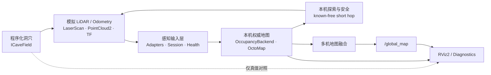

# alien-scanner

基于 ROS 2 Jazzy 与 C++17 的多无人机地下空间自主探索和三维建图项目。

项目在没有真实无人机和 LiDAR 的条件下，以可重复的程序化洞穴、模拟传感器和轨迹驱动完整数据链，
重点验证三维感知、局部占据地图、多机探索、全局地图融合，以及这些能力背后的架构和工程契约。
RViz2 用于观察洞穴真值、实时扫描、无人机轨迹、局部 OctoMap 和融合后的全局地图。

> 当前状态：Phase 1、Phase 2 已完成；Phase 3 已形成三机探索与 `/global_map` 融合基线。
> 新一代感知输入（C1）和本机权威观测地图（C2）已经落地，后续模块仍在按新架构逐步迁移。

## 项目作用

`alien-scanner` 用一个可控、可复现的地下探索场景回答以下工程问题：

- 如何在 ROS 2 中组织多无人机、多传感器和多地图实例，并保持 namespace、TF 和数据来源清晰；
- 如何从 LiDAR 命中点、射线自由空间和无返回信息构建三维占据地图；
- 如何让多机共享地图与任务意图，同时保留本机 known-free 安全边界；
- 如何把算法核心从 ROS 通信中解耦，使其能够被单元测试、替换和确定性回放；
- 如何用自动化测试、运行期诊断和性能基线推动机器人系统持续演进。

## 架构概览



Phase 3 的多机基线目前仍保留原感知/建图入口；图中的 `感知输入层 -> 本机权威地图` 是已完成的
C1/C2 新链路，正在作为后续通信、拓扑和协作重构的统一数据基础。

## 技术亮点

### ROS-free 算法库 + 薄节点

- 洞穴几何、轨迹、LiDAR raycast、占据更新、Frontier 探索和地图融合以无 ROS 依赖的 C++
  算法库为主体；`rclcpp` 节点只承担参数、消息转换、TF、QoS 和收发。
- 使用 `ICaveField`、`ITrajectory`、`IExplorationStrategy` 和 `OccupancyBackend` 等明确替换点，
  通过构造注入复用算法，不为每个内部步骤额外引入 ROS topic。
- 跨进程契约使用标准 ROS 消息或独立 interfaces 包，算法模型不直接依赖 ROS 消息结构。

### 统一感知与三维建图

- 将 `sensor_msgs/LaserScan`、`sensor_msgs/PointCloud2`、`nav_msgs/Odometry` 和 TF 转换为
  ROS-free 的 `LidarObservation` 与 `PoseEstimate`，统一执行 frame、freshness、quality 和 session 门控。
- 显式区分 `HitOnly < HitRay < FullRay` 三档射线证据能力，避免从只有命中点的点云中错误推断
  free space；非法元数据、未知能力值或不完整 payload 均 fail closed。
- 本机地图面向后端无关的 occupancy 契约编程，默认使用 OctoMap，并以确定性体素后端运行同一套
  conformance 测试；支持 occupied endpoint、hit-ray free carving 和 no-return free carving。
- 通过 source/session、epoch、revision 和 provenance 描述地图生命周期；位姿来源切换、reset 或空间
  跳变会关闭旧 revision 链并从空地图恢复，防止新旧坐标语义混用。

### 多无人机未知空间探索

- 使用独立 ROS namespace 和 TF 树并行运行多套无人机感知栈，各机维护本机 OctoMap，中央融合器发布
  `/global_map`。
- 探索与调度不读取洞穴拓扑真值；全局层只提供任务意图，本机仍以 known-free 机体包络和路径检查
  决定是否执行短距离目标。
- 已实现 peer 状态跟踪、局部 Frontier 探索、有限 yaw 重扫、Hold/Stopping 状态和地图来源健康诊断；
  全局多 Region 任务分配仍属于待继续验收的原型能力。

### ROS 2 工程实践

- 使用 TF2、多命名空间 launch、RViz2、DiagnosticArray、OctoMap 和自定义 ROS interface 组织完整系统。
- 根据数据语义选择 QoS：实时状态使用 `Reliable + Volatile + KeepLast(1)`，可供晚加入者读取的地图快照
  使用 `Reliable + Transient Local`。
- Docker/Dev Container 固定 ROS 2 Jazzy 开发环境，colcon 管理多包构建，并保留可复现的配置、
  rosbag 证据和人工 RViz 验收流程。

## 测试驱动的开发方式

本项目把测试作为架构演进的约束，而不只是在功能完成后补充 happy-path 检查：

1. 先把坐标、能力、状态转换、时间和 revision 语义写成 ROS-free 契约；
2. 使用固定 seed、解析几何和轻量假后端编写确定性 gtest，覆盖边界值、非法输入、重放和状态恢复；
3. 再用 `launch_testing` 验证真实 ROS 消息转换、QoS、TF、namespace、进程重启和节点接线；
4. 自动测试通过后执行 RViz2 目检，检查三维几何、射线方向、occupied/free/unknown 和地图增长；
5. 最后通过 profiler 和长时间 smoke 建立 CPU、内存及回调行为基线，为后续重构提供同条件比较依据。

这种分层让大部分算法错误能在不启动 ROS graph 的情况下快速定位，同时保留跨进程集成问题的验证层。

### 已记录的质量证据

| 范围 | 验证结果 |
|------|----------|
| C1 感知输入 | 74 个逻辑测试方法；`colcon test-result` 共 88 tests |
| Phase 3 多机基线 | Release 构建通过；17 个 gtest + 13 个 launch test，`30/30` CTest 通过 |
| Sanitizer | 60 项 ASan 测试及 60 秒 mixed smoke 无越界/UAF；独立目标 LSan smoke 无业务泄漏报告 |
| 稳态性能 | 3 轮各 300 秒；CPU mean 约 `0.64%`，RSS mean 约 `32.3 MiB` |
| 内存趋势 | Massif 180 秒进入平台区；三轮 RSS/PSS 斜率均低于 `1024 KiB/min` 门限 |

性能数据是固定容器、Release 构建和指定输入负载下的回归基线，不代表所有硬件环境中的绝对性能。
测量环境（WSL2/LinuxKit）无硬件 PMU，CPU 时间类指标带约 ±30% 争用污染，可分辨效应量级约 ≥30%；
内存、精确计数与泄漏类结论不受影响。详见
[性能与内存测量 Cookbook](docs/performance-memory-testing-cookbook.md) §6。
完整方法与原始口径见[感知测试说明](docs/perception-input-testing.md)、
[C1 性能基线](docs/perception-resource-profiling.md)和
[C2 性能基线](docs/local-map-resource-profiling.md)。

## 当前进度

| 阶段 | 状态 | 主要产出 |
|------|------|----------|
| Phase 1 | 已完成 | 程序化洞穴、确定性 seed、静态真值点云、`ICaveField` |
| Phase 2 | 已完成 | 模拟轨迹、垂直 360 度 LiDAR、Odometry/TF、单机点云累积 |
| Phase 3 | 基线完成至 3-8 | 本机 OctoMap、未知空间探索、三机运行、`/global_map` 融合 |
| Phase 4 重构 | C1/C2 已完成 | 统一感知输入、射线证据契约、本机权威观测地图、性能与内存基线 |
| 后续 | 规划中 | 地图更新协议、通信数据面、稀疏 Relay 拓扑、多 Region 任务完整验收 |

## 环境

- Docker Dev Container：镜像 `alien-scanner-jazzy:latest`，容器 `alien-scanner-dev`，ROS 2 Jazzy。
- Windows `D:\WorkDir\alien-scanner` ←→ 容器 `/workspaces/alien-scanner`（bind mount）。
- colcon 工作区：`ws/`，源码包在 `ws/src/`。
- GUI（RViz2）经 VcXsrv 转发，`DISPLAY=host.docker.internal:0.0`。

## 构建

```bash
cd /workspaces/alien-scanner/ws
colcon build --symlink-install
source install/setup.bash
```

## 文档

- 工程约定（分层 / 接口 / 测试边界）：[`AGENTS.md`](AGENTS.md)
- 总体规划（目标 / 架构 / 跨 Phase 契约）：[`docs/xenomorph-scanner-plan.md`](docs/xenomorph-scanner-plan.md)
- 感知与多机架构决策：[`docs/decisions/perception-and-swarm-architecture-refactor.md`](docs/decisions/perception-and-swarm-architecture-refactor.md)
- C1 感知输入测试：[`docs/perception-input-testing.md`](docs/perception-input-testing.md)
- C2 本机权威地图：[`docs/local-observation-map.md`](docs/local-observation-map.md)
- 性能与内存基线：[`docs/perception-resource-profiling.md`](docs/perception-resource-profiling.md)（C1 感知输入）、[`docs/local-map-resource-profiling.md`](docs/local-map-resource-profiling.md)（C2 局部观测地图）
- 性能与内存测量方法：[`docs/performance-memory-testing-cookbook.md`](docs/performance-memory-testing-cookbook.md)
- **分步实施细节：**
  - Phase 1：[`docs/phases/phase-01-cave-world.md`](docs/phases/phase-01-cave-world.md)
  - Phase 2：[`docs/phases/phase-02-drone-scanner.md`](docs/phases/phase-02-drone-scanner.md)
  - Phase 3：[`docs/phases/phase-03-swarm.md`](docs/phases/phase-03-swarm.md)

## Phase 1 快速启动（cave_world）

```bash
cd /workspaces/alien-scanner/ws && source install/setup.bash
ros2 launch cave_world cave_world_launch.py
```

- **基础地图**（默认）：`cave_mode:=tree`，`seed:=42`，`tree.loop_bulge:=12`，`tree.loop_direct_length:=16`
- **发布话题**：`/cave/points`（`sensor_msgs/PointCloud2`，`frame_id=map`，`TRANSIENT_LOCAL`）
- **参数写法**：`ros2 launch cave_world cave_world_launch.py 参数名:=值`（勿用 `--ros-args -p`）
- 完整参数表、拓扑说明、验收命令：见 [`docs/phases/phase-01-cave-world.md`](docs/phases/phase-01-cave-world.md)

## Phase 2 快速启动（drone_scanner，已完成）

```bash
cd /workspaces/alien-scanner/ws && source install/setup.bash
ros2 launch drone_scanner fake_lidar_launch.py

# 纯探索视角（关闭洞穴真值）
ros2 launch drone_scanner fake_lidar_launch.py show_cave:=false
```

- **感知：** 3D **垂直 360° 环**（非 2D 水平扫描）；机头沿 **map +X**，环在 **YZ 平面**（`ring_pitch=0`）
- **关键话题：** `/drone_0/odom`、`/drone_0/points`、`/drone_0/cloud_map`
- 完整分步、坐标约定、验收：见 [`docs/phases/phase-02-drone-scanner.md`](docs/phases/phase-02-drone-scanner.md)

## Phase 3 基线（3-1～3-8 已完成）

- **未知探索**（规划不读洞穴真值）；**俯仰垂直环**；**OctoMap**；多机任务调度；`/global_map`
- 当前入口：`ros2 launch swarm_controller multi_drone_exploration.launch.py`
- 当前状态：3-8 `/global_map` 融合已完成；3-9 全局 Frontier 分配原型冻结，后续按新架构继续验收
- 分步与验收：[`docs/phases/phase-03-swarm.md`](docs/phases/phase-03-swarm.md)
