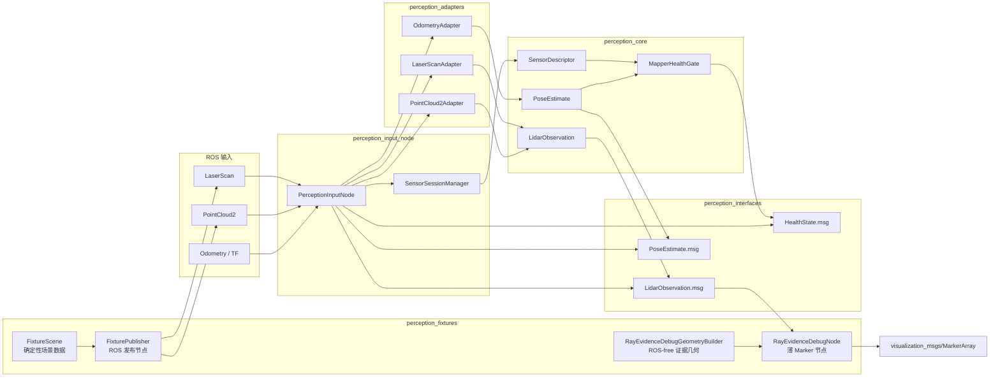
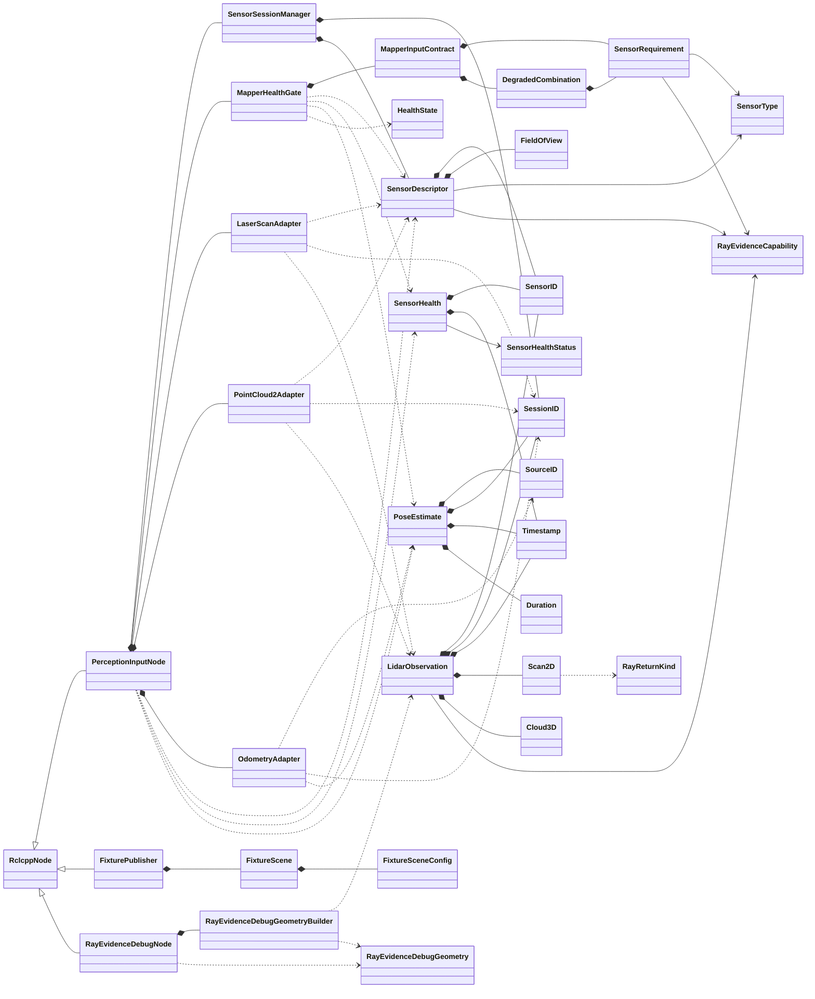
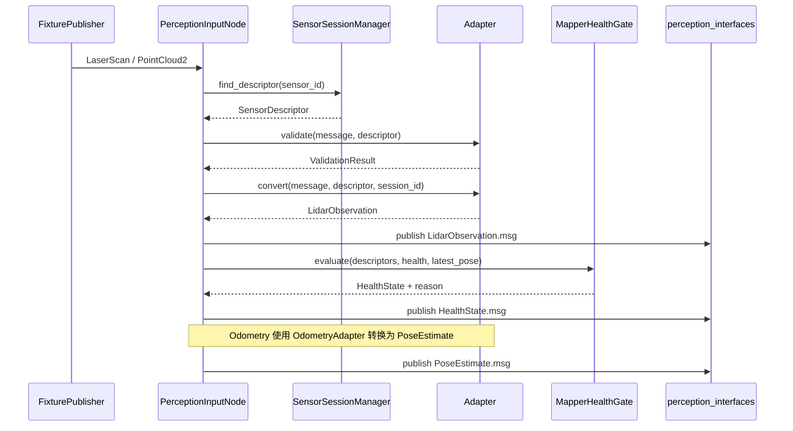

# 感知输入类关系与功能说明

本文说明当前感知输入实现中的主要 C++ 类、值对象、数据转换关系和运行时数据流。
内容已同步到 2026-07-26 AC-09 安全加固与 AC-10 可选射线证据调试视图后的实现。

范围包括：

- `perception_core`
- `perception_adapters`
- `perception_input_node`
- `perception_interfaces`
- `perception_fixtures`

测试类、第三方 ROS 类以及由 `.msg` 自动生成的消息类不作为业务类展开。

## 1. 命名空间与构建目标

C++ 命名空间和 CMake target 命名空间是两套概念：

| 范围 | C++ 命名空间 | CMake target |
| --- | --- | --- |
| 核心领域模型 | `Perception` | `perception_core::perception_core` |
| ROS 消息适配器 | `Perception::Adapters` | `perception_adapters::perception_adapters` |
| 输入节点 | `Perception::Input` | `perception_input_node`、`sensor_session_manager` |
| 测试数据与证据调试 | `Perception::Fixtures` | `fixture_scene`、`perception_fixture_publisher`、`ray_evidence_debug_node` |

构建依赖方向为：

```text
perception_core
    -> perception_adapters
        -> perception_input_node

perception_interfaces
    -> perception_input_node

perception_core + perception_interfaces
    -> perception_fixtures
```

`perception_core` 不依赖 `rclcpp`，因此领域数据和健康判断可以脱离 ROS 使用和测试。

## 2. 总体架构图



## 3. 类关系图



图中关系含义：

- `*--`：组合或拥有关系；被组合对象是所属对象的一部分。
- `..>`：使用关系，例如函数参数、返回值或转换结果。
- `<|--`：继承关系。
- 适配器之间没有继承关系，各自负责一种 ROS 输入格式。
- 核心数据模型主要通过值对象组合，避免为了测试引入无必要的抽象接口。

## 4. perception_core：核心领域模型

核心头文件位于 [`perception_core/include`](../ws/src/alien_perception/perception_core/include)。

### 4.1 身份和时间

相关文件：

- [`identity.hpp`](../ws/src/alien_perception/perception_core/include/perception_core/types/identity.hpp)
- [`timestamp.hpp`](../ws/src/alien_perception/perception_core/include/perception_core/types/timestamp.hpp)

`SensorID` 标识传感器，`SourceID` 标识位姿来源，`SessionID` 标识一次节点运行会话。当前实现中 `SourceID` 是 `SensorID` 的类型别名，但两者在领域语义上分别表示位姿来源和雷达来源。所有观测和位姿都带有 `SessionID`，这样可以区分节点重启前后的数据。

`Timestamp` 和 `Duration` 统一封装纳秒时间值，用于数据时间戳、位姿新鲜度、跳变检测窗口和健康恢复窗口。

### 4.2 传感器描述和运行状态

相关文件：

- [`sensor_descriptor.hpp`](../ws/src/alien_perception/perception_core/include/perception_core/observation/sensor_descriptor.hpp)
- [`health_state.hpp`](../ws/src/alien_perception/perception_core/include/perception_core/health/health_state.hpp)

`FieldOfView` 描述视场角，`SensorDescriptor` 描述传感器的静态属性：

- ID 和传感器类型；
- frame 名称；
- 安装位置和姿态；
- 视场角和角分辨率；
- 最小、最大测距范围。
- 射线证据等级 `HitOnly`、`HitRay` 或 `FullRay`。

`RayEvidenceCapability` 是单调有序的闭合枚举：`HitOnly < HitRay < FullRay`。
该字段参与 `SensorDescriptor` equality，因此运行中提升或降低能力都会触发
inventory freeze 拒绝，必须建立新的 vehicle session。

`SensorHealth` 描述动态状态：

```text
Active -> 正常提供数据
Stale  -> 一段时间没有新数据
Lost   -> 已确认不可用
```

静态描述用于校验输入，动态健康状态用于判断当前建图能力。

### 4.3 观测和位姿

相关文件：

- [`lidar_observation.hpp`](../ws/src/alien_perception/perception_core/include/perception_core/observation/lidar_observation.hpp)
- [`pose_estimate.hpp`](../ws/src/alien_perception/perception_core/include/perception_core/observation/pose_estimate.hpp)

`LidarObservation` 是统一的激光观测类型：

```text
LidarObservation
├── Scan2D
└── Cloud3D
```

它通过 `std::variant` 保存二维扫描或三维点云，并提供 `is_2d()`、`is_3d()` 和
`point_count()` 等查询函数；每批 observation 还从 descriptor 复制同一
`ray_evidence`，使下游不需要从 ROS 消息类型猜测证据能力。

冻结 descriptor 的检查发生在 C1 发布前。成功发布的 observation 是该批次的
权威输入，已经携带 frame、stamp、session、证据等级和完整 payload 元数据；
C2 继续按 sensor/session 溯源，但不需要额外 descriptor topic 重新解释该批次。

`Scan2D::return_kind()` 在原始 `ranges` 上按需返回 `Hit`、`NoReturn` 或
`Invalid`，不复制 payload。量程内有限值为 `Hit`，正无穷为 `NoReturn`，
NaN、负无穷和量程外有限值为 `Invalid`。

`PoseEstimate` 保存位置、姿态、协方差、质量、新鲜度和重置代数。`is_fresh()` 根据传入的时间阈值判断位姿是否仍可用于建图。

## 5. MapperHealthGate：健康判定

相关文件：

- [`mapper_input_contract.hpp`](../ws/src/alien_perception/perception_core/include/perception_core/health/mapper_input_contract.hpp)
- [`mapper_health_gate.hpp`](../ws/src/alien_perception/perception_core/include/perception_core/health/mapper_health_gate.hpp)

`MapperInputContract` 描述建图的输入要求：

- 最小可用传感器组合；
- 允许的降级组合；
- 每个 `SensorRequirement` 的最低射线证据等级；
- 是否要求位姿；
- 位姿新鲜度阈值；
- 恢复所需的稳定样本数。

`MapperHealthGate::evaluate()` 接收传感器描述、传感器健康状态和最新位姿，返回：

```text
Healthy     输入完整且满足建图要求
Degraded    可以继续工作，但缺少部分能力
Unavailable 无法满足最小输入要求
```

故障状态立即生效，恢复状态需要满足稳定采样窗口。`degradation_reason()` 保存当前状态的诊断原因，节点会将它发布到健康消息中。

健康门只统计同时满足 type、可选 sensor ID 和最低射线证据等级的 active
descriptor。`CapabilitySet` 分别暴露 `has_free_space_hit_rays` 与
`has_full_no_return_rays`，避免用单一 healthy 布尔值代替证据语义。

## 6. perception_adapters：输入格式转换

适配器头文件位于 [`perception_adapters/include`](../ws/src/alien_perception/perception_adapters/include)。

### 6.1 LaserScanAdapter

```text
sensor_msgs/LaserScan
    -> validate()
    -> convert()
    -> LidarObservation(Scan2D)
```

`validate()` 检查消息和 `SensorDescriptor` 是否匹配，`convert()` 将 ROS 扫描
数据转换为核心层的 `Scan2D`，并补充传感器 ID、会话 ID、frame、时间和证据
等级。所有能力都要求基础 range/angle 元数据有效；`HitRay/FullRay` 还要求
消息 range、FOV 和角分辨率与冻结 descriptor 一致。

### 6.2 PointCloud2Adapter

```text
sensor_msgs/PointCloud2
    -> validate()
    -> extract_cloud()
    -> LidarObservation(Cloud3D)
```

它检查点云 type、frame、FLOAT32 字段、point/row step 和 data 长度，然后按
row/column 边界提取 `x/y/z/intensity` 生成 `Cloud3D`。当前 schema 没有方向
索引或 no-return 条目，因此只支持 `HitOnly`；直接 `convert()` 也先执行完整
验证，对畸形存储和更高等级都 fail closed。

### 6.3 OdometryAdapter

```text
nav_msgs/Odometry 或 TF
    -> PoseEstimate
```

它负责：

- 位置和姿态转换；
- 时间戳和 frame 转换；
- 位姿质量计算；
- 保存上一帧位姿；
- 检测短时间内的位置跳变；
- 检测到跳变时递增 `reset_epoch`。

三个适配器都只负责转换，不负责 ROS 发布，也不负责健康策略。

## 7. SensorSessionManager：会话和传感器清单

相关文件：

- [`SensorSessionManager.hpp`](../ws/src/alien_perception/perception_input_node/include/perception_input_node/SensorSessionManager.hpp)
- [`SensorSessionManager.cpp`](../ws/src/alien_perception/perception_input_node/src/SensorSessionManager.cpp)

内部关系如下：

```text
SessionID
└── SensorSessionManager
    └── map<SensorID, SensorDescriptor>
```

主要方法：

- `register_sensor()`：建立传感器清单；
- `freeze()`：冻结清单；
- `find_descriptor()`：按传感器 ID 查询描述；
- `can_reconnect()`：判断传感器是否可以按原描述重连；
- `descriptors()`：返回当前传感器列表。

首次有效数据到达后，节点冻结 descriptor inventory。冻结后，同 ID 且描述
完全一致的传感器可以重连，但修改了 frame、类型、安装姿态、量程或射线证据
等级的传感器会被拒绝。

## 8. PerceptionInputNode：ROS 接线节点

实现位于 [`PerceptionInputNode.cpp`](../ws/src/alien_perception/perception_input_node/src/PerceptionInputNode.cpp)。它是唯一直接处理 `rclcpp`、ROS 订阅和 ROS 发布的主要节点。

节点组合了：

```text
PerceptionInputNode
├── SensorSessionManager
├── LaserScanAdapter
├── PointCloud2Adapter
├── OdometryAdapter
├── MapperHealthGate
├── SensorDescriptor 列表
├── SensorHealth 列表
└── latest_pose
```

启动阶段：

1. 生成 `SessionID`。
2. 加载 `MapperInputContract`。
3. 从参数加载传感器描述。
4. 注册传感器并创建对应订阅。
5. 创建观测、位姿和健康状态发布器。

mapper contract 解析 `minimum_lidar_ray_evidence` 与
`degraded_lidar_ray_evidence`，每个 descriptor 解析
`sensor.<id>.ray_evidence`。三者默认 `hit_only`；非法闭合集值在创建订阅前
终止启动。

运行阶段：

```text
LaserScan
    -> on_laser_scan()
    -> LaserScanAdapter
    -> LidarObservation
    -> publish_observation()

PointCloud2
    -> on_point_cloud()
    -> PointCloud2Adapter
    -> LidarObservation
    -> publish_observation()

Odometry
    -> on_odometry()
    -> OdometryAdapter
    -> PoseEstimate
    -> publish_pose()
```

每次有效传感器或位姿数据到达后，节点重新调用 `MapperHealthGate::evaluate()`；状态首次出现、状态或诊断原因变化时立即发布健康消息。健康定时器还会更新传感器与位姿 freshness，并按 `health_period_s` 周期强制发布当前健康状态。

## 9. perception_interfaces：通信消息

消息文件位于 [`perception_interfaces/msg`](../ws/src/alien_perception/perception_interfaces/msg)：

- [`LidarObservation.msg`](../ws/src/alien_perception/perception_interfaces/msg/LidarObservation.msg)：跨节点传输二维或三维观测；
- [`PoseEstimate.msg`](../ws/src/alien_perception/perception_interfaces/msg/PoseEstimate.msg)：传输位姿和质量信息；
- [`HealthState.msg`](../ws/src/alien_perception/perception_interfaces/msg/HealthState.msg)：传输聚合健康状态和 capability set；
- [`SensorHealth.msg`](../ws/src/alien_perception/perception_interfaces/msg/SensorHealth.msg)：描述单个传感器状态。

这些 `.msg` 文件是通信协议，不承担领域逻辑。节点在 `publish_observation()`、
`publish_pose()` 和 `publish_health()` 中完成核心对象到 ROS 消息的字段映射。
`LidarObservation.msg` 携带每批 `ray_evidence` 枚举；`HealthState.msg` 分别携带
当前是否存在 hit free-space ray 和完整 no-return ray。

当前节点发布聚合的 `HealthState`，`SensorHealth.msg` 已定义但尚未单独发布每个传感器的健康消息。

## 10. perception_fixtures：确定性数据源

相关文件：

- [`FixtureScene.hpp`](../ws/src/alien_perception/perception_fixtures/include/perception_fixtures/FixtureScene.hpp)
- [`FixtureScene.cpp`](../ws/src/alien_perception/perception_fixtures/src/FixtureScene.cpp)
- [`FixturePublisher.cpp`](../ws/src/alien_perception/perception_fixtures/src/FixturePublisher.cpp)
- [`RayEvidenceDebugGeometryBuilder.hpp`](../ws/src/alien_perception/perception_fixtures/include/perception_fixtures/RayEvidenceDebugGeometryBuilder.hpp)
- [`RayEvidenceDebugNode.cpp`](../ws/src/alien_perception/perception_fixtures/src/RayEvidenceDebugNode.cpp)

`FixtureSceneConfig` 保存 2D 扫描点数、每条 3D 仰角通道的方位采样数、点云径向距离、仰角数组和随机种子。默认仰角为厂商无关的 16 线 profile（`-15°` 到 `+15°`，步长 `2°`）。`FixtureScene` 根据配置生成确定性的二维扫描和标准多线三维点云：零仰角位于传感器 XY 平面，零方位沿 +X，正方位朝 +Y，正仰角朝 +Z。

`FixtureScene` 只描述传感器自身坐标系的原始数据。3D 单帧点云由多条不同
仰角的完整方位环组成，不是螺旋扫描；点按仰角通道、再按方位角排列。2D
雷达的倾斜安装和 3D 雷达整体姿态都由 TF 表达，不通过旧 `ring_pitch_rad`
语义写入通用 fixture；旧 `drone_scanner::FakeLidar` 的专属几何由旧路径
回放/迁移测试单独负责。

`FixturePublisher` 是一个薄 ROS 节点，只负责：

1. 从 `FixtureScene` 取得测试数据；
2. 封装成 `LaserScan` 或 `PointCloud2`；
3. 按配置周期发布。

它不参与适配、健康判断或会话管理。

`RayEvidenceDebugGeometryBuilder` 同样属于 ROS-free 算法库。它只消费权威
`LidarObservation`：2D 按 `HitOnly < HitRay < FullRay` 生成红色命中端点、
绿色 hit free segment、青色 no-return free segment 和灰色 invalid 短方向段；
Cloud3D 只接受 `HitOnly` 并只生成有限命中端点。`beam_stride` 只选择显示 beam，
不改变返回分类或能力权限。

`RayEvidenceDebugNode` 是薄 ROS 节点，只订阅
`perception_interfaces/LidarObservation`，显式闭合集解析 `data_type` 和
`ray_evidence`，调用几何构建器后发布 `MarkerArray`。Marker 保留原 frame/stamp、
使用稳定 sensor marker ID 和有限 lifetime。未知枚举、交叉 payload、非法 2D
元数据或非有限 Cloud3D 整批拒绝；节点不写 occupancy，也不订阅旧
`/drone_0/scan_returns`。

`fixture_visualization.launch.py` 复用三个 `FixturePublisher` 实例，分别发布
水平 2D、倾斜 2D 和标准多线 3D 数据，并用 `tf2_ros` 将三个传感器 frame
安装到 `base_link`。倾斜只存在于静态 TF 中，两个 `LaserScan` 实例仍生成
完全相同的传感器 XY 平面数据。倾斜 2D 默认使用 `-30°` pitch，使传感器
本地 +X 朝 `base_link` 的 +Z 方向抬起。RViz 的三个传感器 display 可独立
开关，因此单传感器和混装观察共用同一配置。当前 3D 雷达使用零旋转安装
作为标准基线；需要倾斜安装时只修改它到 `base_link` 的 TF，不修改点云生成
公式。

## 11. 完整运行时链路



最终职责边界可以概括为：

```text
perception_core      定义稳定的领域对象和健康规则
perception_adapters  将 ROS 输入转换为领域对象
perception_input_node负责订阅、调用、状态维护和发布
perception_interfaces定义跨进程传输格式
perception_fixtures 生成可重复输入，并提供独立的证据调试视图
```
