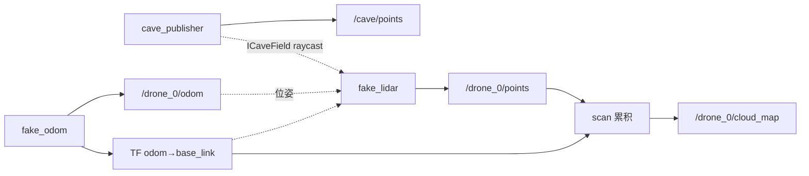

# Phase 2：单 drone 三维扫描闭环（drone_scanner）

> **状态：** ✅ 已完成（`main`）  
> **上级摘要：** [`docs/xenomorph-scanner-plan.md`](../xenomorph-scanner-plan.md) §6 Phase 2  
> **依赖 Phase 1：** [`phase-01-cave-world.md`](phase-01-cave-world.md)  
> **工程约定：** [`AGENTS.md`](../../AGENTS.md)（含 §5.1 Git 分步提交）

---

## 目标与产出

**目标：** 一架虚拟无人机沿洞穴飞行，fake LiDAR 对 `ICaveField` 做 **三维** raycast，发布机载点云；逐步累积可见环境（非 2D 平面 SLAM 演示）。

**产出：**

- RViz2：**双窗口** — 仿真窗（洞穴真值 + 飞机 + 当前扫描环，默认 `show_cave:=true`）+ 地图窗（仅累积 `cloud_map`）；纯探索视角可 `show_cave:=false`
- TF 树：`map → odom → base_link → lidar_link`
- 单机 **3D 扫描累积 / 局部 3D 地图**；（Phase 3）多机 OctoMap 融合

**明确不做（主路径）：**

- ❌ **水平 360°（xy 平面）** 作为唯一扫描 — 无法可靠感知洞顶/地面高度变化
- ❌ **slam_toolbox 2D** 作为 Phase 2 验收核心 — 与 3D 场景目标不一致

---

## 坐标系与扫描几何约定

### 全局坐标系（`map` / `odom`）

本项目全局帧采用 ROS 常用约定（与 [REP-105](https://www.ros.org/reps/rep-0105.html) 移动平台坐标系一致）：

| 帧 | 约定 |
|----|------|
| **`map`** | 固定世界系；**右手系**，**z 朝上**；洞穴几何、`/cave/points`、RViz Fixed Frame 均在此系 |
| **`odom`** | 里程计原点；**z 朝上**；launch 中 `map→odom` 为零变换 static TF，轴与 `map` 对齐 |

`ICaveField` 内部 `(x,y,z)` 与 **`map` 同系**（算法库无 ROS 帧名，数值即 map 坐标）。

### 机体坐标系（REP-103）

[`base_link`](https://www.ros.org/reps/rep-0103.html) / `lidar_link` 遵循 **[REP-103](https://www.ros.org/reps/rep-0103.html)**：

| 轴 | 方向 |
|----|------|
| **+x** | 前进（机头） |
| **+y** | 左侧 |
| **+z** | 上方 |

默认进洞轨迹 **`yaw=0`** 时：**`base_link` +x ∥ `map` +X**（机头沿 map 红轴飞入洞穴）。

### 业务方向与扫描几何

| 概念 | 约定 | 说明 |
|------|------|------|
| 洞穴入口 | `map` 原点附近 | 与 Phase 1 `TreeCaveField` 一致 |
| 默认轨迹 | 沿 **map +X**（`yaw=0`） | `LineTrajectory` 默认 `(0,0,1.5)→(11,0,1.5)` |
| **FakeLidar 扫描环** | **垂直 360° 环** | 环所在平面 **⊥ 机头 +x**（进洞时即 **map YZ 平面**） |

**垂直环示意（机头沿 map +X）：**

```text
        z ↑
          | · 环上各 beam（含 ±y、±z 分量）
          |·   ●   ·     ← lidar_link 原点
          └────────→ y
               x 朝屏幕外 = 机头 / map +X

垂直环平面 = YZ 平面（法向沿 +X）
```

**为何不用水平 2D（xy 绕 z）：** 在固定高度上一圈只有「等高切片」，前方**地面骤降**时 beam 易从坑边上方掠过，缺少可靠 **Δz** 信息。

**量程与拼接：** 环顶/环底若打不到洞顶或洞底，允许 **单机量程内部分可见**；完整覆盖靠多高度航线 / 多机 / Phase 3 融合。

**噪声：** 测距 **高斯噪声**（可选），不是图像模糊。

---

## 任务清单与进度

| 步 | 内容 | 状态 | Git commit（分支上） |
|----|------|------|----------------------|
| 2-1 | `ITrajectory` + `LineTrajectory` + gtest | ✅ | `phase2(step1): LineTrajectory` |
| 2-2 | **`FakeLidar`**：注入 `ICaveField`，**YZ 垂直 360° 环** raycast | ✅ | `phase2(step2): FakeLidar` |
| 2-3 | `fake_odom` 节点 + `/drone_0/odom` + TF | ✅ | `phase2(step3): fake_odom` |
| 2-4 | `fake_lidar` 节点 → **`/drone_0/points`**（`PointCloud2`） | ✅ | `69481a2` |
| 2-5 | 单机 **3D 扫描累积** + 双 RViz 预览 | ✅ | `e511a1b` |
| 2-6 | 单机一键闭环入口（=`fake_lidar_launch.py`） | ✅ | `e511a1b` |
| — | cave launch 复用；Phase 2 预览 RViz 迁至 `drone_scanner/config/` | ✅ | `1dfd927` |

---

## Step 2-1：轨迹算法（✅ 已完成）

### 设计

- **接口：** `ITrajectory` — `pose(t_seconds)` + `duration()`（纯 C++，无 ROS）
- **实现：** `LineTrajectory` — 起点到终点匀速直线；`yaw` 沿 xy 投影方向，全程恒定
- **默认配置：** `(0,0,1.5) → (11,0,1.5)`，沿 **map +X** 进洞，`duration=60s`

### 包内文件

```
ws/src/drone_scanner/
├── include/drone_scanner/
│   ├── ITrajectory.hpp
│   ├── LineTrajectory.hpp
│   └── Pose3D.hpp
├── src/LineTrajectory.cpp
└── test/TestLineTrajectory.cpp
```

### 验证

```bash
cd /workspaces/alien-scanner/ws
colcon build --packages-select drone_scanner
colcon test --packages-select drone_scanner --event-handlers console_direct+
colcon test-result --verbose
```

---

## Step 2-3：fake_odom 节点（✅ 已完成）

### 职责

- 读取 `LineTrajectory` 参数，按 `publish_rate` 发布 `nav_msgs/Odometry`
- 广播 TF **`odom → base_link`**
- namespace：`drone_0` → 话题 **`/drone_0/odom`**

### 参数（节点 + launch 均可覆盖）

| 参数 | 默认 | 说明 |
|------|------|------|
| `line.start_x/y/z` | `0, 0, 1.5` | 轨迹起点 |
| `line.end_x/y/z` | `11, 0, 1.5` | 轨迹终点（沿 +X） |
| `line.duration_seconds` | `60.0` | 飞完全程时间 (s) |
| `publish_rate` | `20.0` | 发布频率 (Hz) |
| `odom_frame` | `odom` | 里程计父帧 |
| `base_frame` | `base_link` | 机体帧 |

### Launch：`fake_odom_launch.py`

**复用 Phase 1，不复制 launch/RViz：**

1. `IncludeLaunchDescription(cave_publisher_launch.py)` — `show_cave:=true`（默认）
2. `static_transform_publisher` — **`map → odom`**（零变换，仿真无漂移）
3. `fake_odom` — namespace `drone_0`
4. RViz2 — 加载 **`cave_world/config/cave_world.rviz`**（Phase 1 全洞 + odom；`DroneOdom Keep=20`）

```bash
cd /workspaces/alien-scanner/ws && source install/setup.bash
ros2 launch drone_scanner fake_odom_launch.py

# 微调轨迹
ros2 launch drone_scanner fake_odom_launch.py \
  line.end_x:=15.0 line.duration_seconds:=90.0
```

### TF 树（当前 step 2-3）

```text
map  ──static──►  odom  ──fake_odom──►  base_link
```

RViz 中 Fixed Frame=`map`；Odometry 显示订阅 `/drone_0/odom`，箭头应沿 **map +X（红轴）** 移动。

**`/drone_0/odom` 的 `twist`：** 按 `nav_msgs/Odometry` 约定，线速度在 **`child_frame_id`（`base_link`）** 下表达——直线飞行时应为 `(speed, 0, 0)`，与 `yaw` 无关（见 REP-103 配套的里程计消息惯例，非轴方向定义本身）。

### 验证命令

```bash
ros2 topic hz /drone_0/odom
ros2 run tf2_ros tf2_echo map base_link
ros2 run tf2_tools view_frames   # 生成 frames.pdf
```

---

## Step 2-2：FakeLidar 算法（✅ 已完成）

### 设计

- **具体类**（不抽象自身），构造函数注入 `std::shared_ptr<CaveWorld::ICaveField>`
- **YZ 垂直 360° 环：** 在 `lidar_link` 下均匀分布方位角 θ，beam 方向 `(0, cos θ, sin θ)`，变换到 `map` 后调用 `ICaveField::raycast`
- 可选 `range_noise_std` + `noise_seed`（确定性）；输出 **lidar 系**命中点 `LidarPoint`
- 库 `drone_lidar` 链接 `cave_world::cave_geometry`（`ament_export_targets`）

### 包内文件

```
ws/src/drone_scanner/
├── include/drone_scanner/FakeLidar.hpp
├── src/FakeLidar.cpp
└── test/TestFakeLidar.cpp
```

### 验证

```bash
cd /workspaces/alien-scanner/ws
colcon build --packages-select cave_world drone_scanner
colcon test --packages-select drone_scanner --event-handlers console_direct+
colcon test-result --verbose
```

---

## Step 2-4：fake_lidar 节点（✅ 已完成）

### 职责

- 查 TF **`map → lidar_link`**（launch 发布 `base_link → lidar_link` 零外参）
- 调用 `FakeLidar::scan()`，发布 **`/drone_0/points`**（`sensor_msgs/PointCloud2`，`SensorDataQoS`）
- `frame_id` = `lidar_link`（累积节点再变换到 `map`）
- 与 `cave_publisher` **同参**构造 `ICaveField`（`CaveFieldFromParameters` + `CaveFieldFactory`）

### 包内文件

```
ws/src/drone_scanner/
├── include/drone_scanner/
│   ├── FakeLidarNode.hpp
│   └── CaveFieldFromParameters.hpp
├── src/
│   ├── FakeLidarNode.cpp
│   ├── FakeLidarMain.cpp
│   └── CaveFieldFromParameters.cpp
└── launch/fake_lidar_launch.py
```

### 参数（节点 + launch 均可覆盖）

| 参数 | 默认 | 说明 |
|------|------|------|
| `num_beams` | `360` | 垂直环 beam 数 |
| `max_range` | `30.0` | 最大量程 (m) |
| `range_noise_std` | `0.0` | 测距高斯噪声 σ (m) |
| `noise_seed` | `0` | 噪声 RNG seed（`range_noise_std>0` 时） |
| `scan_rate` | `10.0` | 扫描频率 (Hz) |
| `map_frame` | `map` | raycast 参考帧 |
| `lidar_frame` | `lidar_link` | 点云 `frame_id` |
| `cave_mode` / `seed` / `tree.*` | 同 Phase 1 | 与 `cave_publisher` 一致 |

### Launch：`fake_lidar_launch.py`（Step 2-4 初版）

1. `IncludeLaunchDescription(cave_publisher_launch.py)` — cave 参数透传
2. `static_transform_publisher` — **`map → odom`**、**`base_link → lidar_link`**
3. `fake_odom` + **`fake_lidar`** — namespace `drone_0`

（Step 2-5 起同一文件扩展 `scan_accumulator`、双 RViz、`show_cave` 等，见 Step 2-5。）

```bash
cd /workspaces/alien-scanner/ws && source install/setup.bash
ros2 launch drone_scanner fake_lidar_launch.py

ros2 topic hz /drone_0/points
ros2 run tf2_ros tf2_echo map lidar_link
```

### TF 树（当前 step 2-4）

```text
map  ──static──►  odom  ──fake_odom──►  base_link  ──static──►  lidar_link
```

### 验证

```bash
cd /workspaces/alien-scanner/ws
colcon build --packages-select cave_world drone_scanner
colcon test --packages-select drone_scanner --event-handlers console_direct+
```

---

## Step 2-5：3D 扫描累积（✅ 已完成）

### 设计

- **`PointCloudAccumulator`**（纯 C++ 库）：将各帧点变换到 `map` 后合并；`max_points` 为容量上限（**默认 500000**），超出时 **丢弃最早写入的点**（FIFO），非时间衰减
- **`scan_accumulator` 节点**：订阅 `/drone_0/points` + TF `map ← lidar_link`，发布 **`/drone_0/cloud_map`**（`PointCloud2`，`frame_id=map`）
- **`fake_lidar` 轨迹结束停扫**（改 `FakeLidarNode`）：订阅同 namespace 的 `/drone_0/odom`；检测到 `twist.linear.x` 由非零变为零（`fake_odom` 到达终点后停飞）即 **取消扫描定时器**，避免停飞空转占满 50 万上限导致最早扫描环被裁掉
- **双 RViz 配置**（`config/drone_sim.rviz` / `drone_map.rviz`）：仿真窗 `DroneOdom Keep=20`（约 1s 尾迹，@20Hz）
- **`cave_world.rviz` 附带更新**：新增 `CloudMap` 层（供 `fake_odom_launch` 等仍用该配置时可选显示）；`DroneOdom Keep=20`
- **不用** `slam_toolbox` 2D / `OccupancyGrid` 作主输出

### 包内文件

```
ws/src/drone_scanner/
├── include/drone_scanner/
│   ├── Point3f.hpp
│   ├── RigidTransform.hpp
│   ├── PointCloudAccumulator.hpp
│   └── ScanAccumulatorNode.hpp
├── src/
│   ├── RigidTransform.cpp
│   ├── PointCloudAccumulator.cpp
│   ├── ScanAccumulatorNode.cpp
│   └── ScanAccumulatorMain.cpp
├── config/
│   ├── drone_sim.rviz      # 仿真窗：飞机 + 当前环扫 + 可选 CavePoints
│   └── drone_map.rviz      # 地图窗：仅 cloud_map
└── test/
    ├── TestPointCloudAccumulator.cpp
    └── test_cloud_map_integration.py
    └── test_stop_scan_integration.py   # 轨迹结束后停扫 + cloud_map 稳定
```

（Launch 仍用 Step 2-4 的 `launch/fake_lidar_launch.py`，本步扩展双 RViz、`show_cave`、`stop_scan_when_trajectory_done` 等参数。）

### Launch：`fake_lidar_launch.py`

| 参数 | 默认 | 说明 |
|------|------|------|
| `show_cave` | `true` | 启动 `cave_publisher`；真值 **仅仿真窗** `drone_sim.rviz` 的 CavePoints 层显示（地图窗无此层） |
| `show_rviz_sim` | `true` | 仿真 RViz（`drone_sim.rviz`） |
| `show_rviz_map` | `true` | 地图 RViz（`drone_map.rviz`） |
| `max_cloud_map_points` | `500000` | 累积上限；`0` = 不限制（仅演示/短航线推荐） |
| `cloud_map_rate` | `5.0` | `cloud_map` 发布频率 (Hz) |
| `stop_scan_when_trajectory_done` | `true` | 轨迹结束后停止 `fake_lidar` |

**双 RViz 预览（默认）：** 两个独立 RViz 窗口，均在 **`map` 坐标系**（非空间平移）。屏幕左右摆放由用户自行拖动窗口。

| 窗口 | 配置 | 显示 |
|------|------|------|
| 仿真 | `config/drone_sim.rviz` | TF、飞机 odom（Keep=20）、**当前帧** `/drone_0/points`（绿环）、`/cave/points` 真值（`show_cave:=true` 时） |
| 地图 | `config/drone_map.rviz` | **累积** `/drone_0/cloud_map`（橙/黄） |

```bash
cd /workspaces/alien-scanner/ws && source install/setup.bash
ros2 launch drone_scanner fake_lidar_launch.py

# 纯探索视角（仿真窗也不显示洞穴真值）
ros2 launch drone_scanner fake_lidar_launch.py show_cave:=false

# 仅地图窗
ros2 launch drone_scanner fake_lidar_launch.py show_rviz_sim:=false
```

### 累积容量与停扫（重要）

**默认行为：**

1. 飞行期间每帧扫描点追加到 `cloud_map`，地图 **只增不减**（在 50 万点以内）
2. 到达轨迹终点后 `fake_odom` 的 `twist.linear.x → 0`，`fake_lidar` **停止扫描**
3. `scan_accumulator` 继续按 `cloud_map_rate` 发布最终累积结果（不再增长）

**若关闭停扫**（`stop_scan_when_trajectory_done:=false`）且仍用默认 50 万上限：停飞后雷达仍 10Hz 空转，约 80s 后会从 **路径起点** 裁掉最早扫描环，视觉上像「隧道消散」。

**验证：**

```bash
ros2 topic echo /drone_0/cloud_map --field width   # 飞行中递增，停扫后稳定
ros2 topic hz /drone_0/points                      # 停飞后应无新消息
colcon test --packages-select drone_scanner
```

### 验收要点

- 飞机移动后，`cloud_map` 逐步覆盖已飞过的洞段
- 双 RViz：仿真窗见绿环随飞（默认叠加半透明白色 CavePoints 真值），地图窗见橙黄累积图 **只增不减**（正常航线 + 默认参数）
- `show_cave:=true`（默认）时仿真窗真值与扫描可对照，同 `seed` 下洞壁形状一致；地图窗始终无真值

---

## Step 2-6：single_drone 一键入口（✅ 已完成）

### 结论

**不另建 `single_drone_launch.py`。** Step 2-5 的 **`launch/fake_lidar_launch.py`** 已包含 Phase 2 单机闭环所需的全部节点，即 **single_drone 官方入口**。

### 一键拉起内容

```text
cave_publisher（show_cave，默认 true）
  + map→odom / base_link→lidar_link static TF
  + fake_odom + fake_lidar + scan_accumulator（namespace drone_0）
  + rviz2_sim + rviz2_map（drone_sim.rviz / drone_map.rviz）
```

### 命令

```bash
cd /workspaces/alien-scanner/ws && source install/setup.bash
ros2 launch drone_scanner fake_lidar_launch.py
```

分步调试仍可用：`fake_odom_launch.py`（仅 odom + `cave_world.rviz`）。

---

## 关键话题

| 话题 | 类型 | 说明 |
|------|------|------|
| `/cave/points` | `PointCloud2` | Phase 1 全洞参考（对照） |
| `/drone_0/odom` | `Odometry` | 仿真里程计 |
| `/drone_0/points` | `PointCloud2` | **当前帧 3D 垂直环扫描** |
| `/drone_0/cloud_map` | `PointCloud2` | 累积局部 3D 地图 |
| `/tf`, `/tf_static` | `TFMessage` | `map→odom`（static）、`odom→base_link`（fake_odom） |

---

## 数据流（Phase 2 目标态）



---

## 构建与依赖

```bash
cd /workspaces/alien-scanner/ws
colcon build --symlink-install --packages-select cave_world drone_scanner
source install/setup.bash
colcon test --packages-select drone_scanner --event-handlers console_direct+
```

**建议 apt（Jazzy desktop-full 大多已含）：**

```bash
sudo apt install -y \
  ros-jazzy-tf2-ros \
  ros-jazzy-tf2-geometry-msgs \
  ros-jazzy-nav-msgs
```

---

## Git 工作流（本 Phase）

遵循 [`AGENTS.md`](../../AGENTS.md) §5.1：

- 开发分支：**`phase/2-drone-scanner`**（步骤历史保留于此）
- 每完成一步一个 commit：`phase2(stepK): 简短说明`
- Phase 验收通过后已 **squash merge 到 `main`**：`245b726`（`main` 上本 Phase 仅 1 个功能合并提交）

**阶段分支 commit（节选，供逐步 diff）：**

```
7f00477 phase2(step5-6): scan accumulator, dual rviz, single_drone entry
341ca7f phase2(test): fake_odom and fake_lidar launch_testing
69481a2 phase2(step4): fake_lidar node and launch
4655e61 phase2(step2): FakeLidar YZ vertical ring raycast
6e61382 phase2(step3): fake_odom
1dfd927 phase2: cave launch reuse + shared rviz
bb22d89 phase2(step1): LineTrajectory
```

---

## Phase 2 验收标准

- RViz：垂直环扫描随飞机移动；在**地面骤降**测试几何中，扫描点云能反映上下边界变化
- TF 树合法：`map → odom → base_link → lidar_link`
- 双 RViz：`cloud_map` 随飞行累积；轨迹结束后扫描停止、地图不再被 cap 误裁
- 扫描与 Phase 1 同 `seed` 的洞壁在视觉上可对照（仿真窗 `show_cave:=true`）
- 测试：`LineTrajectory` / `FakeLidar` / `PointCloudAccumulator` gtest ✅；`fake_odom` / `fake_lidar` / `cloud_map` / **`stop_scan`** launch_testing ✅
- 一键入口：`ros2 launch drone_scanner fake_lidar_launch.py`（Step 2-6，即 single_drone）
