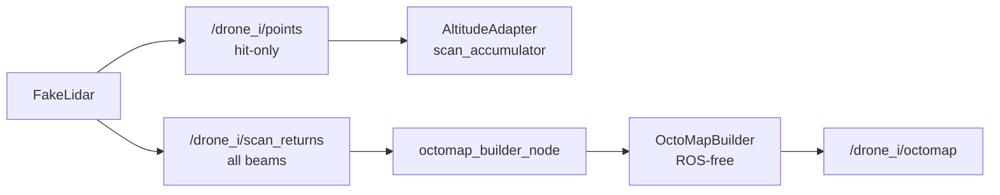

# Phase 3：多机未知探索与地图融合（swarm_controller）

> **状态：** 🟡 进行中（3-1～3-3 已完成；分支 `phase/3-swarm-controller`）  
> **上级摘要：** [`docs/xenomorph-scanner-plan.md`](../xenomorph-scanner-plan.md) §6 Phase 3  
> **依赖：** Phase 1 [`phase-01-cave-world.md`](phase-01-cave-world.md)、Phase 2 [`phase-02-drone-scanner.md`](phase-02-drone-scanner.md)  
> **工程约定：** [`AGENTS.md`](../../AGENTS.md)（含 §5.1 Git 分步提交）

---

## 目标与产出

**目标：** 在**不假定洞穴拓扑 / 出口已知**的前提下，多架无人机根据已观测地图探索未知区域；扫描几何采用**可俯仰垂直环**消除正前盲区；用 **OctoMap** 表达自由 / 占用 / 未知；任务规划派机探索；融合为全局地图。

**产出：**

- 包 `swarm_controller`：观测地图、探索策略、多机调度、地图融合（算法库 + 薄节点）
- `drone_scanner` 扩展：`ring_pitch` 俯仰环、高度自适应
- `/global_map`（OctoMap 或等价全局观测）
- `launch` 一键多机入口（`num_drones:=3`）
- RViz：多机 + 全局图；`/cave/points` 仅作对照，**不参与**规划

**明确不做（主路径）：**

- ❌ 按真值「外环 / 直连 / 右廊 / 出口」预分配航线作为验收路径
- ❌ 从 `ICaveField` / 中轴线抄整条飞行廊道给规划用
- ❌ Mesh 导出（Phase 4）、Gazebo、2D `slam_toolbox` 主路径
- ❌ 以「纯点云列表、不维护未知」作为探索主地图（主路径直接用 OctoMap）

---

## 原则（与 Phase 1/2 的契约）

| 原则 | 说明 |
|------|------|
| 真值保密 | `ICaveField` 仅供 `fake_lidar` raycast 造数；规划 / 调度不得依赖拓扑真值 |
| 未知探索 | 「岔路通到哪」由任务规划派机扫出来，不是建图凭空知道 |
| 航线在线 | 轨道 = 探索目标 + 高度自适应（+ 最小避障）；非整条预设廊道 |
| 前视 | 垂直环 **俯仰倾斜（方案 A）**，`num_beams` 不变 |
| 观测地图 | **OctoMap 直接实现**（hit=占用，射线中段 / 未命中至 max_range=自由，其余=未知） |

---

## 扫描几何：可俯仰垂直环（方案 A）

Phase 2 默认环在 **YZ**（法向沿机头 +X），正前方无 beam，探索时前视全盲。

**Phase 3 主路径：** 同一圈 beam 数不变，将扫描平面相对机头 **前倾**（参数 `ring_pitch_rad`）：

| `ring_pitch_rad` | 行为 |
|------------------|------|
| `0` | 兼容 Phase 2 纯 YZ |
| 默认建议 `≈0.35`（约 20°） | beam 带 +X 分量，斜前方可观测 |

高度估计仍可用环上接近顶/底的命中；策略与避障依赖前倾后的斜前方信息。

---

## 分层与数据流

```text
ICaveField（真值）──仅造数──► FakeLidar（俯仰环）
                                    │
                    ┌───────────────┼───────────────┐
                    ▼               ▼               ▼
              高度自适应         OctoMap 更新      /points（可视化）
              （顶/底 → z）    free/occ/unknown
                                    │
                                    ▼
                         IExplorationStrategy / 多机调度
                                    │
                                    ▼ goal
                         执行：短移 + 最小避障 + 高度自适应
                                    │
                                    ▼
                               /global_map
```

| 层 | 职责 | 建议归属 |
|----|------|----------|
| 俯仰环 + 高度自适应 | 感知与单机运动 | `drone_scanner` |
| OctoMap 观测、策略、调度、融合 | 探索与协同 | `swarm_controller` |
| `ITrajectory` / fake_odom | 执行短段运动 | `drone_scanner`（复用） |

---

## 任务清单与进度

| 步 | 内容 | 状态 | 建议 commit |
|----|------|------|-------------|
| 3-1 | 环面俯仰倾斜 `ring_pitch`（方案 A） | ✅ | `phase3(step1): pitched vertical ring` |
| 3-2 | 高度自适应 | ✅ | `phase3(step2): altitude adaptation` |
| 3-3 | OctoMap 观测地图（含未命中 beam free 雕刻） | ✅ | `phase3(step3): octomap observation` |
| 3-4 | `IExplorationStrategy`（单机选目标） | ⬜ | `phase3(step4): exploration strategy` |
| 3-5 | 单机探索闭环 + **最小避障** | ⬜ | `phase3(step5): single-drone explore loop` |
| 3-6 | 多机 launch（`num_drones:=3`） | ⬜ | `phase3(step6): multi-drone launch` |
| 3-7 | 多机任务调度（未知分配） | ⬜ | `phase3(step7): swarm task allocation` |
| 3-8 | `/global_map` 融合 | ⬜ | `phase3(step8): global map merge` |
| 3-9 | 更强短程/全局路径规划 | ⬜ 按需 | `phase3(step9): path planner` |
| 3-10 | 一键 swarm + 测试 + 文档验收 | ⬜ | `phase3(step10): swarm entry and tests` |

**主路径达标：** 3-1～3-8。  
**里程碑：** M1 = 3-1～3-5（单机自主探索）；M2 = 3-6～3-8（多机 + 全局图）。

---

## Step 3-1：环面俯仰倾斜

### 设计

- `FakeLidar` 增加 `ring_pitch_rad`：扫描平面绕机体 +Y（或等价）前倾
- beam 方向在 `lidar_link` 下带前向分量；`num_beams` / `max_range` 语义不变
- launch / 节点参数可覆盖；`0` 保持 Phase 2 行为

### 验收

- 默认前倾时，单帧点云在机头斜前方有命中
- `ring_pitch:=0` 回归纯 YZ
- 现有 FakeLidar gtest 扩展覆盖俯仰情形

---

## Step 3-2：高度自适应

### 设计

- 用当前环扫估计**最近上方 / 最近下方障碍**，形成可飞高度带（相对旧式裸 min/max 更稳，仍属通用启发式）
- 将飞行高度保持在安全中带；**不读**真值中轴
- 逻辑放在 `drone_scanner`：`AltitudeAdapter`（ROS-free）+ `fake_odom` 订阅同 namespace `points` 覆盖轨迹 `z`
- 两层平滑（见下）：**EMA** 平滑「看见的顶/底」；**按时间限速** 平滑「飞机实际跟高度」
- **接线约束：** hits 必须用**扫描时**机体 z 解释；EMA **仅在新扫描帧**更新；过期帧丢弃（`points_stale_sec`）
- **几何校验：** `vertical_dot_min < cos(ring_pitch)`，否则禁用高度自适应并打 ERROR
- **成对样本：** 上、下近垂向 hit 都要有，否则本帧 invalid（hold 上一高度）

### 当前范围 vs 未来特性

| | 内容 |
|--|------|
| **Phase 3-2 当前验收** | 管状 / 截面缓变洞穴：高度跟随平滑、几何校验、扫描时 z 绑定、EMA 仅新帧、成对样本 |
| **明确不作为本步验收** | 钟乳石 / 石笋林、竖井、大侧厅、稀疏凸起「透过空隙看到真顶」等复杂局部几何的完备避障 |

**未来特性（非本步交付）：**

- 钟乳石 / 石笋等尖状凸起的专用净空与通过策略（含更强鲁棒统计、局部障碍图）
- 竖井 / 岔口侧壁离群 hit 的场景化过滤与置信度
- 将 `AltitudeBand` + `valid` 作为正式接口交给探索 / 避障，并约定与 `goal.z` 的仲裁
- 机体 roll/pitch 非零时的完整姿态投影（当前假设无倾斜）

当前「最近上/下障碍」可作为上述场景的**弱基线**（例如稀疏石林时比裸 `max` 估真顶更不易穿尖），但**不宣称**已覆盖钟乳石完备安全；复杂场景留待后续特性迭代。

### 平滑机制 1：EMA（指数滑动平均）

**EMA = Exponential Moving Average。** 把本帧测量与上一帧平滑值按比例混合，减轻单帧扫描噪声 / 截面突变带来的顶底跳变。

```text
平滑值 = α × 本帧测量 + (1 − α) × 上一帧平滑值
```

| 项 | 说明 |
|----|------|
| 作用对象 | 估计出的 `floor_z` / `ceiling_z`（不是机体 `z` 本身） |
| 参数 | `altitude_adapt.band_ema_alpha`（代码：`band_ema_alpha`） |
| 默认 | `0.25` |
| α 越大 | 越跟新测量，反应快，更容易抖 |
| α 越小 | 越信历史，更稳，跟截面变化更慢 |

例：洞底估计从 `0` 突然跳到 `-1`，α=0.25 时下一帧平滑底约为 `-0.25`，不会一步跳满。

### 平滑机制 2：按时间限速

即使目标高度（顶底中带）已算出，机体 `z` 也不允许一帧贴过去，而是限制竖直速度：

```text
max_dz = max_vertical_speed × dt
新高度 = 当前高度 + clamp(目标 − 当前, −max_dz, +max_dz)
```

| 项 | 说明 |
|----|------|
| 作用对象 | 机体飞行高度 `z`（`fake_odom` 发布的位姿） |
| 参数 | `altitude_adapt.max_vertical_speed` |
| 默认 | `0.6` m/s |
| `dt` | 两次 `fake_odom` 定时器回调的时间差（与发布频率解耦） |
| 为何需要 | 若每帧直接跳到目标，噪声与截面突变会让飞机上下阶跃；旧式固定 `max_step` 还会和 Hz 绑死（例如每 tick 0.15 m @ 20 Hz ≈ 3 m/s） |

### 两者分工

| 机制 | 管什么 |
|------|--------|
| **EMA** | 「看见的顶/底」别一帧跳变 |
| **按时间限速** | 「飞机实际跟高度」别跟得太猛 |

调参：更稳 → 减小 `band_ema_alpha` / `max_vertical_speed`；跟得更快 → 调大。

### 相关参数（launch / 节点）

| 参数 | 默认 | 说明 |
|------|------|------|
| `altitude_adapt.enable` | `true` | 是否启用高度自适应 |
| `altitude_adapt.target_fraction` | `0.5` | 0=贴底，1=贴顶；默认走廊中带 |
| `altitude_adapt.min_clearance` | `0.35` | 相对顶/底至少保留的净空 (m) |
| `altitude_adapt.band_ema_alpha` | `0.25` | 顶/底 EMA 系数（仅新扫描帧更新） |
| `altitude_adapt.max_vertical_speed` | `0.6` | 竖直 \|vz\| 上限 (m/s) |
| `altitude_adapt.min_band_height` | `0.8` | 顶底间距过小则本帧无效 |
| `altitude_adapt.vertical_dot_min` | `0.65` | 筛近垂向 beam |
| `altitude_adapt.ring_pitch_rad` | 与 `ring_pitch_rad` 同步 | 几何兼容校验 |
| `altitude_adapt.points_stale_sec` | `0.5` | 扫描帧过期丢弃阈值 (s) |

### 验收

- 截面起伏时 `z` 跟随变化，无大幅阶跃抖动（RViz 目检；以管状 / 缓变洞为主）
- 可在 Phase 2 一键 launch 上先单机验证，不依赖 OctoMap
- gtest：`TestAltitudeAdapter`（含 EMA / 限速 / 几何校验 / 扫描原点 z）
- **不要求**本步通过钟乳石等复杂凸起场景的完备目检（见「未来特性」）

---

## Step 3-3：OctoMap 观测地图

### 目标

建立单机 OctoMap 观测后端：

- hit endpoint → `occupied`
- hit 前段 → `free`
- miss ray 到 `max_range` → `free`
- miss endpoint **不标 occupied**
- 未被任何 ray 覆盖 → `unknown`

本步只做**单机观测地图**，不做 frontier、多机融合、探索闭环。

### 数据流



### 保持旧接口不破坏

`/drone_i/points` 继续只表示 **hit-only 点云**。它仍服务于：

- `AltitudeAdapter`：估计顶 / 底时只应看到真实命中点
- `scan_accumulator`：只累积真实墙点
- RViz 现有点云显示

**不得**把 miss endpoint 混入 `/points`，否则会产生 `max_range` 虚假壳层，并污染高度自适应。

`FakeLidar::scan()` 保持现有语义：只返回命中点。新增全 beam API：

```cpp
std::vector<LidarReturn> scanReturns(const Pose3D& lidar_pose_in_map) const;
```

### 全 beam 返回结构

在 `drone_scanner` 中新增：

```cpp
struct LidarReturn {
    float x;
    float y;
    float z;
    float range;
    bool hit;
};
```

坐标语义：

| 字段 | 含义 |
|------|------|
| `x/y/z` | `lidar_link` 系 endpoint |
| `range` | hit 时为实际距离；miss 时为 `max_range` |
| `hit` | `true` = 真实障碍命中点；`false` = max_range 虚点，只表示 ray 沿途 free |

`scanReturns()` 每个 beam 必有一条 return：

- raycast 命中 → `hit=true`
- raycast 未命中 → endpoint = beam direction × `max_range`，`hit=false`

### `FakeLidarNode` 发布两个话题

每帧只做一次全 beam scan：

```text
returns = fake_lidar.scanReturns(pose)
```

然后拆成两个输出：

| 话题 | 内容 | 消费者 |
|------|------|--------|
| `/drone_i/points` | 仅 `hit=true` 的点 | `AltitudeAdapter`、`scan_accumulator`、RViz |
| `/drone_i/scan_returns` | 全 beam return | `octomap_builder_node` |

### `/scan_returns` PointCloud2 字段契约

固定字段，避免隐式约定：

| 字段 | 类型 | 含义 |
|------|------|------|
| `x` | `FLOAT32` | endpoint x，`lidar_link` 系 |
| `y` | `FLOAT32` | endpoint y |
| `z` | `FLOAT32` | endpoint z |
| `range` | `FLOAT32` | hit distance 或 `max_range` |
| `hit` | `UINT8` | `1=hit`，`0=miss` |
| `intensity` | `FLOAT32` | 调试显示用，`hit ? 1.0 : 0.0` |

要求：

- `header.frame_id = lidar_link`
- `header.stamp` = 该帧扫描使用的 TF 时刻
- `width == num_beams`
- beam 顺序稳定

### TF 时间戳一致性

`FakeLidarNode` 扫描时必须保证：

- 用某一时刻 `stamp` 查 `map -> lidar_link`
- 用同一个 `stamp` 发布 `/points` 和 `/scan_returns`

`octomap_builder_node` 订阅 `/scan_returns` 后：

- 用 `msg.header.stamp` 查 `map <- msg.header.frame_id`
- 同一帧所有 endpoint 使用同一个 transform
- origin 使用该 transform 的平移
- endpoint 从 lidar frame 变换到 map frame

### `swarm_controller` 包结构

```text
ws/src/swarm_controller/
├── include/swarm_controller/
│   ├── OctoMapBuilder.hpp
│   └── RayReturn.hpp
├── src/
│   ├── OctoMapBuilder.cpp
│   ├── OctoMapBuilderNode.cpp
│   └── OctoMapBuilderMain.cpp
├── test/
│   └── TestOctoMapBuilder.cpp
├── launch/
│   └── octomap_builder_launch.py
├── CMakeLists.txt
└── package.xml
```

遵循仓库约定：算法库 ROS-free，节点只做消息转换、TF、参数与发布。

### ROS-free `OctoMapBuilder`

```cpp
enum class CellState {
    Unknown,
    Free,
    Occupied,
};

struct RayReturn {
    Point3f endpoint;
    float range;
    bool hit;
};

class OctoMapBuilder {
public:
    explicit OctoMapBuilder(float resolution);

    void insertScan(
        const Point3f& origin_map,
        const std::vector<RayReturn>& returns_map);

    CellState query(float x, float y, float z) const;

    std::size_t occupiedCount() const;
    std::size_t knownCount() const;

    const octomap::OcTree& tree() const;
};
```

### OctoMap 插入语义

#### hit ray

```text
origin -> endpoint 前段：free
endpoint：occupied
```

#### miss ray

```text
origin -> endpoint：free
endpoint 不 occupied
```

不能把全 beam endpoint 直接传给 `insertPointCloud()`，因为 miss endpoint 会被当成 occupied。

推荐使用 `computeRayKeys(origin, endpoint, keys)` / key-level update 自控语义：

- ray keys → free
- hit endpoint → occupied
- miss endpoint → 不 occupied

### `octomap_builder_node`

订阅：

```text
/drone_i/scan_returns
```

QoS：`SensorDataQoS`

处理流程：

```text
PointCloud2 scan_returns
    -> 解析 x/y/z/range/hit
    -> TF: map <- lidar_link @ msg.header.stamp
    -> endpoint_lidar -> endpoint_map
    -> origin_map = TF translation
    -> OctoMapBuilder::insertScan()
```

发布：

```text
/drone_i/octomap
```

类型：`octomap_msgs/msg/Octomap`

插入频率跟随扫描帧；OctoMap 发布频率独立限制，默认 `2.0 Hz`。

### 参数

| 参数 | 默认 | 说明 |
|------|------|------|
| `map_frame` | `map` | OctoMap frame |
| `input_topic` | `scan_returns` | 输入全 beam topic |
| `output_topic` | `octomap` | 输出 OctoMap |
| `resolution` | `0.1` | OctoMap 分辨率 |
| `publish_rate` | `2.0` | OctoMap 发布频率 |
| `max_range` | `30.0` | 与 lidar 保持一致，用于校验 / 裁剪 |

### Launch

新增：

```text
swarm_controller/launch/octomap_builder_launch.py
```

用于单机验证：

- include `drone_scanner` 的 `fake_lidar_launch.py`
- 启动 `/drone_0/octomap_builder`
- `GroupAction(scoped=True)` 隔离内层 Phase 2 launch 参数，避免覆盖外层 `show_rviz_map`
- `show_rviz_map:=true` 启动 `swarm_controller/config/octomap_map.rviz`
- RViz 使用 `octomap_rviz_plugins/OccupancyGrid` 显示三维 occupied voxels（不是二维 `OccupancyMap` 投影）
- 同一界面保留洞穴真值 `/cave/points` 与 hit-only `/drone_0/cloud_map`，用于空间对照

ROS 2 Jazzy 当前镜像中的 `liboctomap_rviz_plugins.so` 未声明 `liboctomap.so` 动态依赖；仅对
OctoMap RViz 进程设置 `LD_PRELOAD=liboctomap.so`，避免 `OcTreeStamped` 符号加载失败，不影响其他节点。

命令示例：

```bash
ros2 launch swarm_controller octomap_builder_launch.py
```

### 测试

#### `FakeLidar` gtest

- `scan()` 仍只返回 hit
- `scanReturns()` 返回数量等于 `num_beams`
- hit beam：`hit=true`
- miss beam：`hit=false`，`range=max_range`
- miss endpoint 不进入 `/points`

#### `FakeLidarNode` 集成测试

- `/points` 只含 hit
- `/scan_returns` 含全 beam
- PointCloud2 字段完整：`x/y/z/range/hit/intensity`
- `width == num_beams`

#### `OctoMapBuilder` gtest

合成场景：

```text
origin = (0,0,0)
ray1: hit at (3,0,0)
ray2: miss to (0,3,0)
```

断言：

| 点 | 期望 |
|----|------|
| `(3,0,0)` | occupied |
| `(1,0,0)` | free |
| `(0,1,0)` | free |
| `(0,3,0)` miss endpoint | not occupied |
| `(5,5,5)` | unknown |

#### `octomap_builder_node` 测试

- `/drone_0/octomap` 在发布
- 消息 `header.frame_id == map`
- OctoMap 可反序列化

### 验收

- `/drone_0/points` hit-only 语义不变
- `/drone_0/scan_returns` 每帧包含所有 beam
- OctoMap 中：
  - 洞壁为 occupied
  - 飞过廊道为 free
  - 未扫区域保持 unknown
- miss endpoint 不形成虚假 occupied 壳层
- RViz 可显示 `/drone_0/octomap`
- gtest / launch_testing 通过

### 实现与验证结果（2026-07-10）

- ✅ `FakeLidar::scanReturns()` 保留全部 hit / miss beam；原 `/points` 继续保持 hit-only
- ✅ 新建 `swarm_controller` 包及 ROS-free `OctoMapBuilder`
- ✅ `/drone_0/octomap` 按扫描帧时间戳与 `map <- lidar_link` TF 构建并定频发布
- ✅ 超量程 hit 裁剪后按 miss/free ray 处理，不在 `max_range` 制造虚假 occupied
- ✅ `PointCloud2` 固定校验 `x/y/z/range/intensity: FLOAT32`、`hit: UINT8`、`count=1`
- ✅ 三维 RViz 目检通过：低处到高处按 Z 轴着色显示地面、侧壁与洞顶 occupied voxels
- ✅ `TestFakeLidar`、`test_fake_lidar_integration.py`、`TestOctoMapBuilder`、
  `test_octomap_builder_integration.py` 通过
- ✅ GPT 5.5 high 评审及复核完成，所报高/中/低风险问题均已修复

### 依赖

```bash
sudo apt install -y \
  ros-jazzy-octomap \
  ros-jazzy-octomap-msgs \
  ros-jazzy-octomap-rviz-plugins
```

### 明确不做

- 多机 `/global_map`
- frontier / `IExplorationStrategy`
- 探索闭环
- 最小避障
- 钟乳石 / 石笋专用逻辑
- Mesh / terrain display

### 实施顺序

```text
1. FakeLidar 新增 LidarReturn + scanReturns()
2. FakeLidarNode 保留 /points，新增 /scan_returns
3. 补 FakeLidar / FakeLidarNode 测试
4. 新建 swarm_controller 包骨架
5. 实现 OctoMapBuilder 算法库
6. 补 OctoMapBuilder gtest
7. 实现 octomap_builder_node
8. 增加单机 launch
9. 容器内 build/test
10. GPT 5.5 代码评审
11. 修评审问题
12. 目检
13. 提交 phase3(step3)
```

---

## Step 3-4：`IExplorationStrategy`

### 设计

- 接口：位姿 + OctoMap 只读视图 → 下一目标（map 系）；无可探目标则失败
- 首实现：基于 frontier（自由–未知边界）的简单策略
- **禁止**读取洞穴真值拓扑 / 出口列表

### 验收

- gtest：合成 OctoMap，断言目标落在 frontier 附近

---

## Step 3-5：单机探索闭环 + 最小避障

### 设计

- 循环：策略目标 → 执行短移（高度自适应）→ 扫描 → 更新 OctoMap → 再决策
- **最小避障并入本步**（不整段后置）：
  - 指向目标的直线若穿越 occupied → 停止 / 近邻 free 绕行 / 换目标
  - 完整 A* / 长路径留 3-9
- 调试用短预设段允许存在，**不计入**本步验收

### 验收（里程碑 M1）

- 无整廊预设航线，单机向未知推进
- 已知体积覆盖总体单调不降
- 不进入 OctoMap occupied
- 规划路径零真值依赖

---

## Step 3-6：多机 launch

### 设计

- `num_drones:=3`，每机 namespace `/drone_i`：fake_odom + 俯仰环 lidar + 高度自适应 + 本机 OctoMap 更新
- 复用 Phase 2 节点；由 `swarm_controller` launch 编排

### 验收

- 三机同时运行，话题 / TF 正常，CPU 可接受

---

## Step 3-7：多机任务调度

### 设计

- 在共享或全局 OctoMap 上生成探索任务并分配给空闲机
- 约束：目标互斥、空间分散，避免长期挤同一未知 frontier
- **不是**「drone0=外环、drone1=直连」式真值分区

### 验收

- 三机走向不同未观测区域；全局覆盖优于单机同时长

---

## Step 3-8：`/global_map` 融合

### 设计

- 合并各机 OctoMap（或扫描插入同一全局树）→ `/global_map`
- 仿真：共享 `map` + `map→odom` 零变换，融合相对直接；重点是接口、QoS、可视化
- `IMapMerger`：先具体实现，预留接口边界（见 `AGENTS.md`）

### 验收（里程碑 M2 / 主路径达标）

- `/global_map` 随探索增长
- RViz 可看；与 `/cave/points` 对照形状合理（仅目检）
- ghosting 可接受或参数可调

---

## Step 3-9：更强路径规划（按需）

- 已知 free 内折线 / 2.5D–3D 搜路
- 当 3-5 最小避障不足以支撑稳定探索时再做

---

## Step 3-10：一键入口与测试

```bash
ros2 launch swarm_controller swarm.launch.xml num_drones:=3
# 或等价 .launch.py
```

| 类型 | 内容 |
|------|------|
| gtest | 俯仰环、OctoMap 插入、ExplorationStrategy、Merger（及调度纯逻辑） |
| launch_testing | N 机话题存在、`/global_map` 在发、TF 合法 |
| 目检 | 前视有效、高度跟随、多机分散探索、全局图增长 |

同步更新：本文件进度表、`xenomorph-scanner-plan.md`、`README.md`；删除 / 修正计划中仍画 `slam_toolbox` 的过时多机图。

---

## 关键话题（目标态）

| 话题 | 类型 | 说明 |
|------|------|------|
| `/drone_i/odom` | Odometry | 复用 Phase 2 |
| `/drone_i/points` | PointCloud2 | 俯仰环当前帧 |
| `/drone_i/cloud_map` | PointCloud2 | 可选可视化累积 |
| `/drone_i/octomap` 或库内视图 | Octomap | 本机观测 |
| `/global_map` | Octomap（或约定类型） | 融合结果 |
| `/drone_i/goal`（可选） | PoseStamped | 调度下发 |
| `/cave/points` | PointCloud2 | 仅 RViz 对照 |

---

## 硬验收判据

1. **零真值依赖：** 规划 / 调度不使用洞穴拓扑真值  
2. **覆盖单调：** 探索过程中 known 体积总体不降  
3. **不穿已知墙：** 不进入 OctoMap occupied  
4. **前视有效：** 默认 `ring_pitch≠0` 时斜前方有观测  
5. **多机互补：** 全局覆盖明显优于单机同时长  

---

## Git 工作流

- 分支：`phase/3-swarm-controller`
- 每步一 commit：`phase3(stepK): …`
- Phase 验收通过后 squash merge 进 `main`（见 `AGENTS.md` §5.1）
- **仅在用户明确要求时提交**

---

## 建议实施顺序（Checklist）

```text
[x] 3-1  环面俯仰倾斜 ring_pitch（方案 A）
[x] 3-2  高度自适应
[x] 3-3  OctoMap 观测地图
[ ] 3-4  IExplorationStrategy
[ ] 3-5  单机闭环 + 最小避障          ← M1
[ ] 3-6  多机 launch
[ ] 3-7  多机任务调度
[ ] 3-8  /global_map                   ← M2
[ ] 3-9  更强路径规划（按需）
[ ] 3-10 一键验收 + 文档
```
