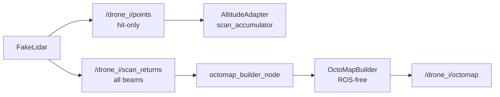

# Phase 3：多机未知探索与地图融合（swarm_controller）

> **状态：** 🟡 进行中（3-1～3-5 / M1 已完成；下一步 3-6；分支 `phase/3-swarm-controller`）
> **上级摘要：** [`docs/xenomorph-scanner-plan.md`](../xenomorph-scanner-plan.md) §6 Phase 3  
> **依赖：** Phase 1 [`phase-01-cave-world.md`](phase-01-cave-world.md)、Phase 2 [`phase-02-drone-scanner.md`](phase-02-drone-scanner.md)  
> **工程约定：** [`AGENTS.md`](../../AGENTS.md)（含 §5.1 Git 分步提交）

---

## 目标与产出

**目标：** 在**不假定洞穴拓扑 / 出口已知**的前提下，多架无人机根据已观测地图探索未知区域；扫描几何采用**可俯仰垂直环**消除正前盲区；用 **OctoMap** 表达自由 / 占用 / 未知；任务规划派机探索；融合为全局地图。

**产出：**

- 包 `swarm_controller`：观测地图、探索策略、多机调度、地图融合（算法库 + 薄节点）
- `drone_scanner` 扩展：`ring_pitch` 俯仰环、高度自适应
- `/global_map`（OctoMap 或等价全局观测）
- `launch` 一键多机入口（`num_drones:=3`）
- RViz：多机 + 全局图；`/cave/points` 仅作对照，**不参与**规划

**明确不做（主路径）：**

- ❌ 按真值「外环 / 直连 / 右廊 / 出口」预分配航线作为验收路径
- ❌ 从 `ICaveField` / 中轴线抄整条飞行廊道给规划用
- ❌ Mesh 导出（Phase 4）、Gazebo、2D `slam_toolbox` 主路径
- ❌ 以「纯点云列表、不维护未知」作为探索主地图（主路径直接用 OctoMap）

---

## 原则（与 Phase 1/2 的契约）

| 原则 | 说明 |
|------|------|
| 真值保密 | `ICaveField` 仅供 `fake_lidar` raycast 造数；规划 / 调度不得依赖拓扑真值 |
| 未知探索 | 「岔路通到哪」由任务规划派机扫出来，不是建图凭空知道 |
| 航线在线 | 轨道 = 探索目标 + 高度自适应（+ 最小避障）；非整条预设廊道 |
| 前视 | 垂直环 **俯仰倾斜（方案 A）**，`num_beams` 不变 |
| 观测地图 | **OctoMap 直接实现**（hit=占用，射线中段 / 未命中至 max_range=自由，其余=未知） |

---

## 扫描几何：可俯仰垂直环（方案 A）

Phase 2 默认环在 **YZ**（法向沿机头 +X），正前方无 beam，探索时前视全盲。

**Phase 3 主路径：** 同一圈 beam 数不变，将扫描平面相对机头 **前倾**（参数 `ring_pitch_rad`）：

| `ring_pitch_rad` | 行为 |
|------------------|------|
| `0` | 兼容 Phase 2 纯 YZ |
| 默认建议 `≈0.35`（约 20°） | beam 带 +X 分量，斜前方可观测 |

高度估计仍可用环上接近顶/底的命中；策略与避障依赖前倾后的斜前方信息。

---

## 分层与数据流

```text
ICaveField（真值）──仅造数──► FakeLidar（俯仰环）
                                    │
                    ┌───────────────┼───────────────┐
                    ▼               ▼               ▼
              高度自适应         OctoMap 更新      /points（可视化）
              （顶/底 → z）    free/occ/unknown
                                    │
                                    ▼
                         IExplorationStrategy / 多机调度
                                    │
                                    ▼ goal
                         执行：短移 + 最小避障 + 高度自适应
                                    │
                                    ▼
                               /global_map
```

| 层 | 职责 | 建议归属 |
|----|------|----------|
| 俯仰环 + 高度自适应 | 感知与单机运动 | `drone_scanner` |
| OctoMap 观测、策略、调度、融合 | 探索与协同 | `swarm_controller` |
| `ITrajectory` / fake_odom | 执行短段运动 | `drone_scanner`（复用） |

---

## 任务清单与进度

| 步 | 内容 | 状态 | 建议 commit |
|----|------|------|-------------|
| 3-1 | 环面俯仰倾斜 `ring_pitch`（方案 A） | ✅ | `phase3(step1): pitched vertical ring` |
| 3-2 | 高度自适应 | ✅ | `phase3(step2): altitude adaptation` |
| 3-3 | OctoMap 观测地图（含未命中 beam free 雕刻） | ✅ | `phase3(step3): octomap observation` |
| 3-4 | `IExplorationStrategy`（单机选目标） | ✅ | `phase3(step4): exploration strategy` |
| 3-5 | 单机探索闭环 + **最小避障** | ✅ | `phase3(step5): single-drone explore loop` |
| 3-6 | 多机 launch（`num_drones:=3`） | ⬜ | `phase3(step6): multi-drone launch` |
| 3-7 | 多机任务调度（未知分配） | ⬜ | `phase3(step7): swarm task allocation` |
| 3-8 | `/global_map` 融合 | ⬜ | `phase3(step8): global map merge` |
| 3-9 | 更强短程/全局路径规划 | ⬜ 按需 | `phase3(step9): path planner` |
| 3-10 | 一键 swarm + 测试 + 文档验收 | ⬜ | `phase3(step10): swarm entry and tests` |

**主路径达标：** 3-1～3-8。  
**里程碑：** M1 = 3-1～3-5（单机自主探索）；M2 = 3-6～3-8（多机 + 全局图）。

---

## Step 3-1：环面俯仰倾斜

### 设计

- `FakeLidar` 增加 `ring_pitch_rad`：扫描平面绕机体 +Y（或等价）前倾
- beam 方向在 `lidar_link` 下带前向分量；`num_beams` / `max_range` 语义不变
- launch / 节点参数可覆盖；`0` 保持 Phase 2 行为

### 验收

- 默认前倾时，单帧点云在机头斜前方有命中
- `ring_pitch:=0` 回归纯 YZ
- 现有 FakeLidar gtest 扩展覆盖俯仰情形

---

## Step 3-2：高度自适应

### 设计

- 用当前环扫估计**最近上方 / 最近下方障碍**，形成可飞高度带（相对旧式裸 min/max 更稳，仍属通用启发式）
- 将飞行高度保持在安全中带；**不读**真值中轴
- 逻辑放在 `drone_scanner`：`AltitudeAdapter`（ROS-free）+ `fake_odom` 订阅同 namespace `points` 覆盖轨迹 `z`
- 两层平滑（见下）：**EMA** 平滑「看见的顶/底」；**按时间限速** 平滑「飞机实际跟高度」
- **接线约束：** hits 必须用**扫描时**机体 z 解释；EMA **仅在新扫描帧**更新；过期帧丢弃（`points_stale_sec`）
- **几何校验：** `vertical_dot_min < cos(ring_pitch)`，否则禁用高度自适应并打 ERROR
- **成对样本：** 上、下近垂向 hit 都要有，否则本帧 invalid（hold 上一高度）

### 当前范围 vs 未来特性

| | 内容 |
|--|------|
| **Phase 3-2 当前验收** | 管状 / 截面缓变洞穴：高度跟随平滑、几何校验、扫描时 z 绑定、EMA 仅新帧、成对样本 |
| **明确不作为本步验收** | 钟乳石 / 石笋林、竖井、大侧厅、稀疏凸起「透过空隙看到真顶」等复杂局部几何的完备避障 |

**未来特性（非本步交付）：**

- 钟乳石 / 石笋等尖状凸起的专用净空与通过策略（含更强鲁棒统计、局部障碍图）
- 竖井 / 岔口侧壁离群 hit 的场景化过滤与置信度
- 将 `AltitudeBand` + `valid` 作为正式接口交给探索 / 避障，并约定与 `goal.z` 的仲裁
- 机体 roll/pitch 非零时的完整姿态投影（当前假设无倾斜）

当前「最近上/下障碍」可作为上述场景的**弱基线**（例如稀疏石林时比裸 `max` 估真顶更不易穿尖），但**不宣称**已覆盖钟乳石完备安全；复杂场景留待后续特性迭代。

### 平滑机制 1：EMA（指数滑动平均）

**EMA = Exponential Moving Average。** 把本帧测量与上一帧平滑值按比例混合，减轻单帧扫描噪声 / 截面突变带来的顶底跳变。

```text
平滑值 = α × 本帧测量 + (1 − α) × 上一帧平滑值
```

| 项 | 说明 |
|----|------|
| 作用对象 | 估计出的 `floor_z` / `ceiling_z`（不是机体 `z` 本身） |
| 参数 | `altitude_adapt.band_ema_alpha`（代码：`band_ema_alpha`） |
| 默认 | `0.25` |
| α 越大 | 越跟新测量，反应快，更容易抖 |
| α 越小 | 越信历史，更稳，跟截面变化更慢 |

例：洞底估计从 `0` 突然跳到 `-1`，α=0.25 时下一帧平滑底约为 `-0.25`，不会一步跳满。

### 平滑机制 2：按时间限速

即使目标高度（顶底中带）已算出，机体 `z` 也不允许一帧贴过去，而是限制竖直速度：

```text
max_dz = max_vertical_speed × dt
新高度 = 当前高度 + clamp(目标 − 当前, −max_dz, +max_dz)
```

| 项 | 说明 |
|----|------|
| 作用对象 | 机体飞行高度 `z`（`fake_odom` 发布的位姿） |
| 参数 | `altitude_adapt.max_vertical_speed` |
| 默认 | `0.6` m/s |
| `dt` | 两次 `fake_odom` 定时器回调的时间差（与发布频率解耦） |
| 为何需要 | 若每帧直接跳到目标，噪声与截面突变会让飞机上下阶跃；旧式固定 `max_step` 还会和 Hz 绑死（例如每 tick 0.15 m @ 20 Hz ≈ 3 m/s） |

### 两者分工

| 机制 | 管什么 |
|------|--------|
| **EMA** | 「看见的顶/底」别一帧跳变 |
| **按时间限速** | 「飞机实际跟高度」别跟得太猛 |

调参：更稳 → 减小 `band_ema_alpha` / `max_vertical_speed`；跟得更快 → 调大。

### 相关参数（launch / 节点）

| 参数 | 默认 | 说明 |
|------|------|------|
| `altitude_adapt.enable` | `true` | 是否启用高度自适应 |
| `altitude_adapt.target_fraction` | `0.5` | 0=贴底，1=贴顶；默认走廊中带 |
| `altitude_adapt.min_clearance` | `0.35` | 相对顶/底至少保留的净空 (m) |
| `altitude_adapt.band_ema_alpha` | `0.25` | 顶/底 EMA 系数（仅新扫描帧更新） |
| `altitude_adapt.max_vertical_speed` | `0.6` | 竖直 \|vz\| 上限 (m/s) |
| `altitude_adapt.min_band_height` | `0.8` | 顶底间距过小则本帧无效 |
| `altitude_adapt.vertical_dot_min` | `0.65` | 筛近垂向 beam |
| `altitude_adapt.ring_pitch_rad` | 与 `ring_pitch_rad` 同步 | 几何兼容校验 |
| `altitude_adapt.points_stale_sec` | `0.5` | 扫描帧过期丢弃阈值 (s) |

### 验收

- 截面起伏时 `z` 跟随变化，无大幅阶跃抖动（RViz 目检；以管状 / 缓变洞为主）
- 可在 Phase 2 一键 launch 上先单机验证，不依赖 OctoMap
- gtest：`TestAltitudeAdapter`（含 EMA / 限速 / 几何校验 / 扫描原点 z）
- **不要求**本步通过钟乳石等复杂凸起场景的完备目检（见「未来特性」）

---

## Step 3-3：OctoMap 观测地图

### 目标

建立单机 OctoMap 观测后端：

- hit endpoint → `occupied`
- hit 前段 → `free`
- miss ray 到 `max_range` → `free`
- miss endpoint **不标 occupied**
- 未被任何 ray 覆盖 → `unknown`

本步只做**单机观测地图**，不做 frontier、多机融合、探索闭环。

### 数据流



### 保持旧接口不破坏

`/drone_i/points` 继续只表示 **hit-only 点云**。它仍服务于：

- `AltitudeAdapter`：估计顶 / 底时只应看到真实命中点
- `scan_accumulator`：只累积真实墙点
- RViz 现有点云显示

**不得**把 miss endpoint 混入 `/points`，否则会产生 `max_range` 虚假壳层，并污染高度自适应。

`FakeLidar::scan()` 保持现有语义：只返回命中点。新增全 beam API：

```cpp
std::vector<LidarReturn> scanReturns(const Pose3D& lidar_pose_in_map) const;
```

### 全 beam 返回结构

在 `drone_scanner` 中新增：

```cpp
struct LidarReturn {
    float x;
    float y;
    float z;
    float range;
    bool hit;
};
```

坐标语义：

| 字段 | 含义 |
|------|------|
| `x/y/z` | `lidar_link` 系 endpoint |
| `range` | hit 时为实际距离；miss 时为 `max_range` |
| `hit` | `true` = 真实障碍命中点；`false` = max_range 虚点，只表示 ray 沿途 free |

`scanReturns()` 每个 beam 必有一条 return：

- raycast 命中 → `hit=true`
- raycast 未命中 → endpoint = beam direction × `max_range`，`hit=false`

### `FakeLidarNode` 发布两个话题

每帧只做一次全 beam scan：

```text
returns = fake_lidar.scanReturns(pose)
```

然后拆成两个输出：

| 话题 | 内容 | 消费者 |
|------|------|--------|
| `/drone_i/points` | 仅 `hit=true` 的点 | `AltitudeAdapter`、`scan_accumulator`、RViz |
| `/drone_i/scan_returns` | 全 beam return | `octomap_builder_node` |

### `/scan_returns` PointCloud2 字段契约

固定字段，避免隐式约定：

| 字段 | 类型 | 含义 |
|------|------|------|
| `x` | `FLOAT32` | endpoint x，`lidar_link` 系 |
| `y` | `FLOAT32` | endpoint y |
| `z` | `FLOAT32` | endpoint z |
| `range` | `FLOAT32` | hit distance 或 `max_range` |
| `hit` | `UINT8` | `1=hit`，`0=miss` |
| `intensity` | `FLOAT32` | 调试显示用，`hit ? 1.0 : 0.0` |

要求：

- `header.frame_id = lidar_link`
- `header.stamp` = 该帧扫描使用的 TF 时刻
- `width == num_beams`
- beam 顺序稳定

### TF 时间戳一致性

`FakeLidarNode` 扫描时必须保证：

- 用某一时刻 `stamp` 查 `map -> lidar_link`
- 用同一个 `stamp` 发布 `/points` 和 `/scan_returns`

`octomap_builder_node` 订阅 `/scan_returns` 后：

- 用 `msg.header.stamp` 查 `map <- msg.header.frame_id`
- 同一帧所有 endpoint 使用同一个 transform
- origin 使用该 transform 的平移
- endpoint 从 lidar frame 变换到 map frame

### `swarm_controller` 包结构

```text
ws/src/swarm_controller/
├── include/swarm_controller/
│   ├── OctoMapBuilder.hpp
│   └── RayReturn.hpp
├── src/
│   ├── OctoMapBuilder.cpp
│   ├── OctoMapBuilderNode.cpp
│   └── OctoMapBuilderMain.cpp
├── test/
│   └── TestOctoMapBuilder.cpp
├── launch/
│   └── octomap_builder_launch.py
├── CMakeLists.txt
└── package.xml
```

遵循仓库约定：算法库 ROS-free，节点只做消息转换、TF、参数与发布。

### ROS-free `OctoMapBuilder`

```cpp
enum class CellState {
    Unknown,
    Free,
    Occupied,
};

struct RayReturn {
    Point3f endpoint;
    float range;
    bool hit;
};

class OctoMapBuilder {
public:
    explicit OctoMapBuilder(float resolution);

    void insertScan(
        const Point3f& origin_map,
        const std::vector<RayReturn>& returns_map);

    CellState query(float x, float y, float z) const;

    std::size_t occupiedCount() const;
    std::size_t knownCount() const;

    const octomap::OcTree& tree() const;
};
```

### OctoMap 插入语义

#### hit ray

```text
origin -> endpoint 前段：free
endpoint：occupied
```

#### miss ray

```text
origin -> endpoint：free
endpoint 不 occupied
```

不能把全 beam endpoint 直接传给 `insertPointCloud()`，因为 miss endpoint 会被当成 occupied。

推荐使用 `computeRayKeys(origin, endpoint, keys)` / key-level update 自控语义：

- ray keys → free
- hit endpoint → occupied
- miss endpoint → 不 occupied

### `octomap_builder_node`

订阅：

```text
/drone_i/scan_returns
```

QoS：`SensorDataQoS`

处理流程：

```text
PointCloud2 scan_returns
    -> 解析 x/y/z/range/hit
    -> TF: map <- lidar_link @ msg.header.stamp
    -> endpoint_lidar -> endpoint_map
    -> origin_map = TF translation
    -> OctoMapBuilder::insertScan()
```

发布：

```text
/drone_i/octomap
```

类型：`octomap_msgs/msg/Octomap`

插入频率跟随扫描帧；OctoMap 发布频率独立限制，默认 `2.0 Hz`。

### 参数

| 参数 | 默认 | 说明 |
|------|------|------|
| `map_frame` | `map` | OctoMap frame |
| `input_topic` | `scan_returns` | 输入全 beam topic |
| `output_topic` | `octomap` | 输出 OctoMap |
| `resolution` | `0.1` | OctoMap 分辨率 |
| `publish_rate` | `2.0` | OctoMap 发布频率 |
| `max_range` | `30.0` | 与 lidar 保持一致，用于校验 / 裁剪 |

### Launch

新增：

```text
swarm_controller/launch/octomap_builder_launch.py
```

用于单机验证：

- include `drone_scanner` 的 `fake_lidar_launch.py`
- 启动 `/drone_0/octomap_builder`
- `GroupAction(scoped=True)` 隔离内层 Phase 2 launch 参数，避免覆盖外层 `show_rviz_map`
- `show_rviz_map:=true` 启动 `swarm_controller/config/octomap_map.rviz`
- RViz 使用 `octomap_rviz_plugins/OccupancyGrid` 显示三维 occupied voxels（不是二维 `OccupancyMap` 投影）
- 同一界面保留洞穴真值 `/cave/points` 与 hit-only `/drone_0/cloud_map`，用于空间对照

ROS 2 Jazzy 当前镜像中的 `liboctomap_rviz_plugins.so` 未声明 `liboctomap.so` 动态依赖；仅对
OctoMap RViz 进程设置 `LD_PRELOAD=liboctomap.so`，避免 `OcTreeStamped` 符号加载失败，不影响其他节点。

命令示例：

```bash
ros2 launch swarm_controller octomap_builder_launch.py
```

### 测试

#### `FakeLidar` gtest

- `scan()` 仍只返回 hit
- `scanReturns()` 返回数量等于 `num_beams`
- hit beam：`hit=true`
- miss beam：`hit=false`，`range=max_range`
- miss endpoint 不进入 `/points`

#### `FakeLidarNode` 集成测试

- `/points` 只含 hit
- `/scan_returns` 含全 beam
- PointCloud2 字段完整：`x/y/z/range/hit/intensity`
- `width == num_beams`

#### `OctoMapBuilder` gtest

合成场景：

```text
origin = (0,0,0)
ray1: hit at (3,0,0)
ray2: miss to (0,3,0)
```

断言：

| 点 | 期望 |
|----|------|
| `(3,0,0)` | occupied |
| `(1,0,0)` | free |
| `(0,1,0)` | free |
| `(0,3,0)` miss endpoint | not occupied |
| `(5,5,5)` | unknown |

#### `octomap_builder_node` 测试

- `/drone_0/octomap` 在发布
- 消息 `header.frame_id == map`
- OctoMap 可反序列化

### 验收

- `/drone_0/points` hit-only 语义不变
- `/drone_0/scan_returns` 每帧包含所有 beam
- OctoMap 中：
  - 洞壁为 occupied
  - 飞过廊道为 free
  - 未扫区域保持 unknown
- miss endpoint 不形成虚假 occupied 壳层
- RViz 可显示 `/drone_0/octomap`
- gtest / launch_testing 通过

### 实现与验证结果（2026-07-10）

- ✅ `FakeLidar::scanReturns()` 保留全部 hit / miss beam；原 `/points` 继续保持 hit-only
- ✅ 新建 `swarm_controller` 包及 ROS-free `OctoMapBuilder`
- ✅ `/drone_0/octomap` 按扫描帧时间戳与 `map <- lidar_link` TF 构建并定频发布
- ✅ 超量程 hit 裁剪后按 miss/free ray 处理，不在 `max_range` 制造虚假 occupied
- ✅ `PointCloud2` 固定校验 `x/y/z/range/intensity: FLOAT32`、`hit: UINT8`、`count=1`
- ✅ 三维 RViz 目检通过：低处到高处按 Z 轴着色显示地面、侧壁与洞顶 occupied voxels
- ✅ `TestFakeLidar`、`test_fake_lidar_integration.py`、`TestOctoMapBuilder`、
  `test_octomap_builder_integration.py` 通过
- ✅ GPT 5.5 high 评审及复核完成，所报高/中/低风险问题均已修复

### 依赖

```bash
sudo apt install -y \
  ros-jazzy-octomap \
  ros-jazzy-octomap-msgs \
  ros-jazzy-octomap-rviz-plugins
```

### 明确不做

- 多机 `/global_map`
- frontier / `IExplorationStrategy`
- 探索闭环
- 最小避障
- 钟乳石 / 石笋专用逻辑
- Mesh / terrain display

### 实施顺序

```text
1. FakeLidar 新增 LidarReturn + scanReturns()
2. FakeLidarNode 保留 /points，新增 /scan_returns
3. 补 FakeLidar / FakeLidarNode 测试
4. 新建 swarm_controller 包骨架
5. 实现 OctoMapBuilder 算法库
6. 补 OctoMapBuilder gtest
7. 实现 octomap_builder_node
8. 增加单机 launch
9. 容器内 build/test
10. GPT 5.5 代码评审
11. 修评审问题
12. 目检
13. 提交 phase3(step3)
```

---

## Step 3-4：`IExplorationStrategy`

> **实现状态：** ✅ 已完成；ROS-free `swarm_exploration` 库与确定性合成 OctoMap 测试已通过。

### 目标与边界

从当前位姿与只读 OctoMap 中选择下一探索目标，为 3-5 单机闭环提供决策：

```text
GoalSelectionRequest（Pose3D + rejected_cluster_ids）
    + const octomap::OcTree
    → FrontierExplorationStrategy
    → GoalSelectionResult（map 系）
```

- 本步只做 ROS-free 目标选择，不新增运行期节点
- 3-5 负责 ROS 消息转换、短移执行、直线路径避障、拒绝目标集合、重规划与主动重扫
- **禁止**读取洞穴真值拓扑 / 中轴线 / 出口列表
- 直接依赖 `const octomap::OcTree&`；OctoMap 是便宜、可直接构造的算法数据，不额外引入 `IMapView`

### 3-3 前置加固

frontier 会放大地图中的假孔洞，因此实现策略前先修正 `OctoMapBuilder::insertScan()`：

- 一帧先汇总 `free_keys` 与 `occupied_keys`
- 从 free 集合删除 occupied key
- 每个 key 每帧只更新一次，且 occupied 优先
- miss endpoint 继续保持 unknown

这与 OctoMap `computeUpdate()` 的 occupied-preferred 语义一致，可避免相邻 beam 在同一帧把真实墙点抵消成 free。

新增回归断言：

- miss endpoint 明确为 `Unknown`
- 同一 voxel 被一束 beam 命中、另一束 beam 穿过时，结果仍为 `Occupied`

### ROS-free 接口

新增通用类型：

```text
Point3f.hpp
Pose3D.hpp
IExplorationStrategy.hpp
FrontierExplorationStrategy.hpp/.cpp
```

`RayReturn.hpp` 收为复用通用 `Point3f`。`GoalSelectionRequest` 携带当前位姿和 3-5
传入的 `rejected_cluster_ids`；成功结果同时返回目标点和稳定 cluster ID，避免路径失败后
确定性策略反复返回同一目标。策略状态为：

```cpp
enum class GoalSelectionStatus {
    Success,
    InvalidInput,
    NoKnownFree,
    NoFrontier,
    NoSafeCandidate,
};
```

`Success` 时目标及机体占用体积必须全部为 known-free，且与当前位置有有效距离。接入 3-5
后，策略还使用统一 `KnownFreePathChecker` 检查当前位姿到候选的完整直线路径，只返回当前
地图中整段 known-free 的目标；controller 在下发前及 fresh observation 到来后继续复查，
形成防御性安全兜底。其他状态供 3-5 决定等待、原地转向重扫或换策略，不能把
`NoFrontier` 直接解释为探索完成。

### 3D frontier 定义

在当前位姿附近局部 BBX 中只遍历已知 free leaf；若遇到 coarse leaf，再展开成
`tree.getResolution()` 的 full-resolution key，避免对大块 unknown 空间做立方穷举。
某 voxel 是原始 frontier 当且仅当：

1. 当前 voxel 已知且为 free
2. 6 个面邻居中至少一个为 unknown
3. 位于当前位姿的局部规划窗口内

只用 6 邻域判定，避免 26 邻域把墙角对角 unknown 误认为可进入方向。frontier 的基本单位是
**free voxel 与 unknown 面邻居之间的 face**；物理面积按
`unknown_face_count × resolution²` 计算，不能直接用 voxel 数代替。

### 聚类与安全目标

1. 对原始 frontier 做 6 连通聚类
2. 删除面积过小的单 beam / 小孔噪点
3. 删除距离当前位置过近的伪目标
4. 根据 frontier face 的 unknown 法向过滤地面 / 顶棚 frontier（可配置，未来竖井场景可放宽）
5. 不直接使用 cluster 质心，也不依赖可能相互抵消的 cluster 平均法向
6. 逐 frontier face 沿其明确 unknown 法向向已知区后退 `goal_standoff`
7. 以稳定 key 顺序在后退位置附近选取目标
8. 目标周围按机体半径 / 半高检查 3D 球体或圆柱体，覆盖 voxel 必须全部 known-free
9. 目标 z 仅按几何候选与垂直变化代价选择；3-4 没有 `AltitudeBand`，不得声称知道“安全高度”
10. 候选按 full-resolution `OcTreeKey` 去重，同一位置仅保留稳定评分更优的 cluster 关联
11. 唯一候选稳定排序后逐个检查完整 known-free 路径；高分点被阻断时继续尝试次优候选，
    不得因同 cluster 首选失败而丢弃该 cluster 的其他可达点

初始建议配置：

| 参数 | 初值 | 含义 |
|------|------|------|
| `min_goal_distance` | `0.8 m` | 排除当前位置附近 frontier |
| `max_goal_distance` | `4.0 m` | 只生成短程局部目标 |
| `goal_standoff` | `0.6 m` | 从 unknown 边界退回已知区 |
| `robot_radius` | `0.25 m` | 无人机水平包络半径 |
| `robot_half_height` | `0.15 m` | 无人机垂直包络半高 |
| `safety_margin` | `0.25 m` | 水平 known-free 余量 |
| `vertical_margin` | `0.20 m` | 垂直 known-free 余量 |
| `min_cluster_area` | `0.2 m²` | 过滤小孔 / 离散噪点 |
| `max_abs_frontier_normal_z` | `0.6` | 过滤地面 / 顶棚方向 |

局部枚举窗口必须至少覆盖 `max_goal_distance + goal_standoff + clearance`；构造时校验所有配置
有限、范围合法且窗口覆盖上述边界，运行时按实际 OctoMap resolution 枚举 full-resolution key。

### 评分与确定性

对安全 cluster 使用以下因素评分：

- frontier 面积 / unknown 面数量：信息收益
- 与当前位置距离：短移成本
- 目标高度变化：抑制追逐地面 / 顶棚
- 当前 yaw 对目标方向：小幅朝向奖励

排序必须稳定：总分 → 信息收益 → 距离 → stable cluster ID / key 字典序；不得依赖随机数或
无序容器迭代顺序。stable cluster ID 使用 cluster 内字典序最小 full-resolution key；
3-5 可把该 ID 加入本轮 rejected 集合。

### 单环扫描限制与恢复契约

当前前倾单环每帧只在一个倾斜平面内产生 free 观测，可能形成扫描薄面两侧的伪 frontier；
经过法向、物理面积和 3D known-free 净空过滤后，也可能没有候选。因此：

- 3-4 允许返回 `NoFrontier` / `NoSafeCandidate`
- 3-5 必须实现 `无候选 → 分段原地 yaw 重扫 → 地图更新 → 重选`
- 重扫达到次数 / 角度上限仍失败时悬停并上报，不把 unknown 当 free 强行推进
- 端到端验证若证明 yaw 重扫仍不足，再单独评估 pitch 摆扫或多 pitch 环；不在 3-4 提前扩展传感器

### 文件与构建

新增：

```text
include/swarm_controller/Point3f.hpp
include/swarm_controller/Pose3D.hpp
include/swarm_controller/IExplorationStrategy.hpp
include/swarm_controller/FrontierExplorationStrategy.hpp
src/FrontierExplorationStrategy.cpp
test/TestFrontierExplorationStrategy.cpp
```

CMake 新增独立 ROS-free 静态库 `swarm_exploration`，继续链接 OctoMap；3-4 不增加 launch test。

### 测试

合成确定性 OctoMap，覆盖：

- 封闭隧道仅 +X 开口：目标位于开口内侧的已知 free standoff
- 多个 frontier：按收益 / 距离配置选择预期 cluster
- 不同 OctoMap resolution：物理面积阈值行为一致
- 近身 frontier：不得返回当前位置
- 地面 / 顶棚 frontier：默认失败、放宽法向阈值成功的配对测试
- 墙面小孔：默认面积阈值失败、降低阈值成功的配对测试
- unknown 进入机体包络：无 occupied 干扰时仍不得返回 `Success`
- 多面 cluster 法向抵消：按独立 frontier face 仍能稳定生成或拒绝候选
- rejected cluster：选择下一个候选，不重复返回失败目标
- 空地图、无 frontier、全部候选不安全：返回对应失败状态
- 非有限 pose / 非法配置：返回 `InvalidInput` 或构造失败
- 改变节点插入顺序：选择结果保持一致

### 验收

- 目标来自 free–unknown 边界附近，但目标自身位于已知 free
- 目标满足最小距离、物理 cluster 面积和 3D known-free 机体净空
- 不选择地面 / 顶棚或墙孔伪 frontier
- rejected cluster 不会在同一轮再次返回
- 相同地图与位姿输出确定
- 零 ROS 依赖、零洞穴真值依赖
- `TestFrontierExplorationStrategy` 11 项与 `TestOctoMapBuilder` 3 项回归测试通过

---

## Step 3-5：单机探索闭环 + 最小避障

> **实现状态：** ✅ 已完成；实现与修复已经 GPT-5.6 Terra Medium 代码评审及复核，
> ROS-free 单测、launch_testing、连续 yaw 覆盖风险探针和无 RViz 端到端启动均已验证。
> RViz 目检确认：无预设整廊航线时，单机可自主短段推进并持续扩展 OctoMap（M1 闭环打通）。

### 目标与边界

把 3-3 观测地图与 3-4 目标选择接成单机自主闭环：

```text
scan_returns → dirty OctoMap observation
                       │
odom + OctoMap ────────┴─→ SingleDroneExplorer
                                  │
                         known-free path check
                                  │
                         motion_goal / yaw rescan
                                  │
                         fake_odom → TF → fake_lidar
```

- 无整廊预设轨迹；启动后在入口悬停建初图，再由在线 frontier 目标驱动
- 只实现当前位姿到短程目标的 known-free 直线检查；unknown 与 occupied 都不可通行
- 不实现 A*、长路径或多机调度；A* 留 3-9，多机从 3-6 开始
- 不读取 `ICaveField`、洞穴中轴线、分叉或出口真值
- `NoFrontier` 不能直接解释为探索完成；当前单环观测不足时必须先主动重扫

### 入口停滞修复（2026-07-11）

固定 OctoMap 快照确认原实现存在三项相互放大的问题：1853 个局部候选只有 734 个唯一
voxel；整段路径检查发生在策略返回后，每拒绝一个 cluster 都会重复完整 frontier 提取；
入口部署方向没有成为约束，入口外侧高收益 frontier 可把无人机带回入口后方。修复方案经
GPT-5.6 Terra Medium 方案评审后采用：

1. `GoalSelectionRequest` 可携带 ROS-free 的 XY 前向半空间约束。Explorer 在首次有效
   map-frame 位姿锁存入口原点和 yaw，并以实际到达过的最大前向进度推进 no-retreat 平面；
   默认只允许 `dot(candidate.xy - plane_origin.xy, heading.xy) >= -backward_margin`。
   候选朝向评分也使用锁存的部署 yaw，不跟随主动重扫 yaw 旋转。该规则不硬编码 `+X`、
   不读取洞穴真值，且绑定 explorer 实例生命周期；地图坐标重置时必须重启会话。
2. `GoalSelectionRequest` 同时携带具名 fixed-altitude 约束。策略把候选 XY 投影到当前实际 z，
   并对同一个 effective candidate 完成局部净空、评分、整段检查和返回，避免策略检查的 3D
   goal 与 controller 实际执行的 fixed-z goal 不一致。
3. 候选以投影后的 full-resolution `OcTreeKey` 去重；重复 key 保留稳定评分更优的关联，调试 Marker
   只显示唯一候选。
4. 策略对唯一候选做稳定全局排序并逐个调用 `checkSegment()`；首选阻断后继续检查次优点，
   直至找到可达目标或耗尽候选。Explorer 保留下发前复查和移动中的 fresh-map 复查。
5. 不在本次修复中改 LiDAR 模型、放宽 unknown、增加 pitch 扫描或加入洞穴中轴真值。
   先以固定快照与完整 launch 验证候选数量、segment 检查次数、选择耗时和前向位移。

### 分层与新增组件

#### `drone_scanner`：可命令短段运动

新增 ROS-free `PoseSegmentTrajectory`，继续实现现有 `ITrajectory`：

- 输入起点 / 终点 `Pose3D`、平移速度上限和 yaw 速度上限
- yaw 使用 `[-π, π]` 最短角插值
- `duration = max(xy_distance / linear_speed, abs(yaw_delta) / yaw_rate)`
- 支持平移 + yaw、纯平移、纯 yaw 与零长度 hold
- 输出平面速度向量和 `angular.z`；各自不得超过配置上限
- 非有限位姿或非正速度配置构造失败

`FakeOdomNode` 增加 `motion.mode=line|goal`：

- 默认仍为 `line`，Phase 2 行为及现有测试不变
- 3-5 使用 `goal`：从 `line.start_*` 初始位姿悬停，订阅 `motion_goal`
- 每个新目标从最新实际发布位姿构造 `PoseSegmentTrajectory`
- 不同目标采用 last-goal-wins 抢占；重复等价目标不得重置段起点或开始时间
- 到达目标后锁存位姿并发布零 twist
- 任意方向速度先从 `map/odom` 旋转到 `base_link` 再写 Odometry；纯 yaw 线速度为零
- 3-5 设置 `stop_scan_when_trajectory_done=false`，短段结束后 LiDAR 继续扫描

`motion_goal` 使用 `geometry_msgs/msg/PoseStamped`，契约固定为：

- QoS：reliable + transient-local，depth 1；执行端锁存最后一条合法命令
- `header.frame_id=map`；Phase 3 仿真继续依赖既有 `map→odom` static identity
- 位置 / 四元数必须有限，四元数可归一化；非法 frame / 数值拒绝
- goal 模式只执行 XY + yaw，`position.z` 不作为高度命令
- controller 只在状态转换或目标数值改变时发布，不按控制频率重复创建相同段
- hold 命令 = 采样当前实际 XY / yaw 后发布的零段目标；不得在同一 tick 后立刻覆盖

#### 高度仲裁

3-5 明确采用 **XY + yaw 目标，高度由 `AltitudeAdapter` 独占**：

- 悬停和纯 yaw 重扫时允许 `AltitudeAdapter` 调整 z
- XY 平移开始时冻结最新实际 z；整个平移段保持 fixed-z
- 开始平移前，必须等待实际 `|vz|` 低于停止阈值，再按该实际 z 检查整段 swept body
- frontier 的 3D goal 只提供候选 XY；controller 构造
  `effective_goal=(strategy_goal.x, strategy_goal.y, current_actual_z)`
- 到达条件只检查 XY 距离和 yaw；不等待被高度适配器覆盖的 `strategy_goal.z`
- 固定高度整段已由当前 OctoMap 证明 known-free，因此平移期间不再做未批准的 z 跟随

#### `swarm_exploration`：统一安全检查

新增 ROS-free `BodyEnvelopeConfig` 与 `KnownFreePathChecker`：

- 机体包络为水平半径 + margin、垂直半高 + vertical margin 的圆柱
- `bodyIsKnownFree()` 检查与真实圆柱相交的所有 full-resolution voxel
- 离散化采用保守膨胀：水平至少半个 voxel 对角线，垂直至少半个 voxel
- `checkSegment()` 包含起点 / 终点，沿程采样间距不大于 `resolution / 2`
- 任一覆盖 voxel 为 unknown 或 occupied 即失败
- 返回 `Safe / UnknownBlocked / OccupiedBlocked / InvalidInput` 与首个阻塞位置
- `FrontierExplorationStrategy` 的目标局部净空改用同一 checker，避免两套安全语义

### Fresh observation 契约

控制状态不能把定时重复发布的同一地图当作新观测。修改 `OctoMapBuilderNode`：

1. 只有成功完成 TF、提取到非空 returns 并插入扫描，才递增 observation epoch
2. 记录最新已插入扫描的时间戳并设置 `dirty=true`
3. publish timer 只在 dirty 时发布一次 full OctoMap，随后清 dirty
4. `Octomap.header.stamp` 使用最新已插入扫描 stamp，不使用定时器当前时间
5. publisher 继续使用 transient-local，使晚启动 explorer / RViz 能收到最后地图

`SingleDroneExplorerNode` 只接受 `header.stamp` 严格递增的 OctoMap；重复或倒退 stamp
不得增加本地 observation epoch。这里的 fresh 表示**处理了更新扫描**，不承诺一定新增 voxel。

到达目标或完成 yaw 段的门控必须同时满足：

- observation epoch 严格大于事件发生时记录值
- `Octomap.header.stamp` 严格晚于对应 odom 到达时间

这样不会被事件前采集、事件后延迟发布的在途旧扫描误放行。

### ROS-free 单机状态机

新增 `SingleDroneExplorer`，构造时注入 `IExplorationStrategy`，直接组合
`KnownFreePathChecker`。输入为实际 map 位姿、Odometry 速度、只读 `OcTree`、
observation epoch / stamp 与单调时间；输出离散运动命令和 ROS-free 调试快照。

状态：

```text
WaitingForMap
    ↓
Selecting ──unsafe/rejected──→ Selecting
    │ safe
    ↓
Moving ──blocked/timeout──→ Stopping ──odom stopped──→ Selecting/Rescanning
    │ reached
    ↓
AwaitingFreshObservation ──fresh scan──→ Selecting

Selecting ──no candidate──→ Rescanning
Rescanning ──yaw reached + later fresh scan──→ Selecting / next yaw segment
Rescanning ──limit/stale/timeout──→ Stopping → HoveringFailure
```

#### 目标选择与 rejected 生命周期

- `rejected_cluster_ids` 与当前 observation epoch 绑定
- 同一 epoch 内每个 cluster 最多做一次全段路径检查
- 路径 blocked 时拒绝当前 goal 的 cluster ID，而不是阻塞 voxel
- 同 epoch 内继续请求下一个 cluster；达到上限或候选耗尽后进入重扫
- observation epoch 严格增加后清空 rejected，允许按新知识重新评估
- 到达目标后先 hold，并等待到达后的 fresh observation，再开始下一轮

#### 在线安全与停止确认

- 平移开始前检查当前实际 fixed-z 到 effective goal 的完整 swept body
- Moving 期间仅在 fresh observation 到来时复查剩余 fixed-z 路径
- 发现 unknown / occupied、运动超时或地图 stale 时，先发布 hold
- 进入 `Stopping` 后必须观察：
  - 平面线速度、垂直速度与角速度均低于阈值
  - 实际位姿接近已发布 hold 位姿
- 只有确认停止后才能发布下一运动目标
- hold 确认超时进入 `HoveringFailure`；不得在同一 tick 发布 hold 和替代目标

#### 主动 yaw 重扫

- `NoFrontier`、`NoSafeCandidate` 或同 epoch 候选耗尽时进入 `Rescanning`
- 每段保持 XY 不变，目标 yaw 增加 `π/4`
- 旋转过程中 fake_lidar 继续以 10 Hz 扫描，不是只采 8 个离散平面
- 实际 yaw 达标时记录 reached epoch 与 odom stamp
- 必须再收到 **yaw 达标之后采集** 的 fresh observation 才完成该段并重选
- epoch 先到、yaw 后到，或 yaw 到但没有更新扫描，都不得推进
- 最多 8 个成功完成的 yaw 段覆盖 360°；达到上限仍无候选则悬停失败
- map stale、yaw timeout 或 hold timeout 均安全失败，不把 unknown 当 free

### 默认参数

| 参数 | 初值 | 说明 |
|------|------|------|
| `control_rate` | `5 Hz` | explorer 状态机频率 |
| `motion.linear_speed` | `0.4 m/s` | XY 短段速度上限 |
| `motion.yaw_rate` | `0.5 rad/s` | yaw 速度上限 |
| `goal.position_tolerance` | `0.2 m` | XY 到达阈值 |
| `goal.yaw_tolerance` | `0.15 rad` | yaw 到达阈值 |
| `motion.timeout` | `20 s` | 单段运动超时 |
| `hold.timeout` | `2 s` | 停止确认超时 |
| `hold.linear_speed_max` | `0.02 m/s` | 线速度停止阈值 |
| `hold.angular_speed_max` | `0.03 rad/s` | 角速度停止阈值 |
| `map.stale_timeout` | `2 s` | 无 fresh observation 安全超时 |
| `rescan.yaw_step` | `π/4` | 单段重扫角 |
| `rescan.max_steps` | `8` | 最大成功重扫段数 |
| `max_rejections_per_epoch` | `16` | 同一观测图最多拒绝 cluster 数 |

所有非有限、非正范围及相互矛盾参数在算法构造或节点启动时拒绝。

### 策略诊断与 RViz

`IExplorationStrategy::selectGoal()` 增加可空的 ROS-free
`ExplorationDiagnostics*` 输出：

- 每次调用开始无条件 clear，失败状态不得残留上次数据
- 区分原始 frontier face、cluster / stable ID / 面积、rejected cluster
- 记录通过局部包络的候选与最终目标
- controller 追加全段路径状态、首阻塞点、当前状态与失败原因
- `max_debug_faces` / `max_debug_candidates` 按稳定 key 顺序截断，避免无上限复制

薄 `SingleDroneExplorerNode` 发布
`/drone_i/exploration_markers`（`visualization_msgs/msg/MarkerArray`）：

- frontier face / cluster
- locally-safe candidate 与 selected goal
- green / red path、unknown / occupied 首阻塞点
- rejected cluster
- Moving / Rescanning / Stopping / HoveringFailure 状态文字

Marker 全部在 `map`，每次先 `DELETEALL` 再发布完整当前快照，节点不得复制 frontier
或路径判定。RViz 同时显示 TF、3D OctoMap、可选 `cloud_map` 与 MarkerArray；
`/cave/points` 默认关闭，只能显式开启作人工对照。

### ROS 节点与 launch

`SingleDroneExplorerNode`：

- 订阅同 namespace `odom`
- 订阅 transient-local full `octomap`，只接受可反序列化的 `OcTree`
- 使用 TF 将 odom pose 转成 `map`
- 维护严格 observation epoch，按 5 Hz 驱动 core
- 仅在命令变化时发布 transient-local `motion_goal`
- 发布 `exploration_markers`

新增顶层 `single_drone_exploration.launch.py`。该入口需要组合既有 Python launch、
显式转换数值参数并设置 RViz 环境变量，因此采用 Python：

- 复用现有 fake LiDAR / OctoMap Python launch；复杂参数转换保留在既有文件
- 所有嵌套 include 参数显式传递并保持 scoped
- `fake_odom` 使用 goal mode，`fake_lidar` 持续扫描
- 闭环默认参数（与 `single_drone_exploration.launch.py` 一致）：
  `frontier.planning_radius=3.5 m`、`frontier.max_goal_distance=2.0 m`；
  另启用入口前向半空间约束（`entry.enforce_forward_half_space=true`，
  `entry.backward_margin=0.1 m`）。执行中仍按 fresh observation 复查剩余路径
- 启动 `single_drone_explorer` 与一份 `exploration.rviz`
- 默认关闭洞穴真值显示，提供显式目检开关

### 当前实际状况与已知局限（RViz 目检，2026-07-11）

M1 **闭环与安全契约已打通**；下列现象属于当前策略/执行形态，**不否定 3-5 完成**：

| 现象 | 原因（当前实现） | 是否本步缺陷 |
|------|------------------|--------------|
| `/drone_0/path`（`DronePath`）大量弯折、折线感强 | 每跳只选一个短程局部 frontier → `PoseSegmentTrajectory` 直线执行 → 到点再选；段间接缝方向常变 | 否；路径质量不在 3-5 验收内 |
| 轨迹「不连续」感（短 hop、左右交替） | `max_goal_distance=2.0 m` + `goal_standoff` 贴未知边界；侧墙 frontier 易赢过走廊中线；`heading_weight` 较弱 | 否；属 3-4 评分 / 后续 3-9 可改进 |
| 中途突然停住再换向 | Moving 中新观测使剩余段 unknown/occupied → Hold → 重选 | 否；最小避障契约 |
| 悬停时路径在 Z 向微抖 | 段间 `AltitudeAdapter` 调高；`path` 含 Z 采样 | 否；高度层职责 |
| 偶发 `Rescanning` / 长时间 `Selecting` | 无安全候选时分段 yaw 重扫；选目标在大候选集上较慢（诊断可见 `select` 耗时） | 否；设计内行为；性能可后续优化 |

**明确未做（留给后续步）：** 多路点平滑、走廊中线偏好、全局/更强短程规划（3-9）、多机与 `/global_map`（3-6～3-8）。

### 单环几何风险探针

在接入完整闭环前，先验证默认单环 + yaw 是否能满足 full-volume known-free：

- OctoMap resolution `0.1 m`
- `ring_pitch=0.35 rad`、360 beams、scan `10 Hz`
- yaw rate `0.5 rad/s`，按真实连续 yaw 采样
- 默认机体包络与 checker 保守离散化

把全 beam returns 插入 OctoMap 后必须断言：

1. 至少一条指定局部短段通过 `KnownFreePathChecker`
2. max-range 外及未扫描邻域仍为 unknown

若探针失败，依次评估 yaw rate / 扫描密度、resolution、机体包络；仍失败才评估 pitch
摆扫或多 pitch 环。**不得通过把 unknown 当 free 绕过失败。**

### 文件与构建（预计）

```text
drone_scanner/
  include/drone_scanner/PoseSegmentTrajectory.hpp
  src/PoseSegmentTrajectory.cpp
  src/FakeOdomNode.cpp                         # line / goal 双模式
  test/TestPoseSegmentTrajectory.cpp
  test/test_fake_odom_goal_integration.py

swarm_controller/
  include/swarm_controller/KnownFreePathChecker.hpp
  include/swarm_controller/ExplorationDiagnostics.hpp
  include/swarm_controller/SingleDroneExplorer.hpp
  include/swarm_controller/SingleDroneExplorerNode.hpp
  src/KnownFreePathChecker.cpp
  src/SingleDroneExplorer.cpp
  src/SingleDroneExplorerNode.cpp
  src/SingleDroneExplorerMain.cpp
  launch/single_drone_exploration.launch.py
  config/exploration.rviz
  test/TestKnownFreePathChecker.cpp
  test/TestSingleDroneExplorer.cpp
  test/test_single_drone_exploration_integration.py
```

同步修改两个包的 CMake / `package.xml`；`drone_scanner` 不依赖
`swarm_controller`，闭环编排仍归 `swarm_controller`。

### 测试

#### gtest

- `PoseSegmentTrajectory`：端点、速度上限、纯 yaw、零段、跨 `±π` 最短角、非法参数
- `KnownFreePathChecker`：known-free 成功、unknown / occupied 阻塞、擦墙、起终点、不同 resolution
- `SingleDroneExplorer`：
  - 安全目标输出 MoveTo
  - unsafe cluster 被拒并选择下一目标
  - 同 epoch 每 cluster 只检查一次，候选耗尽只启动一次 rescan
  - 到达后必须等待 epoch 与 scan stamp 双 fresh gate
  - Moving 新图使路径 blocked → Hold → odom 停止确认 → 重规划
  - repeated goal 不重置；Hold 未确认前不得发布下一目标
  - yaw / observation 两种先后顺序均不得提前完成重扫段
  - 8 段仍失败、motion / yaw / hold timeout、map stale 均进入悬停失败
- diagnostics clear / 截断 / 稳定顺序及全部 3-4 回归

#### launch_testing

- `FakeOdomNode` goal 模式：目标驱动 XY / yaw、重复目标不重置、hold 后 twist 为零
- Builder 无新 scan 时不重复发布 dirty map；重复 / 倒退 stamp 不形成 fresh epoch
- 全栈话题存在且收到 OctoMap、Marker、motion goal、Odom
- 运动由 exploration goal 驱动，不使用 `line.end_*` 预设整廊终点
- 关闭 cave truth 后闭环仍正常

#### RViz 目检

- 启动后先悬停建图；无安全候选时原地连续 yaw 重扫
- frontier / cluster、选中目标、路径和状态 Marker 与 OctoMap 对齐
- 路径 blocked 后先停止，再切换 cluster
- 无整廊预设航线，单机在已知 free 内逐段向未知推进
- 重扫达到上限时悬停并显示失败原因

### 实施顺序

```text
1. PoseSegmentTrajectory + goal-mode fake_odom
2. dirty observation epoch + KnownFreePathChecker
3. 默认参数 yaw-sweep coverage 风险探针
4. ExplorationDiagnostics + SingleDroneExplorer 状态机
5. SingleDroneExplorerNode + MarkerArray
6. Python launch + exploration.rviz
7. gtest / launch_testing / RViz 目检
8. 指定模型代码审核、修复与复核
9. 同步 3-5 完成状态与实际局限说明；等待用户验收和提交授权
```

### 验收（里程碑 M1）

- 无整廊预设航线，单机向未知推进
- unknown / occupied 从不被路径检查或执行器当作可通行
- 每条 XY 平移段的 fixed-z swept body 在下发时全部 known-free
- 到达 / yaw 重扫只由事件后的 fresh scan 解锁
- 路径失败先 Hold 并确认停止，再重规划
- 单环 yaw 风险探针通过；失败时不放宽 unknown 阻塞规则
- 已知覆盖随成功探索总体增长（效果指标，不作为安全证明）
- RViz 可观察 frontier、目标、路径、拒绝、重扫和悬停状态
- 规划路径零真值依赖
- **不要求** 轨迹平滑或连续长廊航线；短 hop 折线 / 弯折见上文「当前实际状况」

**M1 状态（2026-07-11）：** 闭环目检通过；下一步进入 3-6 多机 launch（策略质量与路径平滑非阻塞）。

---

## Step 3-6：多机 launch

### 设计

- `num_drones:=3`，每机 namespace `/drone_i`：fake_odom + 俯仰环 lidar + 高度自适应 + 本机 OctoMap 更新
- 复用 Phase 2 节点；由 `swarm_controller` launch 编排

### 验收

- 三机同时运行，话题 / TF 正常，CPU 可接受

---

## Step 3-7：多机任务调度

### 设计

- 在共享或全局 OctoMap 上生成探索任务并分配给空闲机
- 约束：目标互斥、空间分散，避免长期挤同一未知 frontier
- **不是**「drone0=外环、drone1=直连」式真值分区

### 验收

- 三机走向不同未观测区域；全局覆盖优于单机同时长

---

## Step 3-8：`/global_map` 融合

### 设计

- 合并各机 OctoMap（或扫描插入同一全局树）→ `/global_map`
- 仿真：共享 `map` + `map→odom` 零变换，融合相对直接；重点是接口、QoS、可视化
- `IMapMerger`：先具体实现，预留接口边界（见 `AGENTS.md`）

### 验收（里程碑 M2 / 主路径达标）

- `/global_map` 随探索增长
- RViz 可看；与 `/cave/points` 对照形状合理（仅目检）
- ghosting 可接受或参数可调

---

## Step 3-9：更强路径规划（按需）

- 已知 free 内折线 / 2.5D–3D 搜路
- 当 3-5 最小避障不足以支撑稳定探索时再做

---

## Step 3-10：一键入口与测试

```bash
ros2 launch swarm_controller swarm.launch.xml num_drones:=3
# 或等价 .launch.py
```

| 类型 | 内容 |
|------|------|
| gtest | 俯仰环、OctoMap 插入、ExplorationStrategy、Merger（及调度纯逻辑） |
| launch_testing | N 机话题存在、`/global_map` 在发、TF 合法 |
| 目检 | 前视有效、高度跟随、多机分散探索、全局图增长 |

同步更新：本文件进度表、`xenomorph-scanner-plan.md`、`README.md`；删除 / 修正计划中仍画 `slam_toolbox` 的过时多机图。

---

## 关键话题（目标态）

| 话题 | 类型 | 说明 |
|------|------|------|
| `/drone_i/odom` | Odometry | 复用 Phase 2 |
| `/drone_i/points` | PointCloud2 | 俯仰环当前帧 |
| `/drone_i/cloud_map` | PointCloud2 | 可选可视化累积 |
| `/drone_i/octomap` 或库内视图 | Octomap | 本机观测 |
| `/global_map` | Octomap（或约定类型） | 融合结果 |
| `/drone_i/goal`（可选） | PoseStamped | 调度下发 |
| `/cave/points` | PointCloud2 | 仅 RViz 对照 |

---

## 硬验收判据

1. **零真值依赖：** 规划 / 调度不使用洞穴拓扑真值  
2. **覆盖单调：** 探索过程中 known 体积总体不降  
3. **不穿已知墙：** 不进入 OctoMap occupied  
4. **前视有效：** 默认 `ring_pitch≠0` 时斜前方有观测  
5. **多机互补：** 全局覆盖明显优于单机同时长  

---

## Git 工作流

- 分支：`phase/3-swarm-controller`
- 每步一 commit：`phase3(stepK): …`
- Phase 验收通过后 squash merge 进 `main`（见 `AGENTS.md` §5.1）
- **仅在用户明确要求时提交**

---

## 建议实施顺序（Checklist）

```text
[x] 3-1  环面俯仰倾斜 ring_pitch（方案 A）
[x] 3-2  高度自适应
[x] 3-3  OctoMap 观测地图
[x] 3-4  IExplorationStrategy
[x] 3-5  单机闭环 + 最小避障          ← M1
[ ] 3-6  多机 launch
[ ] 3-7  多机任务调度
[ ] 3-8  /global_map                   ← M2
[ ] 3-9  更强路径规划（按需）
[ ] 3-10 一键验收 + 文档
```
