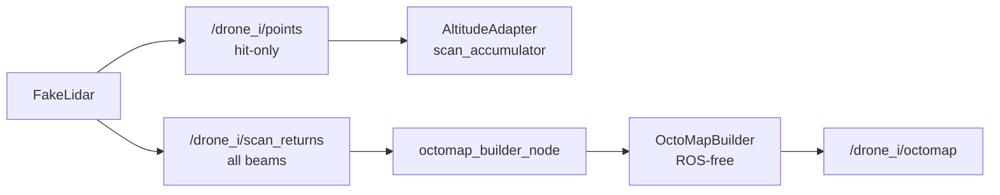

# Phase 3：多机未知探索与地图融合（swarm_controller）

> **状态：** 🟡 重构前收口（3-1～3-8 已完成；3-9 基础实现与诊断已冻结，但多 Region 任务分配验收延期；3-10 当前不启动；分支 `phase/3-swarm-controller`）
> **答疑与决策：** [`docs/decisions/phase-03-swarm-qa.md`](../decisions/phase-03-swarm-qa.md)
> **上级摘要：** [`docs/xenomorph-scanner-plan.md`](../xenomorph-scanner-plan.md) §6 Phase 3  
> **依赖：** Phase 1 [`phase-01-cave-world.md`](phase-01-cave-world.md)、Phase 2 [`phase-02-drone-scanner.md`](phase-02-drone-scanner.md)  
> **工程约定：** [`AGENTS.md`](../../AGENTS.md)（含 §5.1 Git 分步提交）

---

## 目标与产出

**目标：** 在**不假定洞穴拓扑 / 出口已知**的前提下，多架无人机根据已观测地图探索未知区域；扫描几何采用**可俯仰垂直环**消除正前盲区；用 **OctoMap** 表达自由 / 占用 / 未知；任务规划派机探索；融合为全局地图。

**产出：**

- 包 `swarm_controller`：观测地图、探索策略、多机调度、地图融合（算法库 + 薄节点）
- `drone_scanner` 扩展：`ring_pitch` 俯仰环、高度自适应
- `/global_map`（OctoMap 或等价全局观测）
- `launch` 一键多机入口（`num_drones:=3`）
- RViz：多机 + 全局图；`/cave/points` 仅作对照，**不参与**规划

**明确不做（主路径）：**

- ❌ 按真值「外环 / 直连 / 右廊 / 出口」预分配航线作为验收路径
- ❌ 从 `ICaveField` / 中轴线抄整条飞行廊道给规划用
- ❌ Mesh 导出（Phase 4）、Gazebo、2D `slam_toolbox` 主路径
- ❌ 以「纯点云列表、不维护未知」作为探索主地图（主路径直接用 OctoMap）

---

## 原则（与 Phase 1/2 的契约）

| 原则 | 说明 |
|------|------|
| 真值保密 | `ICaveField` 仅供 `fake_lidar` raycast 造数；规划 / 调度不得依赖拓扑真值 |
| 未知探索 | 「岔路通到哪」由任务规划派机扫出来，不是建图凭空知道 |
| 航线在线 | 轨道 = 探索目标 + 高度自适应（+ 最小避障）；非整条预设廊道 |
| 前视 | 垂直环 **俯仰倾斜（方案 A）**，`num_beams` 不变 |
| 观测地图 | **OctoMap 直接实现**（hit=占用，射线中段 / 未命中至 max_range=自由，其余=未知） |

---

## 扫描几何：可俯仰垂直环（方案 A）

Phase 2 默认环在 **YZ**（法向沿机头 +X），正前方无 beam，探索时前视全盲。

**Phase 3 主路径：** 同一圈 beam 数不变，将扫描平面相对机头 **前倾**（参数 `ring_pitch_rad`）：

| `ring_pitch_rad` | 行为 |
|------------------|------|
| `0` | 兼容 Phase 2 纯 YZ |
| 默认建议 `≈0.35`（约 20°） | beam 带 +X 分量，斜前方可观测 |

高度估计仍可用环上接近顶/底的命中；策略与避障依赖前倾后的斜前方信息。

---

## 分层与数据流

```text
ICaveField（真值）──仅造数──► FakeLidar（俯仰环）
                                    │
                    ┌───────────────┼───────────────┐
                    ▼               ▼               ▼
              高度自适应         OctoMap 更新      /points（可视化）
              （顶/底 → z）    free/occ/unknown
                                    │
                                    ▼
                         IExplorationStrategy / 多机调度
                                    │
                                    ▼ goal
                         执行：短移 + 最小避障 + 高度自适应
                                    │
                                    ▼
                               /global_map
```

| 层 | 职责 | 建议归属 |
|----|------|----------|
| 俯仰环 + 高度自适应 | 感知与单机运动 | `drone_scanner` |
| OctoMap 观测、策略、调度、融合 | 探索与协同 | `swarm_controller` |
| `ITrajectory` / fake_odom | 执行短段运动 | `drone_scanner`（复用） |

---

## 任务清单与进度

| 步 | 内容 | 状态 | 建议 commit |
|----|------|------|-------------|
| 3-1 | 环面俯仰倾斜 `ring_pitch`（方案 A） | ✅ | `phase3(step1): pitched vertical ring` |
| 3-2 | 高度自适应 | ✅ | `phase3(step2): altitude adaptation` |
| 3-3 | OctoMap 观测地图（含未命中 beam free 雕刻） | ✅ | `phase3(step3): octomap observation` |
| 3-4 | `IExplorationStrategy`（单机选目标） | ✅ | `phase3(step4): exploration strategy` |
| 3-5 | 单机探索闭环 + **最小避障** | ✅ | `phase3(step5): single-drone explore loop` |
| 3-6 | 多机 launch（`num_drones:=3`） | ✅ | `phase3(step6): multi-drone sensing launch` |
| 3-7 | 多机探索分散（peer 启发式 + 简化前向局部规划） | ✅ | `phase3(step7): multi-drone peer-dispersion allocation` |
| 3-8 | `/global_map` 融合 | ✅ | `phase3(step8): global map merge` |
| 3-9 | 全局 frontier 多机任务分配（非全局路径规划） | ⏸ 重构后继续 | `phase3(step9): global frontier task allocation` |
| 3-10 | 一键 swarm + 测试 + 文档验收 | ⏸ 重构后重定 | `phase3(step10): swarm entry and tests` |

**原主路径目标：** 3-1～3-9；3-10 执行 Phase 总验收。当前收口只认定 3-1～3-8 完成，
3-9 保留未完成状态，3-10 不作为下一项直接实施。
**里程碑：** M1 = 3-1～3-5（单机自主探索）；M2 = 3-6～3-8（多机 + 全局图）；
M3 = 3-9（全局任务所有权与确定性派机，延期到重构后验收）。

---

## 重构前收尾结论（2026-07-20）

Phase 3 当前停止继续修补中央式三机实现，并将提交 `82954d8` 冻结为可复现、可诊断的参考基线。
“收口”不等于 Phase 3 验收完成，也不取消 3-9；它表示现有代码、测试、Demo、bag 和已知限制已经足够
支撑后续架构设计，新增行为修改应在新边界确定后进行。

### 已完成并冻结

- 3-1～3-8：俯仰垂直环、高度自适应、本机 OctoMap、单机/多机本地探索和完整快照全局融合；
- 3-9 基础能力：frontier support-v2、Component 审计、region/task 确定性纯算法、epoch/revision/lease、
  allocator 后台处理与 revision 级时延诊断；
- merger 的 source/cycle 分阶段诊断、revision 与原子提交边界，以及异常/资源失败测试；
- `KnownFreePathChecker` 的本机 body/segment known-free 安全契约；
- Frontier Geometry Demo、Component Audit Replay、Release `30/30` CTest 和两份 source-level replay bag；
- 中央式三机 headless/GUI 性能证据及已知 `ExplorationStalled` 行为。

### 重构后必须继续

| 顺序 | 工作 | 完成判据 |
|------|------|----------|
| 1 | 冻结新的角色、通信拓扑和地图数据面契约 | 明确 source/relay/aggregator/allocator 边界，以及 full/keyframe/delta、epoch、重同步和背压语义 |
| 2 | 在新边界上恢复 3-9 多 Region 任务分配 | 合成与 replay 输入稳定产生至少两个有效 Region，`eligible_edges > 0`、`matching_cardinality > 0` |
| 3 | 完成任务生命周期验收 | 不同无人机获得唯一 `Assigned`；owner、lease、撤销、失效和重新分配可诊断且确定 |
| 4 | 完成真实场景人工验收 | 三机真实运行验证 LocalFallback/Assigned/Standby 切换，truth audit 保持 `Clear` |
| 5 | 重定并执行原 3-10 | 新架构的一键入口、N 机接线、回归测试、RViz 和 Phase 总验收 |

多 Region 分配是保留的强制需求，不得因本次收口被视为取消或完成。新架构可以替换当前中央 allocator
的部署位置和输入协议，但必须保留唯一所有权、租约/revision、确定性匹配和本机 first-hop 安全边界。

### 当前暂不做

- 不实施 Detector leaf-scan B 优化或 merger C 并行 preparation；先由新数据面决定完整 decode/normalize
  是否仍是主成本；
- 不直接扩大 Component 连通半径、降低 `min_columns`/方向阈值，也不为当前 tree cave 强行制造两个
  Region；
- 不修改 `ExplorationStalled` 恢复、多运动航向或本机 planner 行为；这些作为独立运动规划问题处理；
- 不在当前中央式实现中加入 Relay、EdgeAggregator、delta/keyframe 协议、稀疏拓扑、角色/编队或
  `N > 3` 调度；
- 不通过增大 freshness timeout、改写 header stamp 或放宽 `KnownFreePathChecker` 掩盖性能/安全问题；
- 不实现动态障碍时间预测、长距离 A*/Theta*、全局 3D 路径规划或 Mesh（Phase 4）。

### 后续重启条件

开始重构实现前，先形成可提交的架构决策，至少回答节点角色、拓扑控制面、地图数据面、故障/重同步、
兼容迁移和验收矩阵。重构使用新的阶段分支或明确的新 Step；不得在当前基线提交上继续混入试探性行为
修改。新旧 source-level bag 用作相同输入对照，bag 本体继续保存在 Docker volume，不进入 Git。

---

## Step 3-1：环面俯仰倾斜

### 设计

- `FakeLidar` 增加 `ring_pitch_rad`：扫描平面绕机体 +Y（或等价）前倾
- beam 方向在 `lidar_link` 下带前向分量；`num_beams` / `max_range` 语义不变
- launch / 节点参数可覆盖；`0` 保持 Phase 2 行为

### 验收

- 默认前倾时，单帧点云在机头斜前方有命中
- `ring_pitch:=0` 回归纯 YZ
- 现有 FakeLidar gtest 扩展覆盖俯仰情形

---

## Step 3-2：高度自适应

### 设计

- 用当前环扫估计**最近上方 / 最近下方障碍**，形成可飞高度带（相对旧式裸 min/max 更稳，仍属通用启发式）
- 将飞行高度保持在安全中带；**不读**真值中轴
- 逻辑放在 `drone_scanner`：`AltitudeAdapter`（ROS-free）+ `fake_odom` 订阅同 namespace `points` 覆盖轨迹 `z`
- 两层平滑（见下）：**EMA** 平滑「看见的顶/底」；**按时间限速** 平滑「飞机实际跟高度」
- **接线约束：** hits 必须用**扫描时**机体 z 解释；EMA **仅在新扫描帧**更新；过期帧丢弃（`points_stale_sec`）
- **几何校验：** `vertical_dot_min < cos(ring_pitch)`，否则禁用高度自适应并打 ERROR
- **成对样本：** 上、下近垂向 hit 都要有，否则本帧 invalid（hold 上一高度）

### 当前范围 vs 未来特性

| | 内容 |
|--|------|
| **Phase 3-2 当前验收** | 管状 / 截面缓变洞穴：高度跟随平滑、几何校验、扫描时 z 绑定、EMA 仅新帧、成对样本 |
| **明确不作为本步验收** | 钟乳石 / 石笋林、竖井、大侧厅、稀疏凸起「透过空隙看到真顶」等复杂局部几何的完备避障 |

**未来特性（非本步交付）：**

- 钟乳石 / 石笋等尖状凸起的专用净空与通过策略（含更强鲁棒统计、局部障碍图）
- 竖井 / 岔口侧壁离群 hit 的场景化过滤与置信度
- 将 `AltitudeBand` + `valid` 作为正式接口交给探索 / 避障，并约定与 `goal.z` 的仲裁
- 机体 roll/pitch 非零时的完整姿态投影（当前假设无倾斜）

当前「最近上/下障碍」可作为上述场景的**弱基线**（例如稀疏石林时比裸 `max` 估真顶更不易穿尖），但**不宣称**已覆盖钟乳石完备安全；复杂场景留待后续特性迭代。

### 平滑机制 1：EMA（指数滑动平均）

**EMA = Exponential Moving Average。** 把本帧测量与上一帧平滑值按比例混合，减轻单帧扫描噪声 / 截面突变带来的顶底跳变。

```text
平滑值 = α × 本帧测量 + (1 − α) × 上一帧平滑值
```

| 项 | 说明 |
|----|------|
| 作用对象 | 估计出的 `floor_z` / `ceiling_z`（不是机体 `z` 本身） |
| 参数 | `altitude_adapt.band_ema_alpha`（代码：`band_ema_alpha`） |
| 默认 | `0.25` |
| α 越大 | 越跟新测量，反应快，更容易抖 |
| α 越小 | 越信历史，更稳，跟截面变化更慢 |

例：洞底估计从 `0` 突然跳到 `-1`，α=0.25 时下一帧平滑底约为 `-0.25`，不会一步跳满。

### 平滑机制 2：按时间限速

即使目标高度（顶底中带）已算出，机体 `z` 也不允许一帧贴过去，而是限制竖直速度：

```text
max_dz = max_vertical_speed × dt
新高度 = 当前高度 + clamp(目标 − 当前, −max_dz, +max_dz)
```

| 项 | 说明 |
|----|------|
| 作用对象 | 机体飞行高度 `z`（`fake_odom` 发布的位姿） |
| 参数 | `altitude_adapt.max_vertical_speed` |
| 默认 | `0.6` m/s |
| `dt` | 两次 `fake_odom` 定时器回调的时间差（与发布频率解耦） |
| 为何需要 | 若每帧直接跳到目标，噪声与截面突变会让飞机上下阶跃；旧式固定 `max_step` 还会和 Hz 绑死（例如每 tick 0.15 m @ 20 Hz ≈ 3 m/s） |

### 两者分工

| 机制 | 管什么 |
|------|--------|
| **EMA** | 「看见的顶/底」别一帧跳变 |
| **按时间限速** | 「飞机实际跟高度」别跟得太猛 |

调参：更稳 → 减小 `band_ema_alpha` / `max_vertical_speed`；跟得更快 → 调大。

### 相关参数（launch / 节点）

| 参数 | 默认 | 说明 |
|------|------|------|
| `altitude_adapt.enable` | `true` | 是否启用高度自适应 |
| `altitude_adapt.target_fraction` | `0.5` | 0=贴底，1=贴顶；默认走廊中带 |
| `altitude_adapt.min_clearance` | `auto`（当前 0.1 m 图分辨率下为 `0.41`） | 与规划器机体包络共享的垂直净空契约 |
| `altitude_adapt.band_ema_alpha` | `0.25` | 顶/底 EMA 系数（仅新扫描帧更新） |
| `altitude_adapt.max_vertical_speed` | `0.6` | 竖直 \|vz\| 上限 (m/s) |
| `altitude_adapt.min_band_height` | `0.8` | 顶底间距过小则本帧无效 |
| `altitude_adapt.vertical_dot_min` | `0.65` | 筛近垂向 beam |
| `altitude_adapt.ring_pitch_rad` | 与 `ring_pitch_rad` 同步 | 几何兼容校验 |
| `altitude_adapt.points_stale_sec` | `0.5` | 扫描帧过期丢弃阈值 (s) |

顶层 exploration/sensing launch 按
`robot_half_height + vertical_margin + resolution/2 + clearance_epsilon`
计算 `auto` 值；显式配置低于该值时拒绝启动，避免高度控制器把机体保持在规划器必然判阻的边界。

### 验收

- 截面起伏时 `z` 跟随变化，无大幅阶跃抖动（RViz 目检；以管状 / 缓变洞为主）
- 可在 Phase 2 一键 launch 上先单机验证，不依赖 OctoMap
- gtest：`TestAltitudeAdapter`（含 EMA / 限速 / 几何校验 / 扫描原点 z）
- **不要求**本步通过钟乳石等复杂凸起场景的完备目检（见「未来特性」）

---

## Step 3-3：OctoMap 观测地图

### 目标

建立单机 OctoMap 观测后端：

- hit endpoint → `occupied`
- hit 前段 → `free`
- miss ray 到 `max_range` → `free`
- miss endpoint **不标 occupied**
- 未被任何 ray 覆盖 → `unknown`

本步只做**单机观测地图**，不做 frontier、多机融合、探索闭环。

### 数据流



### 保持旧接口不破坏

`/drone_i/points` 继续只表示 **hit-only 点云**。它仍服务于：

- `AltitudeAdapter`：估计顶 / 底时只应看到真实命中点
- `scan_accumulator`：只累积真实墙点
- RViz 现有点云显示

**不得**把 miss endpoint 混入 `/points`，否则会产生 `max_range` 虚假壳层，并污染高度自适应。

`FakeLidar::scan()` 保持现有语义：只返回命中点。新增全 beam API：

```cpp
std::vector<LidarReturn> scanReturns(const Pose3D& lidar_pose_in_map) const;
```

### 全 beam 返回结构

在 `drone_scanner` 中新增：

```cpp
struct LidarReturn {
    float x;
    float y;
    float z;
    float range;
    bool hit;
};
```

坐标语义：

| 字段 | 含义 |
|------|------|
| `x/y/z` | `lidar_link` 系 endpoint |
| `range` | hit 时为实际距离；miss 时为 `max_range` |
| `hit` | `true` = 真实障碍命中点；`false` = max_range 虚点，只表示 ray 沿途 free |

`scanReturns()` 每个 beam 必有一条 return：

- raycast 命中 → `hit=true`
- raycast 未命中 → endpoint = beam direction × `max_range`，`hit=false`

### `FakeLidarNode` 发布两个话题

每帧只做一次全 beam scan：

```text
returns = fake_lidar.scanReturns(pose)
```

然后拆成两个输出：

| 话题 | 内容 | 消费者 |
|------|------|--------|
| `/drone_i/points` | 仅 `hit=true` 的点 | `AltitudeAdapter`、`scan_accumulator`、RViz |
| `/drone_i/scan_returns` | 全 beam return | `octomap_builder_node` |

### `/scan_returns` PointCloud2 字段契约

固定字段，避免隐式约定：

| 字段 | 类型 | 含义 |
|------|------|------|
| `x` | `FLOAT32` | endpoint x，`lidar_link` 系 |
| `y` | `FLOAT32` | endpoint y |
| `z` | `FLOAT32` | endpoint z |
| `range` | `FLOAT32` | hit distance 或 `max_range` |
| `hit` | `UINT8` | `1=hit`，`0=miss` |
| `intensity` | `FLOAT32` | 调试显示用，`hit ? 1.0 : 0.0` |

要求：

- `header.frame_id = lidar_link`
- `header.stamp` = 该帧扫描使用的 TF 时刻
- `width == num_beams`
- beam 顺序稳定

### TF 时间戳一致性

`FakeLidarNode` 扫描时必须保证：

- 用某一时刻 `stamp` 查 `map -> lidar_link`
- 用同一个 `stamp` 发布 `/points` 和 `/scan_returns`

`octomap_builder_node` 订阅 `/scan_returns` 后：

- 用 `msg.header.stamp` 查 `map <- msg.header.frame_id`
- 同一帧所有 endpoint 使用同一个 transform
- origin 使用该 transform 的平移
- endpoint 从 lidar frame 变换到 map frame

### `swarm_controller` 包结构

```text
ws/src/swarm_controller/
├── include/swarm_controller/
│   ├── OctoMapBuilder.hpp
│   └── RayReturn.hpp
├── src/
│   ├── OctoMapBuilder.cpp
│   ├── OctoMapBuilderNode.cpp
│   └── OctoMapBuilderMain.cpp
├── test/
│   └── TestOctoMapBuilder.cpp
├── launch/
│   └── octomap_builder_launch.py
├── CMakeLists.txt
└── package.xml
```

遵循仓库约定：算法库 ROS-free，节点只做消息转换、TF、参数与发布。

### ROS-free `OctoMapBuilder`

```cpp
enum class CellState {
    Unknown,
    Free,
    Occupied,
};

struct RayReturn {
    Point3f endpoint;
    float range;
    bool hit;
};

class OctoMapBuilder {
public:
    explicit OctoMapBuilder(float resolution);

    void insertScan(
        const Point3f& origin_map,
        const std::vector<RayReturn>& returns_map);

    CellState query(float x, float y, float z) const;

    std::size_t occupiedCount() const;
    std::size_t knownCount() const;

    const octomap::OcTree& tree() const;
};
```

### OctoMap 插入语义

#### hit ray

```text
origin -> endpoint 前段：free
endpoint：occupied
```

#### miss ray

```text
origin -> endpoint：free
endpoint 不 occupied
```

不能把全 beam endpoint 直接传给 `insertPointCloud()`，因为 miss endpoint 会被当成 occupied。

推荐使用 `computeRayKeys(origin, endpoint, keys)` / key-level update 自控语义：

- ray keys → free
- hit endpoint → occupied
- miss endpoint → 不 occupied

### `octomap_builder_node`

订阅：

```text
/drone_i/scan_returns
```

QoS：`SensorDataQoS`

处理流程：

```text
PointCloud2 scan_returns
    -> 解析 x/y/z/range/hit
    -> TF: map <- lidar_link @ msg.header.stamp
    -> endpoint_lidar -> endpoint_map
    -> origin_map = TF translation
    -> OctoMapBuilder::insertScan()
```

发布：

```text
/drone_i/octomap
```

类型：`octomap_msgs/msg/Octomap`

插入频率跟随扫描帧；OctoMap 发布频率独立限制，默认 `2.0 Hz`。

### 参数

| 参数 | 默认 | 说明 |
|------|------|------|
| `map_frame` | `map` | OctoMap frame |
| `input_topic` | `scan_returns` | 输入全 beam topic |
| `output_topic` | `octomap` | 输出 OctoMap |
| `resolution` | `0.1` | OctoMap 分辨率 |
| `publish_rate` | `2.0` | OctoMap 发布频率 |
| `max_range` | `30.0` | 与 lidar 保持一致，用于校验 / 裁剪 |

### Launch

新增：

```text
swarm_controller/launch/octomap_builder_launch.py
```

用于单机验证：

- include `drone_scanner` 的 `fake_lidar_launch.py`
- 启动 `/drone_0/octomap_builder`
- `GroupAction(scoped=True)` 隔离内层 Phase 2 launch 参数，避免覆盖外层 `show_rviz_map`
- `show_rviz_map:=true` 启动 `swarm_controller/config/octomap_map.rviz`
- RViz 使用 `octomap_rviz_plugins/OccupancyGrid` 显示三维 occupied voxels（不是二维 `OccupancyMap` 投影）
- 同一界面保留洞穴真值 `/cave/points` 与 hit-only `/drone_0/cloud_map`，用于空间对照

ROS 2 Jazzy 当前镜像中的 `liboctomap_rviz_plugins.so` 未声明 `liboctomap.so` 动态依赖；仅对
OctoMap RViz 进程设置 `LD_PRELOAD=liboctomap.so`，避免 `OcTreeStamped` 符号加载失败，不影响其他节点。

命令示例：

```bash
ros2 launch swarm_controller octomap_builder_launch.py
```

### 测试

#### `FakeLidar` gtest

- `scan()` 仍只返回 hit
- `scanReturns()` 返回数量等于 `num_beams`
- hit beam：`hit=true`
- miss beam：`hit=false`，`range=max_range`
- miss endpoint 不进入 `/points`

#### `FakeLidarNode` 集成测试

- `/points` 只含 hit
- `/scan_returns` 含全 beam
- PointCloud2 字段完整：`x/y/z/range/hit/intensity`
- `width == num_beams`

#### `OctoMapBuilder` gtest

合成场景：

```text
origin = (0,0,0)
ray1: hit at (3,0,0)
ray2: miss to (0,3,0)
```

断言：

| 点 | 期望 |
|----|------|
| `(3,0,0)` | occupied |
| `(1,0,0)` | free |
| `(0,1,0)` | free |
| `(0,3,0)` miss endpoint | not occupied |
| `(5,5,5)` | unknown |

#### `octomap_builder_node` 测试

- `/drone_0/octomap` 在发布
- 消息 `header.frame_id == map`
- OctoMap 可反序列化

### 验收

- `/drone_0/points` hit-only 语义不变
- `/drone_0/scan_returns` 每帧包含所有 beam
- OctoMap 中：
  - 洞壁为 occupied
  - 飞过廊道为 free
  - 未扫区域保持 unknown
- miss endpoint 不形成虚假 occupied 壳层
- RViz 可显示 `/drone_0/octomap`
- gtest / launch_testing 通过

### 实现与验证结果（2026-07-10）

- ✅ `FakeLidar::scanReturns()` 保留全部 hit / miss beam；原 `/points` 继续保持 hit-only
- ✅ 新建 `swarm_controller` 包及 ROS-free `OctoMapBuilder`
- ✅ `/drone_0/octomap` 按扫描帧时间戳与 `map <- lidar_link` TF 构建并定频发布
- ✅ 超量程 hit 裁剪后按 miss/free ray 处理，不在 `max_range` 制造虚假 occupied
- ✅ `PointCloud2` 固定校验 `x/y/z/range/intensity: FLOAT32`、`hit: UINT8`、`count=1`
- ✅ 三维 RViz 目检通过：低处到高处按 Z 轴着色显示地面、侧壁与洞顶 occupied voxels
- ✅ `TestFakeLidar`、`test_fake_lidar_integration.py`、`TestOctoMapBuilder`、
  `test_octomap_builder_integration.py` 通过
- ✅ GPT 5.5 high 评审及复核完成，所报高/中/低风险问题均已修复

### 依赖

```bash
sudo apt install -y \
  ros-jazzy-octomap \
  ros-jazzy-octomap-msgs \
  ros-jazzy-octomap-rviz-plugins
```

### 明确不做

- 多机 `/global_map`
- frontier / `IExplorationStrategy`
- 探索闭环
- 最小避障
- 钟乳石 / 石笋专用逻辑
- Mesh / terrain display

### 实施顺序

```text
1. FakeLidar 新增 LidarReturn + scanReturns()
2. FakeLidarNode 保留 /points，新增 /scan_returns
3. 补 FakeLidar / FakeLidarNode 测试
4. 新建 swarm_controller 包骨架
5. 实现 OctoMapBuilder 算法库
6. 补 OctoMapBuilder gtest
7. 实现 octomap_builder_node
8. 增加单机 launch
9. 容器内 build/test
10. GPT 5.5 代码评审
11. 修评审问题
12. 目检
13. 提交 phase3(step3)
```

---

## Step 3-4：`IExplorationStrategy`

> **实现状态：** ✅ 已完成；ROS-free `swarm_exploration` 库与确定性合成 OctoMap 测试已通过。

### 目标与边界

从当前位姿与只读 OctoMap 中选择下一探索目标，为 3-5 单机闭环提供决策：

```text
GoalSelectionRequest（Pose3D + rejected_cluster_ids）
    + const octomap::OcTree
    → FrontierExplorationStrategy
    → GoalSelectionResult（map 系）
```

- 本步只做 ROS-free 目标选择，不新增运行期节点
- 3-5 负责 ROS 消息转换、短移执行、直线路径避障、拒绝目标集合、重规划与主动重扫
- **禁止**读取洞穴真值拓扑 / 中轴线 / 出口列表
- 直接依赖 `const octomap::OcTree&`；OctoMap 是便宜、可直接构造的算法数据，不额外引入 `IMapView`

### 3-3 前置加固

frontier 会放大地图中的假孔洞，因此实现策略前先修正 `OctoMapBuilder::insertScan()`：

- 一帧先汇总 `free_keys` 与 `occupied_keys`
- 从 free 集合删除 occupied key
- 每个 key 每帧只更新一次，且 occupied 优先
- miss endpoint 继续保持 unknown

这与 OctoMap `computeUpdate()` 的 occupied-preferred 语义一致，可避免相邻 beam 在同一帧把真实墙点抵消成 free。

新增回归断言：

- miss endpoint 明确为 `Unknown`
- 同一 voxel 被一束 beam 命中、另一束 beam 穿过时，结果仍为 `Occupied`

### ROS-free 接口

新增通用类型：

```text
Point3f.hpp
Pose3D.hpp
IExplorationStrategy.hpp
FrontierExplorationStrategy.hpp/.cpp
```

`RayReturn.hpp` 收为复用通用 `Point3f`。`GoalSelectionRequest` 携带当前位姿和 3-5
传入的 `rejected_cluster_ids`；成功结果同时返回目标点和稳定 cluster ID，避免路径失败后
确定性策略反复返回同一目标。策略状态为：

```cpp
enum class GoalSelectionStatus {
    Success,
    InvalidInput,
    NoKnownFree,
    NoFrontier,
    NoSafeCandidate,
};
```

`Success` 时目标及机体占用体积必须全部为 known-free，且与当前位置有有效距离。接入 3-5
后，策略还使用统一 `KnownFreePathChecker` 检查当前位姿到候选的完整直线路径，只返回当前
地图中整段 known-free 的目标；controller 在下发前及 fresh observation 到来后继续复查，
形成防御性安全兜底。其他状态供 3-5 决定等待、原地转向重扫或换策略，不能把
`NoFrontier` 直接解释为探索完成。

### 3D frontier 定义

在当前位姿附近局部 BBX 中只遍历已知 free leaf；若遇到 coarse leaf，再展开成
`tree.getResolution()` 的 full-resolution key，避免对大块 unknown 空间做立方穷举。
某 voxel 是原始 frontier 当且仅当：

1. 当前 voxel 已知且为 free
2. 6 个面邻居中至少一个为 unknown
3. 位于当前位姿的局部规划窗口内

只用 6 邻域判定，避免 26 邻域把墙角对角 unknown 误认为可进入方向。frontier 的基本单位是
**free voxel 与 unknown 面邻居之间的 face**；物理面积按
`unknown_face_count × resolution²` 计算，不能直接用 voxel 数代替。

### 聚类与安全目标

1. 对原始 frontier 做 6 连通聚类
2. 删除面积过小的单 beam / 小孔噪点
3. 删除距离当前位置过近的伪目标
4. 根据 frontier face 的 unknown 法向过滤地面 / 顶棚 frontier（可配置，未来竖井场景可放宽）
5. 不直接使用 cluster 质心，也不依赖可能相互抵消的 cluster 平均法向
6. 逐 frontier face 沿其明确 unknown 法向向已知区后退 `goal_standoff`
7. 以稳定 key 顺序在后退位置附近选取目标
8. 目标周围按机体半径 / 半高检查 3D 球体或圆柱体，覆盖 voxel 必须全部 known-free
9. 目标 z 仅按几何候选与垂直变化代价选择；3-4 没有 `AltitudeBand`，不得声称知道“安全高度”
10. 候选按 full-resolution `OcTreeKey` 去重，同一位置仅保留稳定评分更优的 cluster 关联
11. 唯一候选稳定排序后逐个检查完整 known-free 路径；高分点被阻断时继续尝试次优候选，
    不得因同 cluster 首选失败而丢弃该 cluster 的其他可达点

初始建议配置：

| 参数 | 初值 | 含义 |
|------|------|------|
| `min_goal_distance` | `0.8 m` | 排除当前位置附近 frontier |
| `max_goal_distance` | `4.0 m` | 只生成短程局部目标 |
| `goal_standoff` | `0.6 m` | 从 unknown 边界退回已知区 |
| `robot_radius` | `0.25 m` | 无人机水平包络半径 |
| `robot_half_height` | `0.15 m` | 无人机垂直包络半高 |
| `safety_margin` | `0.25 m` | 水平 known-free 余量 |
| `vertical_margin` | `0.20 m` | 垂直 known-free 余量 |
| `min_cluster_area` | `0.2 m²` | 过滤小孔 / 离散噪点 |
| `max_abs_frontier_normal_z` | `0.6` | 过滤地面 / 顶棚方向 |

局部枚举窗口必须至少覆盖 `max_goal_distance + goal_standoff + clearance`；构造时校验所有配置
有限、范围合法且窗口覆盖上述边界，运行时按实际 OctoMap resolution 枚举 full-resolution key。

### 评分与确定性

对安全 cluster 使用以下因素评分：

- frontier 面积 / unknown 面数量：信息收益
- 与当前位置距离：短移成本
- 目标高度变化：抑制追逐地面 / 顶棚
- 当前 yaw 对目标方向：小幅朝向奖励

排序必须稳定：总分 → 信息收益 → 距离 → stable cluster ID / key 字典序；不得依赖随机数或
无序容器迭代顺序。stable cluster ID 使用 cluster 内字典序最小 full-resolution key；
3-5 可把该 ID 加入本轮 rejected 集合。

### 单环扫描限制与恢复契约

当前前倾单环每帧只在一个倾斜平面内产生 free 观测，可能形成扫描薄面两侧的伪 frontier；
经过法向、物理面积和 3D known-free 净空过滤后，也可能没有候选。因此：

- 3-4 允许返回 `NoFrontier` / `NoSafeCandidate`
- 3-5 必须实现 `无候选 → 分段原地 yaw 重扫 → 地图更新 → 重选`
- 重扫达到次数 / 角度上限仍失败时悬停并上报，不把 unknown 当 free 强行推进
- 端到端验证若证明 yaw 重扫仍不足，再单独评估 pitch 摆扫或多 pitch 环；不在 3-4 提前扩展传感器

### 文件与构建

新增：

```text
ws/src/swarm_controller/
├── include/swarm_controller/
│   ├── FrontierExplorationStrategy.hpp
│   ├── IExplorationStrategy.hpp
│   ├── Point3f.hpp
│   └── Pose3D.hpp
├── src/
│   └── FrontierExplorationStrategy.cpp
├── test/
│   └── TestFrontierExplorationStrategy.cpp
├── CMakeLists.txt
└── package.xml
```

CMake 新增独立 ROS-free 静态库 `swarm_exploration`，继续链接 OctoMap；3-4 不增加 launch test。

### 测试

合成确定性 OctoMap，覆盖：

- 封闭隧道仅 +X 开口：目标位于开口内侧的已知 free standoff
- 多个 frontier：按收益 / 距离配置选择预期 cluster
- 不同 OctoMap resolution：物理面积阈值行为一致
- 近身 frontier：不得返回当前位置
- 地面 / 顶棚 frontier：默认失败、放宽法向阈值成功的配对测试
- 墙面小孔：默认面积阈值失败、降低阈值成功的配对测试
- unknown 进入机体包络：无 occupied 干扰时仍不得返回 `Success`
- 多面 cluster 法向抵消：按独立 frontier face 仍能稳定生成或拒绝候选
- rejected cluster：选择下一个候选，不重复返回失败目标
- 空地图、无 frontier、全部候选不安全：返回对应失败状态
- 非有限 pose / 非法配置：返回 `InvalidInput` 或构造失败
- 改变节点插入顺序：选择结果保持一致

### 验收

- 目标来自 free–unknown 边界附近，但目标自身位于已知 free
- 目标满足最小距离、物理 cluster 面积和 3D known-free 机体净空
- 不选择地面 / 顶棚或墙孔伪 frontier
- rejected cluster 不会在同一轮再次返回
- 相同地图与位姿输出确定
- 零 ROS 依赖、零洞穴真值依赖
- `TestFrontierExplorationStrategy` 11 项与 `TestOctoMapBuilder` 3 项回归测试通过

---

## Step 3-5：单机探索闭环 + 最小避障

> **实现状态：** ✅ 已完成；实现与修复已经 GPT-5.6 Terra Medium 代码评审及复核，
> ROS-free 单测、launch_testing、连续 yaw 覆盖风险探针和无 RViz 端到端启动均已验证。
> RViz 目检确认：无预设整廊航线时，单机可自主短段推进并持续扩展 OctoMap（M1 闭环打通）。

### 目标与边界

把 3-3 观测地图与 3-4 目标选择接成单机自主闭环：

```text
scan_returns → dirty OctoMap observation
                       │
odom + OctoMap ────────┴─→ SingleDroneExplorer
                                  │
                         known-free path check
                                  │
                         motion_goal / yaw rescan
                                  │
                         fake_odom → TF → fake_lidar
```

- 无整廊预设轨迹；启动后在入口悬停建初图，再由在线 frontier 目标驱动
- 只实现当前位姿到短程目标的 known-free 直线检查；unknown 与 occupied 都不可通行
- 不实现 A*、长路径或多机调度；A* 留给后续独立增强，多机从 3-6 开始
- 不读取 `ICaveField`、洞穴中轴线、分叉或出口真值
- `NoFrontier` 不能直接解释为探索完成；当前单环观测不足时必须先主动重扫

### 入口停滞修复（2026-07-11）

固定 OctoMap 快照确认原实现存在三项相互放大的问题：1853 个局部候选只有 734 个唯一
voxel；整段路径检查发生在策略返回后，每拒绝一个 cluster 都会重复完整 frontier 提取；
入口部署方向没有成为约束，入口外侧高收益 frontier 可把无人机带回入口后方。修复方案经
GPT-5.6 Terra Medium 方案评审后采用：

1. `GoalSelectionRequest` 可携带 ROS-free 的 XY 前向半空间约束。Explorer 在首次有效
   map-frame 位姿锁存入口原点和 yaw，并以实际到达过的最大前向进度推进 no-retreat 平面；
   默认只允许 `dot(candidate.xy - plane_origin.xy, heading.xy) >= -backward_margin`。
   候选朝向评分也使用锁存的部署 yaw，不跟随主动重扫 yaw 旋转。该规则不硬编码 `+X`、
   不读取洞穴真值，且绑定 explorer 实例生命周期；地图坐标重置时必须重启会话。
2. `GoalSelectionRequest` 同时携带具名 fixed-altitude 约束。策略把候选 XY 投影到当前实际 z，
   并对同一个 effective candidate 完成局部净空、评分、整段检查和返回，避免策略检查的 3D
   goal 与 controller 实际执行的 fixed-z goal 不一致。
3. 候选以投影后的 full-resolution `OcTreeKey` 去重；重复 key 保留稳定评分更优的关联，调试 Marker
   只显示唯一候选。
4. 策略对唯一候选做稳定全局排序并逐个调用 `checkSegment()`；首选阻断后继续检查次优点，
   直至找到可达目标或耗尽候选。Explorer 保留下发前复查和移动中的 fresh-map 复查。
5. 不在本次修复中改 LiDAR 模型、放宽 unknown、增加 pitch 扫描或加入洞穴中轴真值。
   先以固定快照与完整 launch 验证候选数量、segment 检查次数、选择耗时和前向位移。

### 分层与新增组件

#### `drone_scanner`：可命令短段运动

新增 ROS-free `PoseSegmentTrajectory`，继续实现现有 `ITrajectory`：

- 输入起点 / 终点 `Pose3D`、平移速度上限和 yaw 速度上限
- yaw 使用 `[-π, π]` 最短角插值
- `duration = max(xy_distance / linear_speed, abs(yaw_delta) / yaw_rate)`
- 支持平移 + yaw、纯平移、纯 yaw 与零长度 hold
- 输出平面速度向量和 `angular.z`；各自不得超过配置上限
- 非有限位姿或非正速度配置构造失败

`FakeOdomNode` 增加 `motion.mode=line|goal`：

- 默认仍为 `line`，Phase 2 行为及现有测试不变
- 3-5 使用 `goal`：从 `line.start_*` 初始位姿悬停，订阅 `motion_goal`
- 每个新目标从最新实际发布位姿构造 `PoseSegmentTrajectory`
- 不同目标采用 last-goal-wins 抢占；重复等价目标不得重置段起点或开始时间
- 到达目标后锁存位姿并发布零 twist
- 任意方向速度先从 `map/odom` 旋转到 `base_link` 再写 Odometry；纯 yaw 线速度为零
- 3-5 设置 `stop_scan_when_trajectory_done=false`，短段结束后 LiDAR 继续扫描

`motion_goal` 使用 `geometry_msgs/msg/PoseStamped`，契约固定为：

- QoS：reliable + transient-local，depth 1；执行端锁存最后一条合法命令
- `header.frame_id=map`；Phase 3 仿真继续依赖既有 `map→odom` static identity
- 位置 / 四元数必须有限，四元数可归一化；非法 frame / 数值拒绝
- goal 模式只执行 XY + yaw，`position.z` 不作为高度命令
- controller 只在状态转换或目标数值改变时发布，不按控制频率重复创建相同段
- hold 命令 = 采样当前实际 XY / yaw 后发布的零段目标；不得在同一 tick 后立刻覆盖

#### 高度仲裁

3-5 明确采用 **XY + yaw 目标，高度由 `AltitudeAdapter` 独占**：

- 悬停和纯 yaw 重扫时允许 `AltitudeAdapter` 调整 z
- XY 平移开始时冻结最新实际 z；整个平移段保持 fixed-z
- 开始平移前，必须等待实际 `|vz|` 低于停止阈值，再按该实际 z 检查整段 swept body
- frontier 的 3D goal 只提供候选 XY；controller 构造
  `effective_goal=(strategy_goal.x, strategy_goal.y, current_actual_z)`
- 到达条件只检查 XY 距离和 yaw；不等待被高度适配器覆盖的 `strategy_goal.z`
- 固定高度整段由当前 OctoMap 证明 known-free；平移期间禁止未批准的 z 跟随

#### `swarm_exploration`：统一安全检查

新增 ROS-free `BodyEnvelopeConfig` 与 `KnownFreePathChecker`：

- 机体包络为水平半径 + margin、垂直半高 + vertical margin 的圆柱
- `bodyIsKnownFree()` 检查与真实圆柱相交的所有 full-resolution voxel
- 离散化采用保守膨胀：水平至少半个 voxel 对角线，垂直至少半个 voxel
- `checkSegment()` 包含起点 / 终点，沿程采样间距不大于 `resolution / 2`
- 任一覆盖 voxel 为 unknown 或 occupied 即失败
- 返回 `Safe / UnknownBlocked / OccupiedBlocked / InvalidInput` 与首个阻塞位置
- `FrontierExplorationStrategy` 的目标局部净空改用同一 checker，避免两套安全语义

### Fresh observation 契约

控制状态不能把定时重复发布的同一地图当作新观测。修改 `OctoMapBuilderNode`：

1. 只有成功完成 TF、提取到非空 returns 并插入扫描，才递增 observation epoch
2. 记录最新已插入扫描的时间戳并设置 `dirty=true`
3. publish timer 只在 dirty 时发布一次 full OctoMap，随后清 dirty
4. `Octomap.header.stamp` 使用最新已插入扫描 stamp，不使用定时器当前时间
5. publisher 继续使用 transient-local，使晚启动 explorer / RViz 能收到最后地图

`SingleDroneExplorerNode` 只接受 `header.stamp` 严格递增的 OctoMap；重复或倒退 stamp
不得增加本地 observation epoch。这里的 fresh 表示**处理了更新扫描**，不承诺一定新增 voxel。

到达目标或完成 yaw 段的门控必须同时满足：

- observation epoch 严格大于事件发生时记录值
- `Octomap.header.stamp` 严格晚于对应 odom 到达时间

这样不会被事件前采集、事件后延迟发布的在途旧扫描误放行。

### ROS-free 单机状态机

新增 `SingleDroneExplorer`，构造时注入 `IExplorationStrategy`，直接组合
`KnownFreePathChecker`。输入为实际 map 位姿、Odometry 速度、只读 `OcTree`、
observation epoch / stamp 与单调时间；输出离散运动命令和 ROS-free 调试快照。

状态：

```text
WaitingForMap
    ↓
Selecting ──unsafe/rejected──→ Selecting
    │ safe
    ↓
Moving ──blocked/timeout──→ Stopping ──odom stopped──→ Selecting/Rescanning
    │ reached
    ↓
AwaitingFreshObservation ──fresh scan──→ Selecting

Selecting ──no candidate──→ Rescanning
Rescanning ──yaw reached + later fresh scan──→ Selecting / next yaw segment
Rescanning ──limit/stale/timeout──→ Stopping → HoveringFailure
```

#### 目标选择与 rejected 生命周期

- `rejected_cluster_ids` 与当前 observation epoch 绑定
- 同一 epoch 内每个 cluster 最多做一次全段路径检查
- 路径 blocked 时拒绝当前 goal 的 cluster ID，而不是阻塞 voxel
- 同 epoch 内继续请求下一个 cluster；达到上限或候选耗尽后进入重扫
- observation epoch 严格增加后清空 rejected，允许按新知识重新评估
- 到达目标后先 hold，并等待到达后的 fresh observation，再开始下一轮

#### 在线安全与停止确认

- 平移开始前检查当前实际 fixed-z 到 effective goal 的完整 swept body
- Moving 期间仅在 fresh observation 到来时复查剩余 fixed-z 路径
- 发现 unknown / occupied、运动超时或地图 stale 时，先发布 hold
- 进入 `Stopping` 后必须观察：
  - 平面线速度、垂直速度与角速度均低于阈值
  - 实际位姿接近已发布 hold 位姿
- 只有确认停止后才能发布下一运动目标
- hold 确认超时进入 `HoveringFailure`；不得在同一 tick 发布 hold 和替代目标

#### 主动 yaw 重扫

- `NoFrontier`、`NoSafeCandidate` 或同 epoch 候选耗尽时进入 `Rescanning`
- 每段保持 XY 不变，目标 yaw 增加 `π/4`
- 旋转过程中 fake_lidar 继续以 10 Hz 扫描，不是只采 8 个离散平面
- 实际 yaw 达标时记录 reached epoch 与 odom stamp
- 必须再收到 **yaw 达标之后采集** 的 fresh observation 才完成该段并重选
- epoch 先到、yaw 后到，或 yaw 到但没有更新扫描，都不得推进
- 最多 8 个成功完成的 yaw 段覆盖 360°；达到上限仍无候选则悬停失败
- map stale、yaw timeout 或 hold timeout 均安全失败，不把 unknown 当 free

### 默认参数

| 参数 | 初值 | 说明 |
|------|------|------|
| `control_rate` | `5 Hz` | explorer 状态机频率 |
| `motion.linear_speed` | `0.4 m/s` | XY 短段速度上限 |
| `motion.yaw_rate` | `0.5 rad/s` | yaw 速度上限 |
| `goal.position_tolerance` | `0.2 m` | XY 到达阈值 |
| `goal.yaw_tolerance` | `0.15 rad` | yaw 到达阈值 |
| `motion.timeout` | `20 s` | 单段运动超时 |
| `hold.timeout` | `2 s` | 停止确认超时 |
| `hold.linear_speed_max` | `0.02 m/s` | 线速度停止阈值 |
| `hold.angular_speed_max` | `0.03 rad/s` | 角速度停止阈值 |
| `map.stale_timeout` | `2 s` | 无 fresh observation 安全超时 |
| `rescan.yaw_step` | `π/4` | 单段重扫角 |
| `rescan.max_steps` | `8` | 最大成功重扫段数 |
| `max_rejections_per_epoch` | `16` | 同一观测图最多拒绝 cluster 数 |

所有非有限、非正范围及相互矛盾参数在算法构造或节点启动时拒绝。

### 策略诊断与 RViz

`IExplorationStrategy::selectGoal()` 增加可空的 ROS-free
`ExplorationDiagnostics*` 输出：

- 每次调用开始无条件 clear，失败状态不得残留上次数据
- 区分原始 frontier face、cluster / stable ID / 面积、rejected cluster
- 记录通过局部包络的候选与最终目标
- controller 追加全段路径状态、首阻塞点、当前状态与失败原因
- `max_debug_faces` / `max_debug_candidates` 按稳定 key 顺序截断，避免无上限复制

薄 `SingleDroneExplorerNode` 发布
`/drone_i/exploration_markers`（`visualization_msgs/msg/MarkerArray`）：

- frontier face / cluster
- locally-safe candidate 与 selected goal
- green / red path、unknown / occupied 首阻塞点
- rejected cluster
- Moving / Rescanning / Stopping / HoveringFailure 状态文字

Marker 全部在 `map`，每次先 `DELETEALL` 再发布完整当前快照，节点不得复制 frontier
或路径判定。RViz 同时显示 TF、3D OctoMap、可选 `cloud_map` 与 MarkerArray；
`/cave/points` 默认关闭，只能显式开启作人工对照。

### ROS 节点与 launch

`SingleDroneExplorerNode`：

- 订阅同 namespace `odom`
- 订阅 transient-local full `octomap`，只接受可反序列化的 `OcTree`
- 使用 TF 将 odom pose 转成 `map`
- 维护严格 observation epoch，按 5 Hz 驱动 core
- 仅在命令变化时发布 transient-local `motion_goal`
- 发布 `exploration_markers`

新增顶层 `single_drone_exploration.launch.py`。该入口需要组合既有 Python launch、
显式转换数值参数并设置 RViz 环境变量，因此采用 Python：

- 复用现有 fake LiDAR / OctoMap Python launch；复杂参数转换保留在既有文件
- 所有嵌套 include 参数显式传递并保持 scoped
- `fake_odom` 使用 goal mode，`fake_lidar` 持续扫描
- 闭环当前默认参数：
  `frontier.forward_lookahead_min=0.8 m`、`frontier.forward_lookahead_max=2.0 m`、
  `frontier.forward_lateral_limit=0.5 m`；
  另启用入口前向半空间约束（`entry.enforce_forward_half_space=true`，
  `entry.backward_margin=0.1 m`）。执行中仍按 fresh observation 复查剩余路径
- 启动 `single_drone_explorer` 与一份 `exploration.rviz`
- 默认关闭洞穴真值显示，提供显式目检开关

### 当前实际状况与已知局限（RViz 目检，2026-07-11）

M1 **闭环与安全契约已打通**；下列现象属于当前策略/执行形态，**不否定 3-5 完成**：

| 现象 | 原因（当前实现） | 是否本步缺陷 |
|------|------------------|--------------|
| `/drone_0/path`（`DronePath`）大量弯折、折线感强 | 每跳只选一个短程局部 frontier → `PoseSegmentTrajectory` 直线执行 → 到点再选；段间接缝方向常变 | 否；路径质量不在 3-5 验收内 |
| 轨迹「不连续」感（短 hop、左右交替） | `max_goal_distance=2.0 m` + `goal_standoff` 贴未知边界；侧墙 frontier 易赢过走廊中线；`heading_weight` 较弱 | 否；属 3-4 评分 / 后续独立路径规划可改进 |
| 中途突然停住再换向 | Moving 中新观测使剩余段 unknown/occupied → Hold → 重选 | 否；最小避障契约 |
| 悬停时路径在 Z 向微抖 | 段间 `AltitudeAdapter` 调高；`path` 含 Z 采样 | 否；高度层职责 |
| 偶发 `Rescanning` / 长时间 `Selecting` | 无安全候选时分段 yaw 重扫；选目标在大候选集上较慢（诊断可见 `select` 耗时） | 否；设计内行为；性能可后续优化 |

**明确未做（留给后续步）：** 多路点平滑、走廊中线偏好、全局/更强短程规划（后续独立增强）、多机与 `/global_map`（3-6～3-8）。

### 单环几何风险探针

在接入完整闭环前，先验证默认单环 + yaw 是否能满足 full-volume known-free：

- OctoMap resolution `0.1 m`
- `ring_pitch=0.35 rad`、360 beams、scan `10 Hz`
- yaw rate `0.5 rad/s`，按真实连续 yaw 采样
- 默认机体包络与 checker 保守离散化

把全 beam returns 插入 OctoMap 后必须断言：

1. 至少一条指定局部短段通过 `KnownFreePathChecker`
2. max-range 外及未扫描邻域仍为 unknown

若探针失败，依次评估 yaw rate / 扫描密度、resolution、机体包络；仍失败才评估 pitch
摆扫或多 pitch 环。**不得通过把 unknown 当 free 绕过失败。**

### 文件与构建

```text
ws/src/drone_scanner/
├── include/drone_scanner/
│   └── PoseSegmentTrajectory.hpp
├── src/
│   ├── FakeOdomNode.cpp                       # line / goal 双模式
│   └── PoseSegmentTrajectory.cpp
├── test/
│   ├── TestPoseSegmentTrajectory.cpp
│   └── test_fake_odom_goal_integration.py
├── CMakeLists.txt
└── package.xml

ws/src/swarm_controller/
├── include/swarm_controller/
│   ├── ExplorationDiagnostics.hpp
│   ├── KnownFreePathChecker.hpp
│   ├── SingleDroneExplorer.hpp
│   └── SingleDroneExplorerNode.hpp
├── src/
│   ├── KnownFreePathChecker.cpp
│   ├── SingleDroneExplorer.cpp
│   ├── SingleDroneExplorerMain.cpp
│   └── SingleDroneExplorerNode.cpp
├── launch/
│   └── single_drone_exploration.launch.py
├── config/
│   └── exploration.rviz
├── test/
│   ├── TestKnownFreePathChecker.cpp
│   ├── TestSingleDroneExplorer.cpp
│   └── test_single_drone_exploration_integration.py
├── CMakeLists.txt
└── package.xml
```

同步修改两个包的 CMake / `package.xml`；`drone_scanner` 不依赖
`swarm_controller`，闭环编排仍归 `swarm_controller`。

### 测试

#### gtest

- `PoseSegmentTrajectory`：端点、速度上限、纯 yaw、零段、跨 `±π` 最短角、非法参数
- `KnownFreePathChecker`：known-free 成功、unknown / occupied 阻塞、擦墙、起终点、不同 resolution
- `SingleDroneExplorer`：
  - 安全目标输出 MoveTo
  - unsafe cluster 被拒并选择下一目标
  - 同 epoch 每 cluster 只检查一次，候选耗尽只启动一次 rescan
  - 到达后必须等待 epoch 与 scan stamp 双 fresh gate
  - Moving 新图使路径 blocked → Hold → odom 停止确认 → 重规划
  - repeated goal 不重置；Hold 未确认前不得发布下一目标
  - yaw / observation 两种先后顺序均不得提前完成重扫段
  - 8 段仍失败、motion / yaw / hold timeout、map stale 均进入悬停失败
- diagnostics clear / 截断 / 稳定顺序及全部 3-4 回归

#### launch_testing

- `FakeOdomNode` goal 模式：目标驱动 XY / yaw、重复目标不重置、hold 后 twist 为零
- Builder 无新 scan 时不重复发布 dirty map；重复 / 倒退 stamp 不形成 fresh epoch
- 全栈话题存在且收到 OctoMap、Marker、motion goal、Odom
- 运动由 exploration goal 驱动，不使用 `line.end_*` 预设整廊终点
- 关闭 cave truth 后闭环仍正常

#### RViz 目检

- 启动后先悬停建图；无安全候选时原地连续 yaw 重扫
- frontier / cluster、选中目标、路径和状态 Marker 与 OctoMap 对齐
- 路径 blocked 后先停止，再切换 cluster
- 无整廊预设航线，单机在已知 free 内逐段向未知推进
- 重扫达到上限时悬停并显示失败原因

### 实施顺序

```text
1. PoseSegmentTrajectory + goal-mode fake_odom
2. dirty observation epoch + KnownFreePathChecker
3. 默认参数 yaw-sweep coverage 风险探针
4. ExplorationDiagnostics + SingleDroneExplorer 状态机
5. SingleDroneExplorerNode + MarkerArray
6. Python launch + exploration.rviz
7. gtest / launch_testing / RViz 目检
8. 指定模型代码审核、修复与复核
9. 同步 3-5 完成状态与实际局限说明；等待用户验收和提交授权
```

### 验收（里程碑 M1）

- 无整廊预设航线，单机向未知推进
- unknown / occupied 从不被路径检查或执行器当作可通行
- 每条 XY 平移段的 fixed-z swept body 在下发时全部 known-free
- 到达 / yaw 重扫只由事件后的 fresh scan 解锁
- 路径失败先 Hold 并确认停止，再重规划
- 单环 yaw 风险探针通过；失败时不放宽 unknown 阻塞规则
- 已知覆盖随成功探索总体增长（效果指标，不作为安全证明）
- RViz 可观察 frontier、目标、路径、拒绝、重扫和悬停状态
- 规划路径零真值依赖
- **不要求** 轨迹平滑或连续长廊航线；短 hop 折线 / 弯折见上文「当前实际状况」

**M1 状态（2026-07-11）：** 闭环目检通过；下一步进入 3-6 多机 launch（策略质量与路径平滑非阻塞）。

---

## Step 3-6：多机 launch（感知栈）

> **实现状态：** ✅ 已完成；Grok 4.5 high fast 代码审核通过；构建 / launch_testing /
> 干净实例手动核对话题·TF·错开位姿已通过。  
> **建议 commit：** `phase3(step6): multi-drone sensing launch`  
> **手动入口：** `ros2 launch swarm_controller multi_drone_sensing.launch.py`

### 目标与边界

**目标：** `num_drones:=3`（可配置）一键多机**感知 + 本机 OctoMap** launch：每机
`/drone_i` 下运行 fake_odom、俯仰环 fake_lidar、高度自适应、（可选）scan_accumulator、
本机 `octomap_builder`；共享唯一 `map` 与至多一份洞穴真值可视化。

**明确不做：**

- ❌ 多机任务调度 / frontier 互斥（3-7）
- ❌ `/global_map` 融合（3-8）
- ❌ 挂载 `single_drone_explorer`（多机探索闭环使用 3-7 的独立入口）
- ❌ 更强路径规划（后续独立增强）；不改探索策略算法
- ❌ 从 `ICaveField` 读拓扑分配航线或真值分区

**依赖：** 3-1～3-5；现有节点可执行体；算法库原则上零改动。

### 风险

| 风险 | 缓解 |
|------|------|
| TF 全局帧名冲突 | 多机强制 `drone_i/odom|base_link|lidar_link` |
| N 次 Include 旧 `fake_lidar_launch` | 抽出 sensing stack；旧入口薄包装；禁止整包×N |
| namespace 双前缀 `/drone_i/drone_0/...` | 仅用参数 `drone_ns` 设 `Node(namespace=...)`；禁止再套 `PushRosNamespace` |
| `cloud_map`×N OOM | 多机默认关闭 accumulator 或强降 `max_points`；RViz 不订 cloud_map |
| 同起点重叠 | 错开初始 XY |
| CPU（3× raycast + 3× OctoMap） | 可覆盖降 `scan_rate`/`num_beams`；N=3 不共享 ICaveField（YAGNI） |

### TF / namespace 契约

| 项 | 约定 |
|----|------|
| 共享世界系 | `map`（唯一） |
| 每机 odom / base / lidar | `drone_i/odom`、`drone_i/base_link`、`drone_i/lidar_link` |
| ROS namespace | 参数 `drone_ns`=`drone_i`；**禁止**与外层 `PushRosNamespace` 叠加 |
| `map → odom` | identity；见下节归属 |
| `base → lidar` | 在 sensing stack 内，parent/child 与帧参数一致 |
| 单机默认帧（兼容 3-5） | 仍可用全局 `odom` / `base_link` / `lidar_link` |
| 多机帧 | 必须前缀化；C++ 默认值不改，靠 launch 传参 |

相对话题（落在 `/drone_i/...`）：`odom`、`points`、`scan_returns`、`cloud_map`（若启用）、`octomap`、`path`。

### Launch 结构

复杂循环与按机参数 → **Python launch**（与 3-5 一致）。

1. **`drone_scanner/launch/drone_sensing_stack.launch.py`**（新建）
   - 参数：`drone_ns`、`map_frame`、`odom_frame`、`base_frame`、`lidar_frame`、
     初始位姿、`motion.mode`、`ring_pitch`、`max_range`、altitude、
     `publish_map_to_odom`（默认 `true`）、`enable_scan_accumulator` 等
   - 节点：`fake_odom`、`fake_lidar`、可选 `scan_accumulator`；
     `base→lidar` static TF；若 `publish_map_to_odom` 则发 `map→{odom_frame}`
   - **节点不得硬编码** `namespace='drone_0'`；一律用 `drone_ns`
   - static TF 节点名按机唯一（如 `map_to_odom_drone_0`）
   - **不含** cave_publisher、全局 RViz、explorer、`octomap_builder`

2. **`swarm_controller/launch/multi_drone_sensing.launch.py`**（新建主入口）
   - `num_drones` 默认 3；共享 cave 参数；`show_rviz` / `show_cave_truth`
   - 全局至多一份 `cave_publisher`
   - 循环 `i=0..N-1`：Include sensing stack（`drone_ns:=drone_i`，前缀帧，
     `publish_map_to_odom:=false`）+ 本机 `octomap_builder` +
     static `map→drone_i/odom`（节点名唯一）
   - 默认运动：`motion.mode:=goal` 悬停 + `stop_scan_when_trajectory_done:=false`；
     仅用 `line.start_*` 作初值。CLI 可覆盖为 `motion.mode:=line`（沿 +X 飞
     `line.length`，默认 8 m），**不得在 launch 内写死 goal 忽略该参数**
   - 默认初值表示例：`drone_0→(0,0,1.5)`，`drone_1→(0,1.0,1.5)`，
     `drone_2→(0,-1.0,1.5)`，yaw 同向入口 +X
   - **悬停时 RViz Occupied 环几乎不长**：位姿/yaw 不变则反复扫同一批 voxel；
     要看地图沿廊道增长请用 `motion.mode:=line`，或运行 3-7 的多机探索入口
   - 多机默认 `enable_scan_accumulator:=false`（或 `max_cloud_map_points`≤2e4）
   - 可选 `config/swarm_sensing.rviz`：三机 odom/path/octomap；**默认不订 cloud_map**

3. **重构（行为回归）：**
   - `single_drone_exploration.launch.py` 改 Include sensing stack
     （`publish_map_to_odom:=true` 或由该入口显式补 TF）+ 现有 explorer/octomap/rviz
   - `fake_lidar_launch.py` 薄包装 sensing stack + cave + 旧双 RViz；
     **3-6 不得** N 次 Include 旧整包

### 节点改动

| 组件 | 范围 |
|------|------|
| FakeOdom / FakeLidar / Accumulator / OctoMapBuilder | 原则上零算法改；launch 传帧与位姿 |
| 若有硬编码帧字符串 | 改为已有参数（预期已是参数） |
| gtest | 不新增 |
| launch_testing | 新增多机冒烟 |

### 测试

**launch_testing（`show_rviz:=false`）：**

- `num_drones:=3` 启动成功
- 对每机**同时**在超时内收到：`/drone_i/odom`、`/drone_i/scan_returns`、`/drone_i/octomap`
- TF 可查：`map→drone_i/odom`、`drone_i/odom→drone_i/base_link`、
  `drone_i/base_link→drone_i/lidar_link`
- 可选：三机 odom XY 不完全相同

**RViz 目检：** 三机 TF/odom/本机 OctoMap 同时可见；默认关 cloud_map / cave。

**不做：** 调度、融合、探索覆盖率、可视化外观单测。

### 文件清单

```text
ws/src/drone_scanner/
└── launch/
    ├── drone_sensing_stack.launch.py         # 新建
    └── fake_lidar_launch.py                  # 薄包装重构

ws/src/swarm_controller/
├── launch/
│   ├── multi_drone_sensing.launch.py         # 新建主入口
│   └── single_drone_exploration.launch.py    # 改挂 sensing stack
├── config/
│   └── swarm_sensing.rviz                    # 新建；默认无 cloud_map
├── test/
│   └── test_multi_drone_sensing_integration.py
├── CMakeLists.txt
└── package.xml

docs/
├── phases/
│   └── phase-03-swarm.md                     # 本方案
└── xenomorph-scanner-plan.md                 # 实现后同步进度
```

### 实施顺序

1. 抽出 `drone_sensing_stack`；单机探索 launch 挂接并回归
2. `multi_drone_sensing.launch.py` + 按机 TF/位姿/accumulator 策略
3. `swarm_sensing.rviz`
4. launch_testing
5. 文档进度同步
6. 代码审核（Grok 4.5 high fast）→ 修复 → 用户验收 → 再提交

### 与后续步

- 3-7：在本 launch 上按机增加 explorer 与 peer 分散；TF/namespace 契约不变
- 3-8：订各 `/drone_i/octomap` → `/global_map`；本步保证独立树 + 共享 `map`

### 验收

- `num_drones:=3` 启动；每机 odom + scan_returns + octomap + TF 链正常
- 三机本机 OctoMap 独立增长（不融合）
- CPU/内存可接受（默认不因 cloud_map×N 被 OOM 杀）
- 零真值规划依赖（本步无规划器）

### 方案评审记录

- **方案模型：** Grok 4.5 high fast（`grok-4.5-fast-xhigh`）— 有条件通过；M1–M7 已吸收
- **代码审核：** Grok 4.5 high fast — **通过**（无必须修复；已补 `cave_world` exec_depend）
- **验证（2026-07-11）：**
  - `colcon build --packages-select drone_scanner swarm_controller` 通过
  - `test_multi_drone_sensing_integration.py` 通过（odom + scan_returns + octomap + TF）
  - `test_single_drone_exploration_integration.py` 回归通过
  - 干净单实例手动核对：三机 pose Y=`0/±1`、TF 链 OK、octomap 在发；
    先前 `non-increasing stamp` 来自容器内叠跑两套 launch，非实现缺陷

---

## Step 3-7：多机探索分散（peer 启发式近似调度）

### 当前局部探索契约

3-7 的首要目标是验证多机能够基于各自的观测地图并行向未知区域推进，
而不是在单个倾斜环雷达下完成复杂的 frontier 路线规划。本步保留安全所需的
OctoMap 语义、机体净空检查和 peer 分散，不承担全局分支分配或强路径规划：

1. 入口前向半空间仅承担 no-retreat 硬过滤，不得覆盖候选评分使用的实际运动航向。
2. Explorer 跨 tick 保存最近一段有效平移航向；纯 yaw rescan 不得改变该航向。
3. 正常目标只从当前运动航向前方的短距离走廊生成，优先前向进度，限制横向偏移
   与航向变化；不对所有 frontier 做大规模邻域展开。
4. 对称空旷走廊中，连续目标不得因轻微 frontier/体素变化在左右两侧交替。
5. 无安全前向目标时只允许有限 yaw 重扫并保持 Hold；普通无候选流程不保存回退位姿，
   也不输出向后恢复目标。重扫后仍无目标时报告传感器受限/探索停滞状态。
6. 本节不包含样条/圆弧轨迹、曲率约束、A*、拓扑图、多机岔道所有权、地图共享或
   全局 frontier 分配。

默认参数：

| 参数 | 默认值 | 语义 |
|---|---:|---|
| `motion.travel_heading_update_distance` | `0.35 m` | 达到该平移量后更新实际运动航向 |
| `frontier.forward_lookahead_min` | `0.8 m` | 前向局部目标的最小距离 |
| `frontier.forward_lookahead_max` | `2.0 m` | 前向局部目标的最大距离 |
| `frontier.forward_lateral_limit` | `0.5 m` | 前向走廊的横向采样边界 |
| `frontier.forward_distance_samples` | `4` | 固定纵向采样层数 |
| `frontier.forward_lateral_samples` | `5` | 固定横向采样数 |

> **实现状态：** ✅ 已完成；固定规模前向采样、停滞 Hold、peer 分散与相关
> gtest/launch test 均已通过。
> **表述：** 本步是**分散启发式近似调度**，不是中央 task allocator，也不是全局 frontier 互斥。

### 目标与边界

**目标：** 在 3-6 多机感知栈上挂载 N 台 `SingleDroneExplorer`，使三机自主短段探索；
用 map 系**同伴位姿软惩罚 + 有效同伴目标硬分离**降低挤同一局部 frontier；
RViz 目检三机走向不同未观测区域。

**明确不做：**

- ❌ `/global_map` 融合与 `IMapMerger`（3-8）
- ❌ 在共享/合并 OcTree 上做真正的全局 frontier 互斥（3-8 之后增强）
- ❌ 真值分区航线（drone0=外环等）
- ❌ 更强多路点规划（后续独立增强）
- ❌ 普通探索的安全位姿记录、向后恢复目标或以回退换取地图增量
- ❌ 随 frontier 数量增长的候选邻域展开和展开预算
- ❌ 机体级多机动态避碰、路径预约和时空冲突消解
- ❌ 跨机使用本机 `OcTreeKey` / `cluster_id` 作互斥键
- ❌ 新增 `ITaskAllocator` / `SwarmPeerStateNode`（YAGNI）

**依赖：** 3-1～3-6；共享 `map` + 每机独立 OctoMap + 前缀 TF。

### 风险

| 风险 | 缓解 |
|------|------|
| 无全局图，只能近似互斥 | 本机选目标 + peer 分散；真互斥留 3-8 |
| 硬过滤半径 > 初始 Y 间距 → 入口饿死候选 | 硬过滤**只对有效 peer goals**；默认 `min_peer_goal_separation=0.8`（≤ Y=0/±1 间距） |
| Hold/Rescan 伪目标当探索目标 | goal 与 peer 位姿 XY 距 ≤ 阈值则不入 `active_peer_goals` |
| peer 或其 explorer 退出后留下永久约束 | `PeerStateTracker` 分别对 position/goal 使用 steady 接收时间和超时 |
| 全候选被 peer goal 排除后无意义 yaw 重扫 | 返回 `PeerGoalConflict`，进入 `WaitingForPeer` Hold 等待 |
| peer odom 当 map 坐标 | 一律 TF/校验到 `map_frame` |
| peer 目标分离被误认为动态避碰 | 当前只约束目标点：peer position 仅软惩罚，不检查机体硬距离、路径相交或时间占用 |
| 单倾斜环无法证明前方完整 3D known-free | 有限 yaw 重扫后 Hold 并报告停滞；不把 unknown 当 free，不输出向后恢复目标 |
| 3× frontier CPU | 使用固定规模前向走廊采样，不执行全量 frontier 邻域展开 |
| 自惩罚 | `peer_namespaces` 排除本机 |

### 架构

```text
multi_drone_sensing (3-6)
  + N × SingleDroneExplorerNode
        订本机 odom/octomap + peer odom/motion_goal
        │
        PeerStateTracker（position/goal 独立时效 + Hold 门控）
        │
        ExplorerInput.peer_positions / active_peer_goals  (map 系)
        │
        SingleDroneExplorer::selectAndCommand → GoalSelectionRequest
        │
        FrontierExplorationStrategy
          固定规模：前视距离 × 横向偏移
          安全检查：目标机体包络 + 当前位姿到目标的直线 known-free
          硬过滤：仅有效 peer goals（XY）
          软惩罚：peer positions（及有效 goals）XY 核
        │
        PeerGoalConflict → WaitingForPeer（不做 yaw rescan）
        NoSafeCandidate → 有限 yaw rescan → ExplorationStalled Hold
```

### 简化局部规划契约

本步继续使用 OctoMap，但只将其作为自由/占用/未知状态与安全路径判定的数据源。
局部目标生成只采用固定规模的前向走廊采样，不从所有 frontier face 向周围 free voxel
展开额外候选：

1. 以最近有效平移航向建立局部前向坐标系。
2. 在 `[forward_lookahead_min, forward_lookahead_max]` 内取固定数量的纵向距离，并在
   `[-forward_lateral_limit, +forward_lateral_limit]` 内取固定数量的横向 offset。
3. 候选高度保持当前飞行高度；候选点机体包络和当前位置到候选点的直线路径必须全部
   为 known-free。
4. 对通过安全检查的候选按“前向进度优先、横向偏移与航向变化次之、peer 分散修正”
   做稳定排序。frontier/邻近 unknown 只可作为小幅探索收益，不得触发额外候选展开。
5. 有效 peer goal 继续承担硬分离；peer position 与有效 goal 继续分别贡献软惩罚。
6. 本地没有安全前向目标时，不允许选择位于当前位置后方的普通目标，也不允许通过
   回退获取地图增量。

固定规模采样必须保证单次选择计算量由配置的距离层数与横向 offset 数量直接限定，
候选数量不得随 frontier 数量增长。

### 多机重叠与动态避碰边界

3-7 当前实现的是探索目标分散，不是完整的多机运动避碰：

- peer 当前位姿只贡献软惩罚，不构成候选硬排斥；候选较少时仍可能靠近 peer 当前位置。
- 硬分离只检查本机候选目标与 peer active goal 的 XY 距离，不检查运动中的机体间距。
- 不检查本机直线路径到 peer 当前位置的最小距离。
- 不检查本机路径与 peer 当前执行路径的线段相交、最近距离或时间重叠。
- 不提供通道预约、优先级让行或相互等待的死锁消解。

当前通过错开初始 XY、peer position 软惩罚和 active goal 硬分离降低重叠概率，但不形成
物理防碰撞保证。后续动态避碰必须作为独立安全层设计，不能仅依赖 3-8 分支任务分配；
任务分配决定“谁去哪里”，动态避碰决定“途中如何保持机体安全距离”。

### 无候选行为

```text
NoSafeCandidate
  → Hold
  → 有限 yaw rescan（等待新 OctoMap observation）
  → 重新执行固定规模前向采样
  → 仍无安全目标：ExplorationStalled / SensorLimited，继续 Hold
```

- `StartBodyConflict` 属于本体安全异常，进入 `RecoveringClearance` 并原地 Hold；
  机体净空恢复后重选，超过恢复时限则显式失败。
- `PeerGoalConflict` 继续进入 `WaitingForPeer`，等待 peer goal/地图变化或 retry interval。
- 普通 `NoSafeCandidate` 不得转成向后移动命令。
- 后续 3-8/3-9 提供全局地图与分支任务分配；更完整 3D 观测到位后可再新增拓扑规划和显式
  recovery planner；不得把这些能力继续堆入 3-7 默认局部策略。

### 接口与算法（ROS-free）

**`ExplorerInput` / `GoalSelectionRequest` 增加：**

- `std::vector<Point3f> peer_positions`
- `std::vector<Point3f> active_peer_goals`

**`FrontierExplorationConfig` 增加：**

| 参数 | 默认 | 含义 |
|------|------|------|
| `dispersion_weight` | `0.35` | 软惩罚权重；`utility -= w * Σ soft(d_i)` |
| `min_peer_goal_separation` | `0.8` | 仅对有效 peer **goals** 硬过滤（米，XY） |

- 距离一律 **XY**（忽略 Z）
- 软核写死：`soft(d) = 1 / (1 + d)`
- 硬过滤优先于评分；`peer_positions` **不做**硬丢弃
- `validateConfig`：权重/半径 ≥ 0 且 finite
- peer 列表空 → 与 3-4/3-5 行为一致
- active peer 的 position 与 goal 各贡献一次软核：分别避开当前位置与去向，不去重

**有效 peer goal：** 与该 peer 当前位姿 XY 距离 > `position_tolerance`（默认 0.2 m）才计入；
否则该 peer 只贡献 `peer_positions` 软惩罚。

**`PeerStateTracker`（ROS-free 具体类）：**

| 参数 | 默认 | 约束 / 语义 |
|------|------|-------------|
| `peer.position_timeout` | `2.0 s` | `>0`；过期后 position 与 goal 均退出分散计算 |
| `peer.goal_timeout` | `25.0 s` | `>= motion.timeout`；仅 goal 过期时保留 position 软惩罚 |
| `peer.retry_interval` | `1.0 s` | `>0`；无 peer/map 事件时也定期重选，避免永久等待 |

时效使用本机 `steady_clock` 接收时间；tick 重复处理同一原始消息不得刷新 TTL。

### 节点接线

- **只扩展** `SingleDroneExplorerNode`：参数 `peer_namespaces`（排除自身）；
  订阅 peer `odom` + `motion_goal`（transient_local）；回调锁存最新原始消息，control tick
  以零等待 static TF 变换/校验到 `map`
- 库内从 `ExplorerInput` 拷贝 peer 字段进 request；**禁止**独立 SwarmPeer 节点
- 多机帧沿用 3-6：`drone_i/odom|base_link|lidar_link`
- 发布标准 `diagnostic_msgs/DiagnosticArray`：peer freshness、active goals、过滤计数、TF 状态与失败原因

### Launch / RViz

新建 `multi_drone_exploration.launch.py`：

- 复用 3-6 sensing（goal 悬停初值 + 持续扫描，Y=0/±1）
- 循环启动 explorer，按机注入 peer 列表
- 可选小初始 yaw 偏置（如 ±15°）缓解同向拥堵（非真值扇区）
- `swarm_exploration.rviz`：三机 path/odom/octomap/markers（可基于 sensing rviz 扩展）

### 运行与目检

```bash
ros2 launch swarm_controller multi_drone_exploration.launch.py
```

仅运行 3-6 感知栈时继续使用 `multi_drone_sensing.launch.py`，该入口不挂载 explorer。

### 测试

**gtest（算法权威层）：**

- 单 / 多 active goal 硬分离、position 软偏向、双软核与空 peer 回归
- `PeerStateTracker` position/goal 独立过期、Hold、边界、恢复与倒序消息
- `PeerGoalConflict` 分类；`WaitingForPeer` 不 yaw 重扫并按 goal/地图变化或定时重试恢复
- `StartBodyConflict` 区分 unknown/occupied；occupied 进入 `RecoveringClearance`
- 本体冲突期间保持 Hold，净空恢复后重选；覆盖恢复超时与规划快照重验证
- 固定前视距离 × 横向偏移的候选数量严格有界，不随 frontier face 数量增长
- 一轮有限 yaw 主动感知后仍无安全候选时进入 `ExplorationStalled` / `SensorLimited` Hold，
  新地图到达后可重试，但不得发布向后恢复目标
- 前向进度、横向偏移和航向变化的稳定排序抑制短 hop 左右交替；全局分支分配和
  路径优化仍留给后续步骤
- 可选 `enable_truth_audit:=true` 启动只读真值审计，发布 `/truth_collision_audit`；
  该诊断不进入 explorer 输入，不破坏零真值依赖

**launch_testing（`show_rviz:=false`）：**

- 每机收到 `octomap` + ≥1 条 `motion_goal`
- 每台 explorer 通过标准诊断看到两个 fresh peers
- 每台 explorer 报告有效的共享垂直净空契约（当前 configured=0.41、required=0.40）
- 受控单 peer 测试验证延迟 static TF 自愈、position/goal 独立过期及 Hold 门控
- 不测覆盖率数值；不测跨机 cluster_id

launch 测试只证明 ROS 接线和运行稳定性；分散算法性质由确定性 gtest 证明。

**目检：** 三机 path 分离，不长期挤成一点。

### 文件清单

```text
ws/src/swarm_controller/
├── include/swarm_controller/
│   ├── ExplorationDiagnostics.hpp
│   ├── FrontierExplorationStrategy.hpp
│   ├── IExplorationStrategy.hpp              # request 扩展
│   ├── PeerStateTracker.hpp
│   ├── PlanningSnapshotGuard.hpp
│   ├── SingleDroneExplorer.hpp               # ExplorerInput 扩展
│   └── SingleDroneExplorerNode.hpp
├── src/
│   ├── FrontierExplorationStrategy.cpp
│   ├── PeerStateTracker.cpp
│   ├── PlanningSnapshotGuard.cpp
│   ├── SingleDroneExplorer.cpp               # request 组装
│   └── SingleDroneExplorerNode.cpp
├── launch/
│   └── multi_drone_exploration.launch.py
├── config/
│   └── swarm_exploration.rviz
├── test/
│   ├── TestFrontierExplorationStrategy.cpp
│   ├── TestPeerStateTracker.cpp
│   ├── TestPlanningSnapshotGuard.cpp
│   ├── TestSingleDroneExplorer.cpp
│   ├── test_multi_drone_exploration_integration.py
│   └── test_single_peer_wiring_integration.py
├── CMakeLists.txt
└── package.xml

docs/
├── phases/
│   └── phase-03-swarm.md
└── xenomorph-scanner-plan.md
```

### 实施顺序

1. ExplorerInput/request/config + 策略分散 + gtest
2. Node peer 订阅（空列表回归）
3. multi_drone_exploration launch + rviz
4. peer 时效、冲突等待、诊断与分层测试修复
5. launch_testing + 目检
6. 文档同步 → 代码复核 → 用户验收 → 提交

### 与 3-8

3-8 提供 `/global_map` 后，可将互斥升级为合并图上的 frontier 分配；本步只预留 peer 列表，**不**实现 merger。

### 验收

- 三机探索 launch 启动；每机 explorer + motion_goal + 本机 octomap
- 每机 peer 数据接线、时效与诊断状态正确
- 多 peer goal 下的确定性分散 gtest 通过
- 固定规模前向采样的候选数量有界，不随 frontier 数量增长
- 普通无候选流程不保存回退位姿或发布向后恢复目标；有限 yaw 重扫后进入 `ExplorationStalled` Hold
- RViz 三机走向不同区域（目检）
- 零真值依赖；无 `/global_map` 要求
- 本步只验收探索目标分散，不把 peer 启发式视为机体级动态避碰保证

### 方案评审记录

- **模型：** Grok 4.5 high fast（`grok-4.5-fast-xhigh`）
- **结论：** 有条件通过；M1–M8（硬过滤只对 goals、ExplorerInput 注入、禁 SwarmPeer 节点、
  map 系 TF、伪目标过滤、XY 软核、命名/自排除、加强 launch 断言、明确 peer 启发式边界）
  均已纳入当前契约

### 实现与验证结果

下表记录当前 3-7 契约的实际实现结果。

| 项 | 结果 |
|----|------|
| 策略 peer 软/硬分散 | ✅ `dispersion_weight` / `min_peer_goal_separation` |
| Node `peer_namespaces` | ✅ 订 peer odom + motion_goal → map 系 |
| Launch | ✅ `multi_drone_exploration.launch.py` + `swarm_exploration.rviz` |
| gtest | ✅ 空 peer 回归 / 硬分离 / 软偏向 |
| peer 生命周期 | ✅ position/goal 独立超时 + Hold 门控 |
| 冲突状态 | ✅ `PeerGoalConflict` → `WaitingForPeer` |
| 本体净空恢复 | ✅ `StartBodyConflict` → `RecoveringClearance` 原地 Hold；恢复后重选，超时失败 |
| 规划并发保护 | ✅ 双线程接收 + 快照重验证/丢弃旧命令；固定采样数量提供计算上界 |
| 候选生成 | ✅ 固定前视距离 × 横向偏移采样；候选数量不随 frontier 数量增长 |
| 普通无候选行为 | ✅ 不保存回退位姿或发布向后恢复目标 |
| 无候选终局 | ✅ 有限 yaw rescan 后 `ExplorationStalled` / `SensorLimited` Hold |
| 前向局部目标 | ✅ 固定规模前向走廊采样，前向进度优先 |
| 跨包净空契约 | ✅ launch 自动计算并拒绝低于规划包络的高度净空 |
| 诊断 | ✅ `exploration_diagnostics` + RViz peer/filter 统计 |
| launch_testing | ✅ 每机 octomap+goal+2 fresh peers；受控 peer 时效/TF 测试 |
| `/global_map` | ❌ 仍留给 3-8 |

**自动验收（2026-07-14）：** `swarm_controller` 构建通过；7 个 gtest +
6 个 launch test 共 13/13 通过。固定采样策略 11 项、Explorer 状态机 23 项均通过。
包级测试结果为 78 tests、0 errors、0 failures。

**无 RViz 三机烟测（49.6 s）：** 0/1/2 号最终 `x` 分别约为
`7.93 / 6.29 / 6.33 m`，各机实际回退均为 `0.00 m`。真值审计三机均为 `Clear`，
`collision_frame_count=0`。

### 代码审核记录

- **审核模型：** Grok 4.5 high fast（`grok-4.5-fast-xhigh`）
- **审核结论：** 无 >80% 高置信正确性缺陷
- **落实状态：** 集成测试职责、peer 时效、冲突状态和可观测性均已纳入实现，
  自动测试全部通过

---

## Step 3-8：`/global_map` 融合

> **实现状态：** 融合库、薄节点、launch / RViz 接线与测试均已实现；指定模型代码审核、
> 15 项包级自动测试和人工 RViz 目检均已通过。

### 目标与边界

**目标：** 将 N 台无人机各自发布的完整 OctoMap 状态快照融合为共享 `map` 坐标系下的
`/global_map`，完成里程碑 M2，并为后续全局覆盖统计、frontier 分配和路径规划提供统一地图。

```text
/drone_0/octomap ─┐
/drone_1/octomap ─┼──► global_map_merger ──► /global_map
/drone_2/octomap ─┘                       └─► /global_map_diagnostics
```

3-8 只承担地图融合、运行诊断、ROS 接线和 RViz 展示：

- 每台 `SingleDroneExplorer` 继续使用本机 `/drone_i/octomap`
- 不在本步实现全局 frontier 分配、岔道所有权或 task allocator
- 不修改 3-7 的前向局部规划、peer 分散和状态机
- 不实现多机动态避碰、路径预约或更强路径规划
- `/cave/points` 只用于 RViz 对照，不进入融合算法
- 不重新订阅原始扫描并构建第二套地图；融合输入以各机 OctoMap 快照为唯一来源

### 分层与接口决策

- 在现有 ROS-free `swarm_octomap` 库中新增具体类 `OctoMapMerger`
- 当前只有一种状态融合语义，不创建 `IMapMerger`；出现第二种实现或运行时切换需求后再提取接口
- 新增薄 C++ 节点可执行体 `global_map_merger`，只负责参数、消息校验/转换、节流和发布
- 算法头文件保持无 `rclcpp` / ROS 消息依赖；节点实现放在 `src/`
- 使用标准 `octomap_msgs/msg/Octomap` 和 `diagnostic_msgs/msg/DiagnosticArray`，不新增自定义接口

### 输入契约

每个 `source_topics` 元素同时作为稳定来源标识。节点启动时先解析为绝对话题名，空字符串、
重复项及解析后别名重复均拒绝启动。

每条输入消息必须满足：

- `header.frame_id == map_frame`，默认 `map`；不在本步对整棵 OctoMap 做 TF 变换
- `header.stamp` 非零，并且相对该来源最后接受/待处理时间戳严格递增
- `binary == false`，当前契约只接收 `fullMapToMsg` 产生的完整状态图
- 反序列化结果能够 `dynamic_cast` 为 `octomap::OcTree`
- 输入树 resolution 与配置 resolution 一致，只允许浮点比较容差，不隐式重采样
- 序列化 `data` 大小和规范化后的体素数量均未超过资源上限

成功反序列化得到的**零叶节点 `OcTree` 是合法空快照**，表示清除该来源的全部贡献；
空 frame、错误类型、错误 binary 标志或无法反序列化的数据才是非法消息。

当前多机仿真中的各本机 OctoMap 已经由 `OctoMapBuilderNode` 变换到共享 `map`，因此上述
严格同帧契约不依赖 `map→drone_i/odom` 再次转换。

### 融合语义

本机 OctoMap 是传感器证据累积后的**状态快照**，不是可以再次累计的独立射线证据。
因此 merger 不把重复完整消息反复传给 `updateNode()`，而是按来源替换贡献：

1. 将新树规范化为该来源唯一、按 key 排序的
   `VoxelRecord{OcTreeKey, Free|Occupied}` 序列。
2. 新快照与该来源旧快照做差分，删除旧贡献并加入新贡献。
3. 每个全局 max-depth key 保存 `free_sources` 和 `occupied_sources` 计数。
4. 派生全局状态固定为：
   - `occupied_sources > 0` → `Occupied`
   - 否则 `free_sources > 0` → `Free`
   - 否则 → `Unknown`，从输出树删除该 key
5. 该规则必须满足幂等、交换、结合以及来源处理顺序无关。

输出 `/global_map` 是保守状态合并图，不宣称保留各本机树的原始概率证据。对变化 key：

- `Occupied` 使用 `setNodeValue(key, getClampingThresMaxLog(), true)`
- `Free` 使用 `setNodeValue(key, getClampingThresMinLog(), true)`
- `Unknown` 使用 `deleteNode(key)`
- 批次结束后调用一次 `updateInnerOccupancy()`
- 禁止在 merger 内调用 `updateNode()`，禁止自动 `prune()`

occupied 优先是安全侧决策：不同来源对同一体素冲突时保留障碍，不让一份 free 快照覆盖
另一份 occupied 快照。

### 层级叶节点规范化

输入树可能含经过压缩的浅层 leaf。规范化不能只写 leaf 中心点：

1. 对每个 leaf 计算 `level = tree_depth - leaf_depth` 和边长体素数 `1 << level`。
2. 使用 leaf 的 index key 作为覆盖区起点，枚举其立方体覆盖的全部 max-depth key。
3. 第一遍只用 `uint64_t` 做乘法、加法和溢出检查，计算展开总数并验证上限。
4. 通过预检后才分配临时序列并执行第二遍展开、排序和去重。

浅层 leaf、总展开数、全局预计 key 数任一越界时，整条来源更新拒绝；不得留下中心抽样、
部分展开或半提交状态。

### ROS-free `OctoMapMerger`

建议的具体 API：

```cpp
struct OctoMapMergerConfig {
    double resolution {0.1};
    std::size_t max_voxels_per_source {5'000'000U};
    std::size_t max_global_voxels {10'000'000U};
};

enum class SourceUpdateStatus {
    AcceptedChanged,
    AcceptedUnchanged,
    Invalid,
};

struct SourceUpdateResult {
    SourceUpdateStatus status;
    bool global_changed {false};
    std::uint64_t source_revision {0U};
    std::uint64_t global_revision {0U};
    std::size_t added_keys {0U};
    std::size_t removed_keys {0U};
    std::size_t flipped_keys {0U};
};

class OctoMapMerger {
public:
    explicit OctoMapMerger(const OctoMapMergerConfig& config);

    SourceUpdateResult updateSource(
        const std::string& source_id,
        const octomap::OcTree& source);
    SourceUpdateResult removeSource(const std::string& source_id);

    const octomap::OcTree& tree() const;
    std::uint64_t sourceRevision() const;
    std::uint64_t globalRevision() const;
    std::size_t sourceCount() const;
    std::size_t knownCount() const;
    std::size_t freeCount() const;
    std::size_t occupiedCount() const;
};
```

修订语义明确分为：

- `source_revision`：任一来源的规范快照内容发生变化时递增
- `global_revision`：派生全局体素状态实际发生变化时递增
- 来源变化可能被其他来源遮蔽，此时 source revision 递增而 global revision 不变
- `AcceptedUnchanged` 不增加两类 revision，但合法新观测时间仍可刷新输出消息时间戳

所有可预期的配置、resolution、展开上限和全局上限错误必须在提交前完成验证；错误返回时
来源快照、贡献计数、输出树和两类 revision 均保持不变。资源上限用于在进入提交阶段前
排除可预期内存风险，不把 `std::bad_alloc` 定义为可恢复业务错误。

### 资源上限

| 参数 | 默认值 | 作用 |
|------|------:|------|
| `max_serialized_bytes_per_source` | `67,108,864`（64 MiB） | 反序列化前限制单条 `Octomap.data` |
| `max_voxels_per_source` | `5,000,000` | 限制浅层 leaf 展开及单来源快照 |
| `max_global_voxels` | `10,000,000` | 限制派生全局 unique key 数 |

三个上限必须为正值，launch 显式传给节点。节点还必须使用溢出安全乘法检查
`source_count × max_voxels_per_source`，使来源贡献总量存在确定上界。更新前根据新旧差分
预计算 global key 数，超过上限时原子拒绝并保留上一次合法全局图。

诊断同时发布当前使用量和上限；达到 80% 时进入 WARN，但不自动删除来源地图。

### 节点与时序

`GlobalMapMergerNode` 参数：

| 参数 | 默认值 | 约束 / 语义 |
|------|------:|-------------|
| `map_frame` | `map` | 所有输入与输出的唯一坐标系 |
| `source_topics` | launch 生成 | 非空、解析后绝对且唯一 |
| `output_topic` | `global_map` | 根命名空间下解析为 `/global_map` |
| `diagnostics_topic` | `global_map_diagnostics` | 标准诊断输出 |
| `resolution` | `0.1` | `>0` 且 finite；必须等于来源 resolution |
| `merge_rate` | `1.0 Hz` | `>0` 且 finite；限制全图处理/发布频率 |
| `source_stale_timeout` | `5.0 s` | 只影响诊断，不删除地图贡献 |
| 三项资源上限 | 见上表 | 必须为正值 |

QoS：

- 每个来源：reliable + transient-local + keep-last(1)
- `/global_map`：reliable + transient-local + keep-last(1)
- `/global_map_diagnostics`：reliable + transient-local + keep-last(1)

回调只做廉价 envelope 校验并锁存每个来源最新 `SharedPtr`：

- `received_count` 统计所有到达消息
- 较新消息覆盖尚未处理的 pending 时递增 `coalesced_count`，不计为 rejected
- 非递增 stamp、frame/binary/大小错误在回调阶段拒绝
- timer 按解析后的绝对 topic 名稳定排序处理每来源至多一个最新 pending
- 在锁内取走 pending，在锁外反序列化和调用 ROS-free merger

来源健康分别记录：

- `last_received_steady`：最后到达消息，用于区分链路是否仍有流量
- `last_accepted_steady`：最后合法快照，只用它判定 stale
- 持续发送非法消息不得掩盖已有地图已经 stale
- stale 来源贡献继续保留；只有显式 `removeSource()` 或合法空快照才清除

一次 timer 批次只要处理了至少一个合法新快照，最多发布一次 full `/global_map`；没有合法处理
则不发布。输出 `header.stamp` 取所有当前已接受来源 observation stamp 的最大值，含义是
“全局快照包含的最新观测时间”；该规则依赖本项目各机共享 ROS 时钟。即使内容不变，合法
新 observation 也允许刷新消息 stamp，但不得增加 `global_revision`。

### 诊断

`/global_map_diagnostics` 中 `DiagnosticStatus.name` 固定为 `global_map_merger`，测试按 name
查找，不依赖数组位置。至少包含：

- expected / received / missing / stale source 数量及来源列表
- received / coalesced / accepted / unchanged / rejected update 计数
- source revision / global revision
- known / free / occupied / per-source voxel 数
- 三项资源上限、利用率、最近一次与最大 merge duration
- 最近一次拒绝来源和分类原因：envelope、deserialize、tree type、resolution、resource limit

未收到任何合法来源时为 WARN；存在 invalid/stale 来源时为 WARN；全部来源合法且资源利用率
低于预警线时为 OK。诊断异常不得自动改变地图内容。

### Launch / RViz

- 在 `multi_drone_exploration.launch.py` 中增加根命名空间 `global_map_merger`
- 根据 `num_drones` 生成绝对 `source_topics=[/drone_0/octomap, ...]`
- 新增 `enable_global_map:=true`、`global_map.merge_rate`、stale timeout 和三项资源上限参数
- 3-7 explorer 的 `octomap` 订阅保持不变，禁止改接 `/global_map`
- `swarm_exploration.rviz` 新增 `/global_map` 的 OctoMap OccupancyGrid 显示并默认开启
- 三个本机 OctoMap 显示保留但默认关闭，避免重叠颜色被误判为 ghosting
- 3-10 再提供最终 `swarm.launch.xml`；3-8 不提前扩展一键总入口

### 测试

**gtest：`TestOctoMapMerger`（算法权威层）**

- 独有区域并集、相同状态重叠、occupied/free 冲突、unknown 不覆盖 known
- 来源顺序变化和重复同源快照：状态、计数和序列化语义保持幂等
- 来源快照替换：删除旧独有 key、保留其他来源共享 key、支持 free/occupied 翻转
- 合法空快照和 `removeSource()` 正确清除贡献；最后一个已知 key 删除后物理 OcTree 为零叶树，
  不保留可查询或可序列化的 root leaf
- 来源变化被其他来源遮蔽时，仅 source revision 增长
- 派生状态变化时 global revision 精确增长一次
- pruned free/occupied leaf 覆盖的全部 max-depth key 正确，不是中心抽样
- 非法 config/source id/resolution、展开乘法溢出、每源/全局上限失败均原子拒绝
- added/removed/flipped、known/free/occupied/source 统计准确

**launch_testing（ROS 接线层）**

- 三机 `/drone_i/octomap` 保持正常，`/global_map` 为 `map` / `OcTree` / `binary=false` / 非空
- `global_map_merger` 诊断最终看到三个 accepted sources，无资源拒绝
- 测试触发后才创建订阅的 C++ probe 能够收到 transient-local `/global_map`，通过官方
  `msgToMap()` 反序列化为 `OcTree` 并核验叶节点数
- 受控消息验证错误 frame、binary、stamp 和数据大小被拒，旧合法图保持不变
- 受控高频输入验证 pending 覆盖计入 coalesced，不计 rejected
- 非法新消息不刷新 `last_accepted_steady`；stale 告警不删除地图
- launch 测试只证明消息/QoS/诊断接线，不使用非确定三机轨迹证明融合算法

**回归与目检**

- 运行 `swarm_controller` 全部既有 gtest 和 launch_testing
- 确认 3-7 motion goal、peer 状态和本机规划输入不因 merger 改变
- RViz 对照 `/cave/points` 只检查形状合理性和显示层，不作为自动正确性证据
- 三机 0.1 m 场景中无资源上限拒绝、无 OOM；稳态 `last_merge_duration_ms` 低于 1 s 周期；
  `max_merge_duration_ms` 保留为包含冷启动与调度争用的历史高水位诊断，不作为单次硬失败阈值

### 文件清单

```text
ws/src/swarm_controller/
├── include/swarm_controller/
│   └── OctoMapMerger.hpp
├── src/
│   ├── OctoMapMerger.cpp
│   └── GlobalMapMergerNode.cpp
├── launch/
│   └── multi_drone_exploration.launch.py
├── config/
│   └── swarm_exploration.rviz
├── test/
│   ├── GlobalMapLateSubscriberProbe.cpp
│   ├── TestOctoMapMerger.cpp
│   └── test_global_map_merger_integration.py
├── CMakeLists.txt
└── package.xml

docs/
├── phases/
│   └── phase-03-swarm.md
└── xenomorph-scanner-plan.md
```

`OctoMapMerger.cpp` 加入现有 `swarm_octomap`；`global_map_merger` executable 链接该库并使用
`rclcpp`、`octomap_msgs`、`diagnostic_msgs`。沿用当前 C++17、静态库 export 和安装方式。

### 实施顺序

1. `OctoMapMerger`、资源预检和确定性 gtest
2. 薄 `GlobalMapMergerNode`、QoS、coalescing、诊断和受控 launch test
3. 接入 `multi_drone_exploration.launch.py` 与 RViz
4. 容器内构建、包级全量 gtest / launch_testing 和性能诊断
5. RViz 目检 `/global_map`，确认 3-7 行为回归不变
6. 指定代码审核模型复核，修复后等待用户验收与提交授权

### 验收（里程碑 M2 / 主路径达标）

- 确定性双来源测试证明各自独有区域都进入全局图，occupied/free 冲突符合保守规则
- 同一完整快照重复输入不增加概率权重，不改变 global revision
- 同源合法替换能够删除或翻转旧贡献，不产生永久 ghosting
- 三机运行中 `/global_map` 持续发布且 late subscriber 可获取完整快照
- `/global_map` 只依赖各机 OctoMap；零洞穴真值输入、零隐式重采样
- stale 来源不自动删图；非法或超限更新不破坏最后合法全局图
- explorer 继续使用本机图；3-8 不引入全局调度、规划或动态避碰耦合
- 资源使用受三项上限约束，当前三机 0.1 m 场景无超限或 OOM
- RViz 全局图与 `/cave/points` 形状对应合理，仅作为人工目检证据

对当前 3-3 单调构图来源，正常探索时 global known 集合应总体增长；merger 本身不强制
known 单调锁存，必须忠实反映来源合法快照的删除、重置与状态翻转。

### 审核与实施结果

- **方案与代码审核模型：** GPT-5.6 Terra High（`gpt-5.6-terra`，reasoning effort `high`）
- **审核结论：** 最终复核未发现置信度不低于 80% 的待修问题；完整快照替换、occupied 优先、
  pruned leaf 展开、source/global 双 revision、资源上限、QoS 与本机规划隔离符合本步契约
- **审核修复：** 深层非法高时间戳不再永久抬高来源接收 watermark；诊断发布每个绝对来源
  topic 的 voxel 数、三类当前使用量与利用率；全局贡献降为零时显式清空 OctoMap root；
  受控 C++ probe 覆盖合法空 OcTree 的清除、重新发布、transient-local 重放和官方反序列化
- **自动验证：** `swarm_controller` 构建通过；8 个 gtest 与 7 个 launch test 共 15/15 通过
- **当前状态：** Step 3-8 实现、自动验收和人工目检完成，可进入后续步骤与提交流程

---

## Step 3-9：全局 frontier 多机任务分配（非全局路径规划）

> **当前状态：** 主体实现、行为不变诊断、离线 analyzer 和 Frontier Geometry Demo 已完成；第二阶段
> support 职责修复已完成完整回归、Sol 复核和 Demo 视觉验收，相同 68 帧中 36 帧产生 accepted
> Region。第三阶段 Component 语义审计已完成，证据不支持修改连通或阈值；第四阶段 allocator
> freshness 后台执行管线已独立实现，通过自动测试和 Sol 最终复核。当前按“中央式三机参考基线”
> 收口：3-9 尚未通过真实任务分配人工验收，不标记完成，也不进入 3-10。

### 真实地图诊断与校准修复

本地 `rosbags/swarm_3_9_20260716_091008` 的 222.3 秒有效数据证明：三机任务始终为
`LocalFallback`，`detected_regions/tracked_regions/eligible_edges/matching_cardinality` 全程为 0；
真值审计全部 `Clear`。同时存在两个独立阻断：实际单环地图的 supported column 无法形成 region，
以及同步 decode/detect 造成 allocator freshness 抖动。修复按“定位 -> 语义修复 -> 执行管线”
分阶段进行，不通过放大 timeout 或同时调整多个阈值掩盖根因。

#### 第一阶段：行为不变的结构化诊断

`GlobalFrontierDetector` 的接受结果、region 顺序、首次失败退出和资源拒绝语义保持不变；
`FrontierDetectionResult` 只增加 ROS-free、整数/固定数组形式的有界统计：

```text
scanned_free_voxels
sampled_free_columns
unknown_neighbor_candidate_columns

vertical_passed_columns
vertical_rejected_columns

support_passed_columns
support_rejected_unknown
support_rejected_occupied
support_rejected_out_of_bounds

components_built
component_size_buckets = [1, 2-3, 4-7, 8-11, 12-23, >=24]
component_primary_rejected_columns
component_primary_rejected_area
component_primary_rejected_span
component_primary_rejected_direction
components_accepted
```

计数守恒固定为：

```text
vertical_passed + vertical_rejected
    = unknown_neighbor_candidate_columns

support_passed + rejected_unknown + rejected_occupied + rejected_out_of_bounds
    = vertical_passed

sum(component_size_buckets)
    = components_built

primary component rejects + components_accepted
    = components_built
```

support failure 按首次失败体素单次归类；未访问的体素不得计入原因。首次失败位置只进入固定大小的
归一化 depth octile、lateral center/middle/edge 和 vertical lower/center/upper 分桶，不保存逐 column
或逐体素样本。component primary rejection 沿现有代码判断顺序固定为 columns -> area -> span ->
direction；若额外发布各 predicate 失败数，必须明确其可重叠，不能与 primary 守恒混用。

Invalid/ResourceLimit/Empty 路径继续保持原 `status/reason/regions`；诊断增加 complete/partial 标志，
说明已有计数是否只覆盖失败前的已访问输入。计数使用 `uint64_t` 并做饱和加法；不得增加当前
`samples/frontier_points` 之外的无界容器。阶段耗时使用 steady clock，但属于非确定性遥测，不能
进入要求字节一致的基线 CSV。

#### 离线 MCAP analyzer

在 `BUILD_TESTING` 内新增不安装的 C++ analyzer，逐条读取 MCAP 的 `/global_map`，一次只持有一张
反序列化 OcTree 和检测结果，直接调用同一 ROS-free detector：

- `rosbag2_cpp/rosbag2_storage/rosbag2_storage_mcap` 仅为 test dependency，不进入运行期导出依赖；
- 固定校验 topic/type、`frame_id=map`、full map、resolution、消息反序列化和损坏输入策略；
- 输出按 bag 顺序和固定 frame index 排列，使用 classic locale、固定浮点精度；
- 确定性统计 CSV 与可选 timing CSV 分离；同一 bag 重复运行的统计 CSV 必须字节一致；
- CI 不依赖本地 1.6 GiB bag；reader/parser 使用临时小型 MCAP fixture，缺少 mcap 插件时显式 skip。

#### 当前单环地图基线

`rosbags/swarm_3_9_20260716_091008` 含 68 帧 `/global_map`。测试专用 analyzer 使用生产默认
detector 配置完整运行两次，确定性 CSV 的 SHA-256 均为
`3bba1eb14c7b745f1d431fcb85835b2f1497b3f50c5c0101084e7114ee62c38f`。68 帧均为完整
`Empty`，没有 `Invalid` 或 `ResourceLimit`：

| 指标 | 当前基线 |
|------|----------|
| unknown-neighbor candidate columns | 539,782 |
| vertical pass / reject | 439,699 / 100,083（pass 81.459%） |
| support pass | 1,199（占 vertical pass 0.273%，每帧 8～28） |
| support reject: unknown / occupied / out-of-bounds | 434,767 / 3,733 / 0 |
| components built / accepted | 752 / 0（每帧 4～20） |
| component size 1 / 2～3 / 4～7 / 8～11 / >=12 | 599 / 78 / 74 / 1 / 0 |
| primary component reject | 752 次全部为 `columns`；area/span/direction 均为 0 |

因此当前阻断链为：vertical 聚合并非主要瓶颈；连续 support 包络使 99.727% 的 vertical 合格列
失效，剩余列又被切成小 component，全部在第一个 `min_columns` 判据被拒绝。support 首次失败中
97.324% 位于首个 depth octile，84.181% 位于 lateral edge，72.318% 位于 vertical lower；由于
实现按 lateral 负端到正端、vertical 下端到上端寻找首次失败，这些方向分布包含固定遍历顺序偏置，
只能证明包络边缘很早遇到 unknown，不能解释为洞穴在特定侧或下方更封闭。

阶段 timing 单独输出：单帧总耗时平均 1.289 s、P95 1.514 s、最大 1.545 s；其中 leaf scan
平均 1.239 s，support 平均 0.029 s。allocator freshness 抖动的主要计算来源是同步扫描百万级
free leaf，而不是 component 或 assignment。支撑语义与同步执行管线必须继续作为两个独立改动评审。

#### 合成 RViz 几何演示

展示内容、真实数据链和阶段控制见 [`frontier-geometry-demo.md`](../frontier-geometry-demo.md)，人工目检
记录见 [`frontier-geometry-demo-qa.md`](../decisions/frontier-geometry-demo-qa.md)。

`frontier_geometry_demo` 不读取 bag，也不参与运行期控制。默认 `combined` 使用固定 seed 的真实
`ICaveField/FakeLidar` raycast、同一棵累积 OctoMap、known-free hop 和一次
`GlobalFrontierDetector::detectWithTrace()` 生成四个连续快照。独立 `ring_geometry`、
`voxel_observation`、`vertical_columns`、`support_evidence`、`component_fragmentation` 模式仍保留
固定教学 fixture，只用于解释局部几何概念。

启动方式：

```bash
ros2 launch swarm_controller frontier_geometry_demo.launch.py
```

默认 RViz 提供五个阶段 Display 开关：Stage 0 是标准圆柱隧道和倾斜切面的参考 fixture，Stages 1–4
对应真实观测 replay。各 Display 对应
`/frontier_geometry_demo/stages/<stage>/markers`；话题使用 reliable + transient-local QoS，Fixed Frame
为 `map`。`start_rviz:=false` 只启动 Marker 发布节点。该工具只用于解释几何和状态语义，不能替代
真实 bag inspection，也不构成一般场景下的 detector 正确性证明。

#### 第一阶段测试与进入行为修复的门槛

- 合成 OcTree 分别覆盖 vertical pass/reject、support unknown/occupied/out-of-bounds、component 各
  primary rejection、Accepted/Empty/Invalid/ResourceLimit；
- 每例断言上述守恒关系，并证明新增诊断前后 status、reason、regions 和稳定顺序一致；
- analyzer 对相同 fixture 重复输出字节一致；损坏 schema/type/frame/binary/resolution 行为固定；
- 使用本地 bag 生成完整基线，明确 support 首次失败分布和 component 大小/拒绝原因；
- 在基线报告完成前，不修改支撑、连通、垂直聚合或阈值。

bag 只作为当前传感/建图管线的经验数据集，不作为运行期输入或 CI 真值。后续行为修复必须同时
通过薄环、直廊、双分支、全 unknown 和 occupied 冲突等合成测试，避免针对单次 bag 过拟合。

#### 第一阶段方案审核

- **模型：** 独立主模型 Sol reviewer（自行读取仓库上下文）
- **结论：** 补齐统计互斥/重叠口径、守恒断言、确定性输出、test-only rosbag 依赖和资源上界后
  可实施；风险为中等
- **实施边界：** 本阶段只定位，不改变 detector 接受行为；支撑/component/垂直语义和 allocator
  后台处理管线分别在基线完成后独立评审

#### 第二阶段：support 证据与本机运动安全职责分离

本阶段只修改 `GlobalFrontierDetector` 对 frontier 已知侧证据的定义，不修改 supported column 的
Component 连通、倾斜环垂直聚合、Region 物理阈值、track persistence、allocator first-hop 或后台
执行管线。真实 bag 只用于前后观测，不作为运行期输入、CI 真值或数值通过门槛。

对每个已通过 vertical 判据的 candidate/direction，support 使用以下确定性契约：

1. 对该方向有序去重的 frontier Z keys 取 `keys[size / 2]`，偶数时固定为上中位 Z；
2. 在该方向、该 Z 的实际 frontier raw keys 中，按 `(x, y)` 字典序选择最小 key 作为 anchor；不得
   使用任意 leaf 遍历顺序或从其他 Z 的点覆盖坐标；
3. `D = ceil(support_depth / resolution)`，从 `i=1` 到 `D` 沿 unknown 反方向的 cardinal key step
   检查一条固定 Z、单体素宽的连续 inward evidence ray；
4. ray 上每个必需 key 必须存在且为 free；首个 unknown、occupied 或 out-of-bounds 分别以对应原因
   硬拒绝该方向。ray 外 unknown/occupied 不参与全局 frontier 证据判定，也不被解释为 free；
5. direction 尝试顺序继续固定为 unknown votes 降序、direction enum 升序，第一个通过的 attempt
   标记为 `selected`，其余 component、Region 和稳定排序语义不变。

该 ray 只证明候选边界背后存在连续 known-free 观测，不证明无人机机体能通过。当前位置 body、
first-hop 终点 body 和完整 first-hop segment 仍必须全部通过本机 `KnownFreePathChecker`；本阶段不得
修改或放宽这些检查。Region `representative` 只是用于跟踪和分配的候选目标，当前实现也不证明远端
representative voxel、机体包络或完整长路径安全，文档和诊断不得作此宣称。

随 support 语义同步进行的接口迁移属于同一修改：

- 删除 Detector 的 `support_width` 配置、ROS 参数和 Demo Detector 配置；不保留一个已被忽略但看似
  影响安全的兼容参数；
- `max_support_samples_per_column` 保留，改为单次 inward evidence ray 的最大必需样本数，构造时只
  预检 `D`；
- 删除必然退化为 center 常量的 support failure lateral/vertical bins；保留 failure state、首次失败
  位置、depth octile 和 `support_samples_attempted`，同步迁移节点诊断与 analyzer CSV schema；
- Trace 的每个 direction attempt 只记录该 ray 实际访问的 samples、anchor、方向、首失败和 selected；
  达到 Trace 上限仍只截断展示，不改变检测结果。

Demo 顶层 Stage 3 `validated_observation_hop` 保持“路径检查完成、第二轮扫描前”的时间语义，不得从
最终 Detector Trace 借用数据。新的 inward evidence ray 只在 Stage 4 `accumulated_frontier` 中由同一次
`detectWithTrace()` 展示；旧三维 support envelope 教学层和命名必须移除或改为 evidence ray，不能继续
暗示 Detector 执行 swept-body 检查。

第二阶段合成测试至少覆盖：无 inward depth 的薄观测、直廊、双分支、空树、ray 上
unknown/occupied/out-of-bounds、ray 外冲突但中心 ray 完整的职责分离、多 direction 首次失败后下一方向
通过、raw-key anchor tie-break、`detect()`/`detectWithTrace()` 等价、Trace/资源上限和确定性。职责分离
用同一 OcTree 证明 Detector support 可通过而独立 `KnownFreePathChecker` 仍拒绝机体或 segment；若现有
Component 规则尚不能从双分支 fixture 产生两个 Region，只记录为下一项连通修复证据，不在本阶段改规则。

#### 第二阶段方案审核

- **模型：** GPT-5.6 Terra High（`gpt-5.6-terra`，只读独立审核）
- **结论：** 有条件通过，无 P0；单中位 Z inward ray 足以作为本轮最小可证伪证据，当前没有依据立即
  扩大为多 ray
- **审核条件：** 完整定义 raw-key XY/Z tie-break；Stage 3 不借用最终 Trace；不得把 Region
  representative 描述为已验证安全目标；删除失真的 width 参数和 lateral/vertical failure bins
- **后续触发：** 只有同一 bag 与合成测试证明单 ray 过弱时，才单独评审 `min Z / upper-median Z /
  max Z` 三条单体素 ray，不能在本轮预先加入

#### 第二阶段实施结果

`GlobalFrontierDetector` 已按上述契约改为单体素 inward evidence ray；`support_width`、lateral/vertical
failure bins 和 Demo 三维 envelope 已删除。`GlobalTaskAllocator`、`KnownFreePathChecker`、Component
连通、垂直聚合、Region 阈值和 track persistence 行为未修改。

相同本地 68 帧 bag 使用新 schema 完整运行两次，确定性 CSV SHA-256 均为
`a609d2821f0a28735b02ce83b85f13c187585cf033f014d0040b95a684ff93ea`：

| 指标 | evidence-ray-v2 |
|------|-----------------:|
| frame status | `Accepted 36 / Empty 32` |
| unknown-neighbor candidate columns | 539,782 |
| vertical pass / reject | 439,699 / 100,083 |
| support pass | 191,067（占 vertical pass 43.454%，每帧 2,313～2,991） |
| support reject: unknown / occupied / out-of-bounds | 247,188 / 1,444 / 0 |
| components built / accepted | 9,195 / 45 |
| component size 1 / 2～3 / 4～7 / 8～11 / 12～23 / >=24 | 5,010 / 2,482 / 991 / 207 / 317 / 188 |
| primary component reject | columns 8,690 / area 0 / span 0 / direction 460 |

第一层阻断已解除：support 不再把 99.727% 的 vertical 合格列清空，并且未降低任何物理阈值。但新
结果也把下一瓶颈明确定位到 Component：94.508% 的 component 仍在 `min_columns` 首判据拒绝，另有
460 个达到前置条件后因 direction consistency 拒绝。本轮不修改这些规则；下一项必须独立评审
supported column 的连通与区域形成，继续使用相同 bag 和合成双分支/薄环 fixture 对比。

本次 timing 中 support 平均 `0.0228 s`，仍远低于 leaf scan 平均 `1.5841 s`；总耗时受宿主负载影响，
不能与 envelope-v1 的单次运行直接作性能回归结论。异步执行管线继续作为独立修复。

自动回归：`swarm_controller` 构建通过，13 个 gtest 与 10 个 launch test 共 `23/23` 通过，包级
结果为 `199 tests, 0 errors, 0 failures`。

#### 第三阶段：Component 语义审计与行为门槛（实施完成，行为保持不变）

support-v2 已把 support pass 提升到 `191,067`，但现有 `9,195` 个 Component 中有 `8,690` 个在
`min_columns` 首判据被拒绝。该数量占比不能直接解释为算法漏检：`< 12` 列的 Component 虽占
`94.508%`，按现有 size buckets 推导只承载全部 supported columns 的 `8.162%`～`11.342%`。默认
`resolution=0.1 m`、`column_stride_voxels=2` 时，每列面积为 `0.04 m²`，`12` 列正好对应
`min_area=0.48 m²`。因此本阶段先判断这些小 Component 是应过滤的扫描碎片，还是成熟 Frontier 被观测
缺口错误切断；不得仅为降低拒绝率而调低 `min_columns`、`min_area` 或扩大连通半径。

本阶段只审计 Component 连通与区域形成，不修改 support-v2、vertical 聚合、Region 物理阈值、
track persistence、任务匹配、first-hop 安全或 allocator freshness 执行管线。

##### 行为不变的审计数据

`detect()` 的返回值、排序、诊断和持续开销必须保持不变。仅在 `detectWithTrace()` 开启时，为每个
Component 记录：

- 帧内确定性 `component_index`、`stable_key` 和未受 Trace geometry 截断影响的精确列数；
- `area`、`horizontal_span`、`representative`、`information_gain` 和
  `direction_consistency`；
- 固定 `+X / +Y / -X / -Y` 顺序的四方向 vote counts、dominant direction，以及由完整 Component
  `free_points` 计算的 XY bounds；该 bounds 必须与现有 `horizontal_span` 使用同一批点和同一口径；
- primary rejection，以及 columns / edges 各自的完整性状态。

精确列数和 Region 指标必须来自完整生产 Component，不能从可能被
`max_trace_geometry_elements` 截断的 `trace.columns.size()` 反推。全局 `trace.truncated` 之外必须能
区分具体 Component 的 membership/edge 是否完整；Trace 截断仍只影响审计，不得改变 Detector 结果。

测试专用 `GlobalFrontierBagAnalyzer` 增加显式命名的可选输出，不修改现有 aggregate CSV 的 schema 或
字节内容：

```text
component detail CSV:
  frame, component_index, stable_key, exact_columns, physical metrics,
  four direction votes, bounds, rejection, completeness

normalized membership CSV:
  frame, component_index, stable_key, column_x, column_y
```

membership 按 frame、Component 稳定顺序和 column key 排序。请求 detail 输出时，只要 Component 或
membership 被任一 Trace 上限截断，本次 detail 分析必须显式失败并且不提交临时输出，不能把部分数据
标为精确。关闭 detail 时原 aggregate analyzer 行为不变；开启和关闭 detail 生成的 aggregate CSV
必须字节一致，detail 与 membership CSV 重复运行也必须各自字节一致。

完整 detail 输出必须满足以下守恒关系，否则分析失败：

```text
component detail rows = diagnostics.components_built
sum(component.exact_columns) = diagnostics.support_passed_columns
membership rows = sum(component.exact_columns)
rejected_columns / area / span / direction rows = 对应 primary diagnostics
rejection=None rows = diagnostics.components_accepted = detected regions
```

本地报告基于完整 membership 执行以下只读分析：

- 按 primary rejection 汇总精确 Component 数和 column mass；
- accepted Component 的跨帧关联使用确定性一对一 greedy matching：生成所有 overlap 非零的前后帧
  pair，依次按 overlap 降序、representative 距离升序、direction 相似度降序、前帧 stable key、后帧
  stable key 排序；双方均未使用时才接受该 pair。不得要求 `stable_key` 跨帧完全相等，也不得让一个
  Component 同时匹配多个对端；
- 两个 Component 的离散间隔定义为 `min_chebyshev_distance - 1`，同时报告四方向票数关系；
- counterfactual 只合并已有 supported columns，并使用真实列数、方向 votes 和 bounds 重算现有阈值；
  不生成虚构 column，不把 gap 当作 free，也不改变生产 Detector。

真实 bag 的数值和哈希只进入本地报告与本文，不成为 CI 数值真值。

##### 生产默认契约与 characterization fixture

先补齐使用生产默认配置和物理尺寸的硬契约：

- 单姿态薄观测产生 `0` 个 Region；
- 成熟直廊产生恰好 `1` 个 Region；
- 空间分离且证据完整的成熟双分支产生恰好 `2` 个 Region；
- 空间相邻、`+X / +Y` 量化交替且整体 direction consistency 达标的对角 Frontier 保持一个 Region；
- direction consistency 不合格的相反方向混合证据不得被接受为一个 Region；本阶段不预设它应拆成
  两个 Component，避免提前改变“先空间连通、后方向拒绝”的现有语义；
- occupied barrier 和具有明确物理间隔的两个 Frontier 不得误合并；
- `detect()` / `detectWithTrace()` 完整结果等价，逆序构造不改变结果，Trace 截断和资源上限不改变
  接受行为。

以下只作为 characterization，不在得到证据前写成必须放宽算法的断言：

- 同一成熟 Frontier 的完整版本与移除一个 column 的成对输入，记录分裂发生在连通、列数、面积、跨度
  还是方向判据；
- 同方向且 Chebyshev 距离为 `2` 的两组列，因为仅凭 supported columns 无法区分“一列漏观测”和
  “一列宽真实间隔”，除非 OcTree 中还有 occupied barrier、明确更大间隔或其他可观察证据。

##### 进入行为修改的硬门槛

当前没有充分依据实现 gap bridge 或修改 direction consistency。只有同时满足以下条件，才另写
Component 行为修改方案并再次审核：

1. 至少一个经用户确认的生产默认成熟 fixture，仅因可定位的 Component 断裂而违反目标契约；
2. 本地真实 bag 中存在同类证据，并按上述一对一 overlap 匹配连续出现至少现有 track maturity 的
   `3 updates / 2 s` 尺度；每条顺序读取的 `/global_map` 消息计为一次 update，包括 map stamp 相同但
   内容可能变化的消息，elapsed time 使用单调的 `bag_timestamp_ns`，`map_stamp_ns` 只作为观测元数据；
3. 离线 counterfactual 不改变 `min_columns / min_area / min_span / min_direction_consistency`，不新增
   column，不绕过 direction consistency；
4. 薄观测、成熟直廊、双分支、occupied barrier、明确真实间隔和输入顺序确定性均不回归；
5. 若证据主要表现为四方向 votes 混合，而不是空间断裂，则停止 gap 方案，另立方向连通语义评审。

##### 第三阶段实施结果

`GlobalFrontierDetector::detectWithTrace()` 现从完整生产 Component 记录精确列数、四方向 votes、
free-point XY bounds、物理指标和 membership/edge 完整性；`detect()` 路径及 Component 构造、排序、
拒绝顺序和阈值未修改。测试专用 analyzer 增加 component/membership CSV 和完整性守恒检查；默认
`500,000` geometry 上限会在真实 bag 第 0 帧显式拒绝，不会提交部分 CSV。本地审计使用显式、有限的
`8,000,000` geometry 上限，生产 Detector 和 Demo 默认值保持不变：

```bash
source /opt/ros/jazzy/setup.bash
source ws/install/setup.bash
ws/build/swarm_controller/global_frontier_bag_analyzer \
  rosbags/swarm_3_9_20260716_091008 statistics.csv timing.csv \
  --component-csv components.csv \
  --component-membership-csv membership.csv \
  --max-trace-geometry-elements 8000000
```

相同 68 帧完整运行两次，三类确定性输出分别逐字节一致；aggregate hash 也与 support-v2 原基线一致：

| 输出 | 行数（不含表头） | SHA-256 |
|---|---:|---|
| aggregate statistics | 68 | `a609d2821f0a28735b02ce83b85f13c187585cf033f014d0040b95a684ff93ea` |
| component detail | 9,195 | `4faeb10623ca8b4101c47f2a84146c24d3db608ec66689ab10466866aee7ec77` |
| normalized membership | 191,067 | `1db9829609f87a808a6463345d4ff8570088c6ba5c38b2fb50d79cd5fbbbd3ec` |

精确 column mass 改变了仅看 Component 数量时的判断重点：

| primary 结果 | Component 数 | Component 占比 | supported columns | column mass 占比 |
|---|---:|---:|---:|---:|
| `min_columns` reject | 8,690 | 94.508% | 17,458 | 9.137% |
| direction reject | 460 | 5.003% | 172,816 | 90.448% |
| accepted | 45 | 0.489% | 793 | 0.415% |
| area / span reject | 0 | 0% | 0 | 0% |

accepted Component 按规定的一对一 overlap greedy matching 形成 15 条连续轨迹，其中 10 条达到
`>=3 updates` 且 elapsed time `>=2 s`；最长为 6 updates / 16.020 s，证明现有 accepted Region 本身
能够达到 allocator maturity。

完整 membership 在 68 帧中共找到 10,000 对离散间隔为一列的 Component。仅做成对合并时，有 86 对
“两侧均被拒绝但合并后通过现有四项阈值”的组合，分布于 31 帧；要求两侧 Component 各自通过一对一
overlap 延续后，仍有 7 条轨迹达到 maturity，最长 10 updates / 25.243 s。但这只能证明一列间隔模式
持续存在，不能从 supported membership 区分漏观测、support/vertical 拒绝或真实空间间隔。

将所有一列间隔边执行半径 2 的传递合并后，结果出现明确回归：基线 45 个 accepted Region 全部被吸收
进 39 个最终不再通过的方向混合 group，整份 bag 只剩 6 个 counterfactual accepted group。也就是说，
直接扩大连通半径会用少量新增候选换掉全部现有有效候选；同时 90.448% 的 supported column mass 本来就
集中在 direction rejection，而不是 `min_columns` rejection。

因此行为修改硬门槛未满足：不降低 `min_columns/min_area`，不扩大连通半径，也不修改 direction
consistency。生产默认 fixture 已固定薄观测、成熟直廊、分离双廊、occupied barrier、对角量化、相反
方向混合和一列缺口 characterization。若后续要改变方向分组，必须另立方向语义方案并重新审核，不能
包装成 gap bridge。本阶段完成时，后续工作固定为独立的 allocator freshness 后台 decode/detect 管线；
两者不得在同一行为修改中实现或验收。第三阶段完成时的自动回归中，`swarm_controller` 的 13 个
gtest 与 10 个 launch test 共 `23/23` 通过；这是 Component 审计阶段的历史统计，不是第四阶段加入
allocator pipeline 测试后的当前总数。

代码使用 `gpt-5.6-sol` 做只读复核。审核发现并已修复 analyzer 的 final/staging 路径别名冲突、多文件
顺序发布失败后的部分提交，以及 dangling symlink staging 绕过检查；输出提交现会规范化路径身份、
预检全部目标、备份已有 regular file，并在发布失败时恢复旧输出。membership 还会重建完整八邻域 edge
集合并与 Trace 精确核对。最终复核没有置信度不低于 80% 的剩余 finding。

#### 第四阶段：Allocator freshness 后台执行管线（实施完成）

本阶段只改变 `GlobalTaskAllocatorNode` 的地图输入执行方式，不修改 `GlobalFrontierDetector` 的 vertical、
support、Component、Region 规则，不修改 `KnownFreePathChecker`，也不修改
`GlobalTaskAllocator::update()` 的 track、匹配、租约或 owner 语义。

节点为 global map 和每机 local map 各维护一个有界 `LatestSnapshotSlot`：

- global stamp 采用 `NonDecreasing`，允许 merger 在慢来源改变融合树时发布同 stamp 新内容；local stamp
  采用 `StrictlyIncreasing`，拒绝重复或倒退的本机观测；
- 每个来源最多存在一个 in-flight、一个 ready 和一个 pending；pending 使用 latest-wins 合并，内存占用
  不随输入速率增长；
- 单独 worker 在 global 与各 local 来源间 round-robin，执行 full OctoMap decode；global 结果继续执行
  完整 Frontier detect，local 结果只保留解码树；
- timer 线程独占 ready apply、`GlobalTaskAllocator::update()` 和任务/诊断/Marker 发布，allocator 算法对象
  不跨线程访问；析构时先 cancel timer、停止订阅并设置 stop，再唤醒和 join worker。

revision 与 freshness 屏障固定为：

1. accepted revision 只表示输入已进入有界管线；consumed 表示完成结果已由 timer 明确确认；applied 只在
   decode/detect 成功并原子替换最后合法状态时推进。
2. 已开始处理的 revision 可以先于更新的 pending revision 应用；它必须晚于 consumed revision，随后
   worker 再处理 latest pending。若要求 in-flight 也必须等于瞬时 latest，持续输入会使管线活锁。
3. 对已进入 slot 的 invalid/resource-limit 结果，会推进 consumed，但不推进 applied、
   `global_update_sequence`、合法 map stamp 或合法 receive-time。失败的最新 revision 允许回到最后
   applied stamp 后接收同 stamp 修正；在 slot 之前被 envelope 检查拒绝的输入不产生 slot revision，
   只记录拒绝并保持旧合法状态。显式 `clear()` 只清瞬态槽位，不清持久 stamp watermark。
4. 每次 ROS 输入另有单调 input sequence。较新的无效 envelope 已设置错误时，较旧 in-flight 的成功或
   失败结果不得清除/覆盖该错误；只有更新且成功应用的输入才能恢复健康。
5. global 无效输入使整体 health 失败并显式回到 `LocalFallback`；local 无效输入不刷新本机 freshness，
   上一次合法 local map 只在其原 receive-time 对应的 age 内继续参与 first-hop，之后自然 stale。
6. map、diagnostics 和 odom 在构造 `rclcpp::Time` 或 TF 查询时间前先校验正时间戳；未来 stamp 在
   admission 前拒绝，不得抬高 slot watermark。检测到 ROS clock 回拨时，清空旧时钟域地图、odom 和
   瞬态工作，重置 stamp watermark；revision 与 `global_update_sequence` 保持单调，新时钟域较低 stamp
   的合法输入可重新建立健康状态。

反序列化前限制单来源 `Octomap.data` 为 `max_serialized_bytes_per_source`；global full map 的 byte 上限为
`drone_count * max_serialized_bytes_per_source`，使用溢出安全乘法。解码后 local leaf 上限为
`max_voxels_per_source`，global leaf 上限为 `max_global_voxels`。三项沿用 merger launch 参数并显式转发
给 allocator；超限、`std::bad_alloc`、反序列化异常、Detector 资源拒绝和内部 handoff/ack 失败均转为
诊断状态，不让异常逃逸订阅回调或 worker；预 admission envelope rejection 不伪造完成 revision。

`/global_task_diagnostics` 现同时发布 global/local latest、consumed、applied、pending、in-flight、ready
revision，pending coalesced、invalid envelope、resource rejection、processing/worker failure、leaf count、
最后合法 map age、非法时间戳、ROS clock reset 计数与失败原因。`TestLatestSnapshotSlot` 覆盖 stamp
策略、pending coalescing、ready 显式 ack、失败回滚、较旧完成结果、`clear()` watermark 和 clock-domain
reset；pipeline launch test 覆盖 global/local invalid、负/未来时间戳和同 stamp recovery；高频负载用例
覆盖 pending coalescing、global/local round-robin 与负载中退出码 `0`；独立 simulated-clock 用例覆盖
100 s -> 50 s 回拨后较低 stamp 域恢复。原 allocator integration 与 stale-replay 用例继续作为回归门槛。

第四阶段修复后，四包构建通过；`swarm_controller` 15 个 gtest 与 13 个 launch test 共 `28/28`
通过，合计 `238 tests, 0 errors, 0 failures`。`LatestSnapshotSlot.hpp` 已安装到 install space。

第四阶段代码使用 `gpt-5.6-sol` 做只读复核。首轮发现的非法/未来时间戳 admission、ROS clock 回拨、
shutdown 退出契约、公共头安装和 QA 测试数字问题均已修复；修复后最终复核没有剩余高置信 finding。

#### 第四阶段真实负载复测（freshness 尚未闭环）

2026-07-19 使用默认三机 tree cave 分别进行带 RViz 长时间运行和关闭 RViz、开启
`frontier.collect_stage_timings` 的受控复现。节点、订阅和诊断持续运行，global/local revision 继续推进，
`global_map_processing_failures=0`、`global_map_worker_failures=0`，证明重型工作移出 ROS timer 后没有重现
原来的 executor 阻塞或无界积压。但现场仍反复出现 `global_map_fresh=0`：最后成功应用 map 的 receive age
约为 3～4 s，Detector 总耗时约为 1～2 s；上游 merger 的历史最大融合耗时约为 2.6～5.1 s，单 worker
还需在 global detect 与三份 local decode 间 round-robin。现有诊断没有把 applied revision 的 header age、
queue wait、decode、detect、worker-complete 到 timer apply wait 分开，因此尚不能把剩余延迟唯一归因于
上游 stamp lag、local 轮询或 global 处理本身，也不能通过增大 5 s timeout 宣称问题解决。

同次运行中三机任务均为 `LocalFallback`（`task_mode=0/task_id=0`），最终进入
`ExplorationStalled/NoSafeCandidate`；这是 3-7 固定规模前向 known-free 短跳在当前地图中耗尽后的安全
Hold，不是错误任务分配。本轮不修改 `SingleDroneExplorer`。RViz 绿色球来自
`global_frontier_regions` 的 stable Region representative；当时 `global_task_assignments.points` 为空，
它不是某架无人机的 Assigned target。该视觉语义需要与真正任务目标进一步区分。

后续门槛按 Sol 方案复核固定为：

1. 先做行为不变的有界时延诊断。每项指标绑定具体 revision；queue/decode/detect/apply wait 使用 steady
   clock，header stamp age 使用 ROS clock，并覆盖 coalescing、失败 consumed-but-not-applied 与 clock reset。
2. 只有连续多周期证据证明 local round-robin 是主要延迟来源后，才独立评审加权调度或多 worker；不得
   破坏每来源单 in-flight/ready/pending、local freshness、timer 独占 apply/update 和总内存上界。
3. Marker 独立增加仅对 `Assigned` 发布的 target，Region marker 保留独立 namespace/颜色；
   `LocalFallback/Standby/stale` 时 Assigned target 与 owner-target 连线必须为空，不改变分配算法。

#### 第四阶段补充：Revision 级时延诊断（实施完成）

第一项门槛已实现，未修改 worker round-robin、freshness timeout、Detector/Component、allocator 匹配、
`KnownFreePathChecker` 或 `SingleDroneExplorer`。global 与每份 local map 的 worker 结果携带有界 timing，
timer 对每个实际 claim 的 ready result 分别记录最后一次 consumed revision：

- accepted receive -> worker claim queue wait；
- OctoMap decode；global 额外记录 Frontier detect；
- worker claim -> complete 总耗时；
- worker complete -> timer claim/apply wait；
- accepted receive -> timer consume 总延迟；
- admission receive 和 consume 时刻各自的 header stamp age。

阶段耗时与端到端延迟只使用 steady clock；header age 只使用 ROS clock。applied revision 继续单独保存并
公开其 receive age 与 header age，不能与 latest/consumed revision 混算。invalid/resource-limit 结果推进
consumed timing 且标记 `last_consumed_applied=0`，但不覆盖最后合法 applied map、stamp 或 age。每个来源
只保留一个 last-consumed timing 和一个 applied 状态，内存上界不变；ROS clock rollback 会同时清空旧
时钟域的 applied 状态和 timing，再等待新时钟域输入恢复。

新增 ROS-free `TestMapPipelineTiming` 覆盖正常、consumed-but-not-applied 和时钟/steady 顺序非法计算；
pipeline launch test 锁定失败结果不覆盖 applied 状态；stale replay 明确区分较小 receive age 与超时
header age；高频负载必须捕获 `consumed < latest` 的真实 backlog 和 local coalescing，并验证后续
consumed/timing 同步推进；simulated-clock 用例暂停 probe 输入，先观察 rollback 后恢复前的清空中间态。

首轮 Sol 复核发现 consume 时间采样过早以及 clock-reset/coalescing 测试未锁定中间态，均已修复。
最终 `gpt-5.6-sol` 只读复核无置信度不低于 80% 的剩余问题。该轮 `swarm_controller` 为 `29/29` CTest
通过，合计 `242 tests, 0 errors, 0 failures`；时序敏感的 pipeline-load 连续 10 次、clock-reset 连续
5 次通过。下一步是在默认三机真实负载中采集新字段，先完成延迟归因，再决定是否需要独立调度方案。

2026-07-19 的后续默认三机稳态采集关闭 RViz，启用 truth audit 与 detector stage timing，连续记录
180 秒。按 consumed revision 去重后 global 共 38 次完成，revision 72 -> 110，失败计数保持 0；但
181 个 allocator 周期全部 `global_map_fresh=0`。merger 的 38 个实际重融合周期中位 4.07 s，global map
到达 allocator 时 header age 中位已为 4.80 s。allocator 内部 queue/decode/detect/apply wait 中位分别为
2.56/0.28/3.41/0.76 s，receive -> consume 中位 7.09 s，consume header age 中位 11.87 s。

Detector stage timing 进一步将 3.34 s 内部总耗时归因到 leaf scan 3.17 s；vertical/support/component
中位仅 0.08/0.05/0.02 s。三份 local decode 中位合计约 0.38 s，因此 local round-robin 不是主要延迟
来源。即使移除 local decode、queue 和 apply wait，merger 输出到达时已有的 4.80 s header age 加上
global decode/detect 仍超过 5 s。第二项门槛的前提未成立：本轮不得进入 local 加权调度或仅增加 worker
的实现。下一方案需要独立评审 merger 全量重融合与 Detector 近百万 free voxel 全量 leaf scan 的计算
边界；不得重写 header stamp、增大 timeout 或放宽安全/任务语义来掩盖延迟。

同轮 truth audit 共 8007 个 `Clear`。accepted Region 从 1 增至 6，但输入全程不健康使 eligible edge 与
matching cardinality 保持 0，本轮不能代替最终任务分配验收。原始证据位于本地忽略输出
`ws/log/allocator_freshness_capture.json`。

#### 中央式三机参考基线收口决策（2026-07-20）

本轮目标从“继续追求当前中央式实现的最终性能与任务行为闭环”调整为“冻结可复现、可诊断、可供未来
架构比较的三机参考基线”。该决策不把 3-9 判定为完成：当前仍未证明两个及以上 eligible Region、
matching 和 `Assigned` 在真实场景中稳定成立，也未解决 `ExplorationStalled` 后的本机恢复策略。

收口后保留并验证以下边界：

- `KnownFreePathChecker` 的机体和整段路径 known-free 安全契约不变；
- merger revision、原子提交、异常边界和 cycle/source 分阶段诊断；
- Detector support/Trace 语义、离线 analyzer 和合成测试，作为后续实现的行为 oracle；
- task epoch/revision/lease、allocator revision 级后台管线及纯算法测试；
- 当前真实 bag、Component audit、A-only 与重复运行性能证据。

明确延期以下工作，不混入本轮代码或验收：

- Detector leaf-scan B 优化和 merger C 并行 preparation；
- Component 连通/方向行为修改，以及为当前 tree cave 强行调出两个 Region/Assigned；
- `ExplorationStalled`、多运动航向和本机 planner 行为修改；
- Relay、稀疏通信拓扑、delta/keyframe、EdgeAggregator、角色/编队及 `N > 3`；
- Step 3-10 一键总验收。

第二次同配置 headless Release 复测运行 `181.589 s`，得到 181 个连续唯一 cycle（45～225）；
cycle total p50/p90 为 `0.702/0.801 s`，decode + normalize 占约 `60.4%/61.3%`，失败计数为 0，
22,326 个 truth 状态全部 `Clear`。allocator freshness 为 `180/182`（98.9%），两次瞬时 non-fresh 的
applied header age 为 `5.02/5.64 s`。这证明当前中央式实现可作为 headless 参考基线，但也说明它在 5 s
阈值附近存在运行波动，不能据此宣称端到端性能问题已永久解决。证据位于本地
`ws/log/merger_ab_repeat_20260720_022859`，MCAP SHA-256 为
`a1e5e83cc650612dbfca599c7920a4588a0d7f4a0886dd1d5189293c475b4a3c`。

带 RViz 的长时间现场中，连续 15 个观察样本均为 `global_map_fresh=0`，applied header age 约
`6.1～11.1 s`；三机最终都进入 `ExplorationStalled/NoSafeCandidate`，任务保持
`mode=0/id=0/revision=1`，现场只有 1 个稳定 Region，`eligible_edges=0`、
`matching_cardinality=0`。该现场证明 GUI/整机负载下仍有性能余量和本机探索终止问题，因此只作为
已知限制记录，不通过增大 timeout、改写 stamp 或修改安全语义掩盖。

收口资产另录制一次性、headless、固定 seed 42、180 s 的 source-level replay bag。它不是性能基线，
只用于未来 full-snapshot -> keyframe/delta、边缘聚合和拓扑方案离线比较，话题契约为：

```text
/drone_0/octomap                 /drone_1/octomap                 /drone_2/octomap
/drone_0/odom                    /drone_1/odom                    /drone_2/odom
/drone_0/exploration_task        /drone_1/exploration_task        /drone_2/exploration_task
/drone_0/exploration_diagnostics /drone_1/exploration_diagnostics /drone_2/exploration_diagnostics
/global_map
/global_map_diagnostics
/global_task_diagnostics
/truth_collision_audit
/tf
/tf_static
```

主资产位于容器命名卷
`/workspaces/alien-scanner/ws/log/source_level_replay_loss_debug_seed42_20260720_131653`，使用 MCAP
`zstd_fast`；实际有效时长 `180.369575846 s`，18 个话题共 29,286 条消息，MCAP 为
`890,325,768` bytes。三路 `/drone_i/octomap` 分别为 359/361/359 条，实际频率约
`1.99/2.00/1.99 Hz`；`/global_map` 为 150 条。MCAP SHA-256 为
`0f290620968453564b741a2b1aea3a548a385fbd2ca7c256fa1eb41a01175687`，`metadata.yaml` SHA-256 为
`2efb24146f9adc03490b46d08677384a5631836c09722445e95d25445bb736ef`。metadata 固定记录
`git_head=1c71a9153dbbd757613df3416c8a85c66e3e15fb`、`build_type=Release`、seed 42、镜像
`sha256:76321bde799cb94b4e38ce61feb9836b968b2ff875ae0899fa518ea154e77a13` 和
`loss_diagnostics=debug_qos_message_lost_callback`。资产保存在本地 Docker volume，不进入 Git。

当前 rosbag2 `0.26.10` 没有 `MessagesLostEvent` 消息或对应 event topic；上游 notifier 中按话题统计发布
仍为 TODO，CLI 默认只在停止时对非零总数打印汇总。主资产改用 `--log-level debug`，直接保留 recorder
每次 DDS `QOSMessageLostInfo` 回调中的 topic 和累计数。本轮没有 per-topic callback，停止时也没有非零
汇总；由同版本源码的 `if (num_messages_lost_on_transport > 0)` 条件可确定 transport loss 为 0。launch/
record 日志同样没有 duplicate publisher、non-increasing stamp、ERROR 或 FATAL。

旧资产
`/workspaces/alien-scanner/ws/log/source_level_replay_seed42_20260720_123603` 不删除、不覆盖：有效时长
`181.013276515 s`，三路 source 各 362 条、`/global_map` 180 条，但停止时报告 1 条无法归属话题的
transport loss；其 MCAP/metadata SHA-256 仍分别为
`f29adc98dbb3a8ee6a4952e6718470b805431ed9ab0168879cf02ce1df893e51` 和
`d7355b64a9bd06e09efd213dcb06efaec3ec8e3d088ebb05bf64d8f9cf67c6a1`。未来 source snapshot/delta、
边缘聚合和拓扑研究默认使用无 transport loss 的新包；需要更密 `/global_map` 时间序列时可将旧包作为
第二份对照，但不能宣称其全话题逐条无损。

当前 `/drone_i/octomap` 由 `fullMapToMsg()` 发布完整快照；离线可以规范化相邻快照并推导 added、
removed、free/occupied flipped、dirty bounds 和 content hash，但它不是原生增量协议，不能恢复两次发布
之间的逐 scan 顺序、session epoch、丢包/乱序或 Relay 路由。

收口验证使用 `CMAKE_BUILD_TYPE=Release` 重建 `swarm_controller`；17 个 gtest 注册项与 13 个
launch test 共 `30/30` 通过，总测试时间 `84.38 s`。诊断相关定向测试也在干净 ROS 环境中通过。

#### 已审核但延期的中央式性能方案

Sol 对“A：merger 分段诊断 -> B：Detector leaf-scan 等价优化 -> 根据 A+B 证据决定 C”的总体顺序
给出有条件通过。该方案现作为后续重启中央式优化时的参考，不在本轮继续实施；届时仍必须拆成独立
子步骤并串行集成验收，不得混入 allocator local 调度、多 worker、timeout/header 重写、Component、
任务或安全语义修改。

**基线冻结：** B 动手前固定当前 Git HEAD、dirty diff hash、Docker 镜像、Release 编译参数、Detector
参数和 68 帧 bag SHA-256，并保存旧实现完整逐帧结构化输出。输出必须包含 status/reason/diagnostics、
所有 Region 字段、完整 columns 及顺序，representative 使用 `max_digits10`；timing 不进入确定性比较。

**A：merger cycle 级分段诊断，不改正常融合语义（实施完成）。**

- 非空 timer batch 使用独立单调 `merge_cycle_id`；source/global revision 和 output header 都不能代替
  cycle identity。空 tick 不产生 cycle。
- 每个 pending 输入绑定自身 admission sequence、stamp、receive steady/ROS 时间和 claim 前 coalesced
  计数；每 source last record 显式带 cycle ID、source index/topic、outcome、更新前后 revision、
  added/removed/flipped/global_changed。
- outcome 区分 envelope rejection（不进入 cycle）、decode failure、normalize/resource rejection、
  delta/preflight rejection、commit exception 和 serialization failure。serialization 失败时必须表达
  `merge_applied=1/published=0`，不能回滚或伪装成输入 rejected。
- stage timing 使用 steady clock，至少分出 receive->claim、decode、normalize、snapshot compare、
  delta/preflight、contribution/tree apply、updateInnerOccupancy、serialize、cycle total 和 accounting
  remainder；p90 remainder 不超过 cycle total 的 5%。
- ROS clock 只计算 receive/claim/publish header age；负 stamp、future stamp 或 clock epoch 回拨时输出
  `age_valid=0/-1`，不发布负年龄。A 不增加 merger clock-reset 恢复行为。
- cycle record 还包含 claim source 固定顺序、前后 revision、changed/unchanged/rejected 数、serialize/
  publish attempted/succeeded、output publish sequence 和 output stamp。只保留 last cycle 与每 source
  last record，状态有界。
- 保持完整 source 的单调用 `updateSource()` API；所有会返回 `Invalid` 的校验、资源准备和受控 commit
  failpoint 都在逻辑状态变更前完成。提交阶段的意外分配异常沿用 3-8 契约，属于进程级不可恢复错误，
  不得被节点吞掉后伪装成 rejected update 继续运行。阶段数据只通过结果暴露，不提前公开 C 所需的
  prepare/commit API。

A 的自动验证使用显式时间点，不依赖 sleep 判断耗时；覆盖 changed、unchanged、envelope/decode/
normalize/resource/受控 commit rejection、coalesced latest-wins、真实 serialization 异常、future stamp、
clock rollback 后的旧 watermark 拒绝和恢复。地图内容、revision、header 与旧实现必须一致；随后单独运行
A-only 默认三机 180 秒基线。

**A 实施与 Release 基线结果（2026-07-19）：**

- `OctoMapMerger::updateSource()` 仍是完整 source API；`SourceUpdateResult` 只新增 normalize、snapshot
  compare、delta/preflight、contribution/tree apply、`updateInnerOccupancy` 和 source commit 的只读 timing
  及失败阶段，不公开 prepare/commit API。可返回失败保持原子；commit-stage `bad_alloc` 不定义为可恢复
  业务错误。
- `global_map_merger` 为非空 batch 分配独立 `merge_cycle_id`，绑定 admission sequence、source 顺序、
  coalescing、receive/claim/publish age、decode/cleanup、序列化和发布状态；空 tick 不推进 cycle。只保留
  last cycle 和每 source last record。
- 自动测试覆盖 changed/unchanged、envelope/decode/normalize/resource/受控 commit rejection、latest-wins、
  空 tick、serialization exception/completion、clock epoch/future stamp age invalidation 和 rollback 后旧
  watermark；地图内容、revision、header 和 late subscriber 行为沿用原测试锁定。

2026-07-20 的 Sol 复核进一步修正了四类诊断与边界问题：cycle 前后 revision 现在实际发布；
`coalesced_before_claim` 改为当前 pending slot 的覆盖次数而非来源生命周期累计值；`fullMapToMsg()` 抛异常
会形成 `serialization_failure` 且节点继续服务；单一旧 key 跨位置替换时，树先写入新增状态再删除旧状态，
不再由空 root 扩展出旧 occupied。新 contribution/source 节点在提交前准备，容器只在峰值 key 数确有增长
时 reserve；受控 commit hook 位于任何逻辑变更前，节点不捕获不可恢复的实际 commit 异常。

曾评估“每次 source update 全量复制 contributions/source/OcTree 后 swap”的强异常保证方案，但 60 秒
Release smoke 中 cycle p50 从历史基线 `0.561 s` 上升到 `0.928 s`，accounting remainder p90 达
`13.86%`，会污染本轮性能归因，因此未保留。最终增量提交候选的 56 个连续 accepted cycle 短 smoke 中，
cycle p50/p90 为 `0.651/0.739 s`，contribution/tree apply p50 低于 `0.001 s`、source commit p50 约
`7 us`、remainder ratio p90 为 `0.035%`；57 个 allocator 样本全部 fresh，失败计数为 0，2,871 个
truth 状态全部 `Clear`。该短窗口只用于排除诊断自身回归，不替代下述 180 秒正式基线。

最终 Release 定向验证中 `TestOctoMapMerger` 为 16/16、`TestMapMergeDiagnostics` 为 4/4、merger
launch test 为 2/2。30 项全套首轮 28/30 通过；`single_peer_wiring` 在节点启动前读到空诊断、allocator
pipeline 在时序窗口内未恢复，两项按原参数隔离复跑均通过，未修改调度或放宽 timeout。
Sol 最终复核在上述 3-8 异常契约下无置信度不低于 80% 的待修问题；聚合测试结果为
`220 tests, 0 errors, 0 failures`。

在镜像 `alien-scanner-jazzy:latest`（image
`sha256:1b37af73a12ca4e3f1616b5afcc64dc3d66b4fb276ab526d76672289cc3d6870`）、
`CMAKE_BUILD_TYPE=Release` 下关闭 RViz，开启 truth audit 和 Detector stage timing，连续记录 `181.49 s`。
按 `merge_cycle_id` 得到 182 个连续 cycle（42～223），全部 accepted；139 个 cycle 含 changed source，
43 个 cycle 的三个 source 均 unchanged。阶段结果为：

| merger stage | p50 | p90 |
|--------------|----:|----:|
| receive -> claim 最大值 | 0.411 s | 0.472 s |
| cycle total | 0.561 s | 0.631 s |
| 三份 source decode | 0.134 s | 0.159 s |
| decode cleanup | 0.088 s | 0.104 s |
| normalize | 0.203 s | 0.230 s |
| snapshot compare | 0.001 s | 0.003 s |
| delta/preflight | 0.003 s | 0.010 s |
| contribution/tree apply | 0.001 s | 0.010 s |
| `updateInnerOccupancy` | 0.027 s | 0.043 s |
| serialize | 0.091 s | 0.119 s |
| accounting remainder | 0.000097 s | 0.000148 s |

`decode + normalize` 占 cycle p50/p90 的约 `60.1% / 61.6%`；逐 cycle remainder ratio p90 为
`0.028%`，满足 5% 门槛。182 个 allocator 样本全部 `global_map_fresh=1`，processing/worker/resource/
invalid-envelope failures 均为 0；Detector total p50/p90 为 `0.309/0.397 s`，其中 leaf scan 为
`0.274/0.353 s`；truth audit 的 21,801 个状态全部为 `Clear`。

本地证据位于 `ws/log/merger_stage_a_release_20260719`；MCAP SHA-256 为
`f853cf116eef0c940cc17a787ce14c6a9e6bf01597beaaceca4d9e968172aa45`。rosbag 报告 1 个 transport
message 丢失，但 `/global_map_diagnostics` 的 182 个 cycle ID 连续无缺口。

历史 `4.07 s` 观察与本次 Release 基线未冻结为相同 build profile/运行窗口，不能把差异归因于 A；A 没有
性能行为修改。当前证据确认完整 source 的 decode + normalize 是 merger 主成本，但 C 的正式触发仍必须
等待 B 完成后的 A+B 同配置复测，不在 A 中提前实现并行 preparation。

**B：Detector leaf-scan 语义等价优化（延期）。**

- 四个水平邻居改为统一的溢出安全 key `+/-1` helper；min/max key 越界继续“跳过该方向，不计 unknown”。
- 扫描构建使用 `unordered_map`，后续 candidate/vertical/support/component/trace/Region 全部只遍历排序后的
  `FrontierColumnKey` 视图，禁止直接依赖 hash 迭代顺序；不得按未约束的资源上限一次性 reserve。
- production `detect()` 以 per-column count/sum/min/max 代替保存全部 free Point3f；min/max 基于与当前
  相同的 Point3f center。`detectWithTrace()` 仍保留完整 free_points、顺序、candidate center、anchor、
  support attempts、截断触发点和完整 trace 几何。
- pruned leaf 继续按一个 leaf 计数，使用当前 representative key 检查 max-depth `+/-1` 邻居，不隐式展开。
- representative 是唯一允许微差的生产字段，三轴最大绝对误差预先固定为 1 mm；其他 Detector 字段和
  Region/columns/order 必须精确一致。若真实 bag 超限，不临时放宽门槛。
- 除 68 帧 Detector 完整逐帧比较外，增加 allocator 回放和阈值边界测试；track/ID、eligible edge、
  matching、owner、mode、task ID/revision、fallback reason 必须一致，target 仅允许同一 1 mm 容差。
- 新实现至少重复两次验证 hash/rehash 不影响输出。

B 的 Release 局部门槛固定为：同机同容器、预热 5 轮、1M leaf fixture 至少 20 个样本；leaf scan p50
下降至少 40%、p90 至少 30%，Detector total p50/p90 均下降至少 25%，其余 stage p90 回退不超过 10%。
未达到门槛则继续 profile，不以轻微改善结束。

**A+B 后复测与 C 触发（延期门槛）：** 默认三机再运行至少 180 秒、至少 30 个去重实际 cycle/revision，failures=0、
truth 全 Clear；整体目标为 steady-state global fresh 至少 90%，consume header age p90 低于现有 5 秒。
只有 A+B 后 `decode+normalize` 同时占 cycle p50/p90 至少 50%，且 Amdahl 估计并行 preparation 收益至少
20%，才单独评审 C。否则按 tree/updateInner、serialize 或 queue/header lag 的实际主导阶段另立方案。
性能健康后仍需独立完成 eligible edge、matching 和 Assigned 行为的人工任务分配验收。

### 目标与边界

3-9 使用 3-8 的 `/global_map` 识别持续存在的全局探索区域，为不同无人机建立唯一任务所有权；
每台无人机仍由 3-7 的本机 explorer 在自身 OctoMap 中生成 known-free 短跳并执行安全检查。

```text
 /global_map ───────────────┐
 /global_map_diagnostics ───┤
 /drone_i/octomap ──────────┼──► global_task_allocator
 /drone_i/odom ─────────────┘       │
                                    ├──► /drone_i/exploration_task
                                    ├──► /global_task_diagnostics
                                    └──► /global_task_markers

 /drone_i/exploration_task + 本机 octomap + peer 状态
                    └──► SingleDroneExplorer ──► 本机 known-free 短跳
```

**本步实现：**

- 全局 2.5D frontier 区域检测、跨更新稳定跟踪与 task ID
- 基于本机可执行性的确定性多机唯一分配
- `LocalFallback / Assigned / Standby` 协调模式
- 可撤销、可过期、可抵抗 transient-local 旧消息重放的任务控制契约
- task 引导下的渐进转向、任务等待、诊断与 RViz 展示

**本步不实现：**

- ❌ A* / Theta*、长距离 waypoint 路径或完整 2.5D/3D 搜路
- ❌ 将 `/global_map` 当作某台无人机的运动安全图
- ❌ 动态避碰、速度障碍、路径预约或机体间物理安全保证
- ❌ 3D LiDAR / 双环传感器升级
- ❌ 洞穴真值分支、出口、中轴线或预设航线
- ❌ 修改 3-8 完整快照融合与 occupied 优先语义

更强传感器与全三维路径规划仅在复杂障碍、竖井或本机 known-free 长期断裂时作为后续独立增强；
不得混入 3-9。

### 分层与接口决策

算法层新增三个 ROS-free 具体类，不为唯一实现提前创建接口：

```cpp
class GlobalFrontierDetector;  // 单帧 global OcTree -> raw 2.5D regions
class GlobalTaskAllocator;     // tracks + ownership + matching + progress
class TaskLeaseTracker;        // explorer 侧 epoch/revision/lease/replay 语义
```

- `GlobalFrontierDetector` 无状态，只处理一份不可变全局树快照
- `GlobalTaskAllocator` 有状态，持有 region tracks、协调模式、每机任务与进度窗口
- `TaskLeaseTracker` 有状态，持有某 explorer 最后接受的任务控制消息与租约
- `GlobalTaskAllocatorNode` 是薄 C++ 节点，只负责参数、消息转换、TF、快照锁存、QoS 和发布
- allocator 不并入 `GlobalMapMergerNode`，避免地图融合、任务所有权和控制生命周期耦合
- 本机地图与全局地图是便宜数据依赖，测试直接构造真实 `octomap::OcTree`，不建立 mock 接口

标准 `PoseStamped` / `Path` 无法同时表达任务模式、显式撤销、稳定 ID、实例代和租约。
因此新增独立 `swarm_controller_interfaces`（`rosidl`）包，只定义一个最小控制消息：

```text
# ExplorationTask.msg
uint8 MODE_LOCAL_FALLBACK=0
uint8 MODE_ASSIGNED=1
uint8 MODE_STANDBY=2

std_msgs/Header header                  # frame=map；stamp=本次签发/续约时刻
uint64 allocator_epoch                  # allocator 进程实例代
uint64 revision                         # 每机语义内容 revision
uint64 task_id                          # Assigned 非零；其他模式为 0
uint8 mode
geometry_msgs/Pose target               # Assigned 时有效，位于 global free 一侧
builtin_interfaces/Duration lease
```

explorer 只接受 `header.frame_id == map_frame` 的任务；其他 frame 在进入租约跟踪器前硬拒绝并上报 `RejectedInvalidFrame`。
失败原因、评分与统计只进入 `DiagnosticArray`，不污染控制消息。

### 单环条件下的 frontier 语义

前倾垂直单环产生的是随运动扫掠的薄观测面。算法不能宣称仅凭一帧 XY unknown 邻接就能证明
真实岔道；3-9 的目标是以可证伪判据**抑制**扫描平面边缘，并在证据不足时保持本地探索。

1. 只考虑 max-depth 已知 free 体素的**水平 XY 邻域**是否邻接 unknown；垂直 unknown 邻接
   不生成任务 frontier，避免顶/底未观测面把整条走廊标成任务。
2. 将候选按 `column_stride_voxels` 量化为固定 XY column，聚合：
   - 唯一 z layer 数与 z span
   - 八方向 unknown 邻接投票
   - free-side 支撑点与稳定排序的原始 key
3. 一个 column 必须同时具备垂直 frontier 证据和连续 inward 观测证据：
   - `min_z_layers` 与 `min_z_span` 只过滤垂直证据不足的薄边，不代表机体高度净空
   - 按上中位 Z 与 raw-key 字典序确定唯一 anchor
   - unknown 反方向存在至少 `support_depth` 的单体素宽 known-free ray；ray 上任一
     unknown/occupied/out-of-bounds 都拒绝该方向
   - ray 外体素不属于 Detector support；机体宽度、高度和 segment 安全由本机
     `KnownFreePathChecker` 独立硬检查
4. 对通过支撑检查的 column 按 8 邻域做确定性连通域；区域至少满足
   `min_columns / min_area / min_span / min_direction_consistency`。
5. dominant unknown direction 使用离散方向直方图，不使用可能相互抵消的平均法向。
6. 区域 representative 从已知 free samples 派生，仅作为跟踪和分配的候选目标；它不是已验证的远端
   安全位姿。unknown 只用于信息收益，本机实际运动只允许通过 first-hop known-free 检查的短段。
7. 单姿态单环形成的薄线不得成熟为 stable region；只有移动/重扫后形成足够面积、宽度、
   高度、方向一致性并持续多次更新的区域才允许参与分配。
8. 支撑不足、检测超限或证据不一致时不猜测分支，所有机保持 `LocalFallback`。

### 区域跟踪与稳定 ID

`GlobalTaskAllocator` 将 detector 的 raw regions 匹配到跨更新 tracks：

- 首要匹配量为量化 column 集合 overlap
- 次级量为质心距离与 dominant direction 相似度
- 所有 raw region 与 track 先按稳定 key / track ID 排序
- 匹配并列按 overlap、距离、方向、track ID、raw key 的固定顺序决胜
- 新 track 只有同时达到 `min_persistence_updates` 和 `min_persistence_seconds` 才变为 stable
- `missed_update_grace` 内短暂缺失保留 ID 与所有权；超过 grace 才失效
- track 轻微生长、收缩和 target 前移不更换 `task_id`
- task ID 在 allocator epoch 内单调且不复用；重启后的 ID 只能与新 epoch 一起解释

检测/跟踪使用已经接受的 global map 消息序列作为 observation update；重复但具有新观测时间的
合法快照可贡献时间持久性，但不能绕过面积、通行支撑和方向一致性判据。

### 输入健康与一致快照

allocator node 锁存并验证：

- `/global_map`：`map`、full `OcTree`、resolution 一致、stamp 非递减；merger 使用“各来源最大观测时间”，慢来源改变融合树时允许同 stamp 新快照，倒退 stamp 仍拒绝
- 每机 `/drone_i/octomap`：同样的完整本机树契约
- 每机 `/drone_i/odom`：零等待 TF 转换到 `map`
- `/global_map_diagnostics` 中 `global_map_merger` 的具名字段

只有以下条件同时成立才允许创建或续约 Coordinated 任务：

- global map 与 merger diagnostics 在各自 freshness timeout 内
- `accepted_sources == expected_sources`、`missing_sources == 0`、`stale_sources == 0`
- `last_rejections` 为空，当前无序列化错误或资源拒绝
- 参与 pair 的本机 map 与 odom 新鲜、合法且 resolution 匹配

资源利用率达到预警线但未发生拒绝时只 WARN，不自动取消任务。诊断消息仅作为 merger 当前
健康契约；explorer 执行结果不得通过解析 diagnostics 反向驱动 allocator。

任一控制输入不健康时：

- 禁止签发或续约 `Assigned / Standby`
- 节点仍可运行时显式发布新 revision 的 `LocalFallback` 撤销旧任务
- 节点直接退出或链路断开时，由旧任务绝对租约到期完成兜底
- detector/allocator 内部可保留上一次合法 tracks 以便恢复，但不得继续续约旧所有权

### 本机可执行性门控

全局 free 只证明“至少一台来源无人机观测为 free”，不能证明任意无人机本机已知。每条
drone-region edge 必须独立通过：

1. drone odom 和该机 local OctoMap 新鲜
2. target XY 距离不超过 `max_assignment_distance`
3. 当前机体包络在本机图中 known-free
4. 从当前姿态沿 target 方向构造长度不超过 `first_hop_distance` 的固定引导点
5. 引导点 body 与当前位置到引导点 segment 均通过本机 `KnownFreePathChecker`
6. 引导方向不违反与本机 explorer 同步推进的 no-retreat 平面；只有 fresh odom 才能锁存入口并更新最大前向进度

first-hop 只证明“该机现在能够安全开始朝该区域推进”，不证明到远端 target 的全路径可达，
也不直接成为 `motion_goal`。无 first-hop edge 的无人机不能被 Assigned 或 Standby。

### 确定性分配

对 eligible edge 计算整数化效用：

```text
utility = information_gain
        - distance_cost
        - heading_change_cost
        + current_owner_bonus
        - task_switch_cost
```

- 各连续量按配置 scale 量化为有界 `int64_t`，禁止用浮点 epsilon 决定所有权
- drone 按 namespace/index 排序，region 按 track ID 排序
- 使用矩形 Hungarian assignment；dummy 表示合法未分配，不可行 edge 使用不可选成本
- 同分最终按 drone ID、track ID 固定决胜
- 一个 stable region 同时至多一个 owner，一台无人机同时至多一个 task
- 当前 owner 仍 eligible 且 challenger 未超过 `switch_margin` 时保持所有权

进入求解前原子预检 columns、每区域 columns、raw/stable tracks、eligible edges 与矩阵维度；
任一超限使 allocator unhealthy，禁止续约，不进行部分分配或截断后假装完整。

### 协调模式

```text
Bootstrap / Unhealthy / 0~1 stable executable region
    └── 所有机 LocalFallback（完整 3-7）

至少 2 stable regions + 最大匹配基数至少 2
    └── 持续 activation_updates/time ──► Coordinated

Coordinated
    ├── 匹配成功                         → Assigned
    ├── 有 eligible edge 但唯一 region 已分完 → Standby
    └── 无 eligible edge（本机观测不足）       → LocalFallback

条件持续失效 / 输入不健康 / deactivation grace 到期
    └── 显式 LocalFallback
```

`Standby` 不能用于入口单 frontier，也不能用于本机尚无可执行 edge 的无人机；否则 Hold 会阻止
它继续扫出本机自由空间并形成死锁。`deactivation_grace` 只抑制瞬时抖动，租约仍是退出上界。

### 任务租约、重放与撤销

任务有效期按共享 ROS 时钟计算：

```text
expires_at = header.stamp + lease
```

steady clock 只承担“多久未收到任务消息”的第二 watchdog 和诊断，不能在 transient-local 重放时
重新起算 lease。

- allocator 启动生成非零 `allocator_epoch`；测试可注入固定 epoch
- `revision` 是**每机语义 revision**，只有 mode/task ID/target 超阈值变化时递增
- 同 revision、完全相同 payload、较新签发时间是合法续约，不触发 explorer 重规划
- 同 revision 但 payload 不同、同 epoch revision 回退、旧 epoch 重放、零 stamp、非正 lease、
  已过期消息均拒绝并保持/进入 fallback
- 不同 epoch 仅在签发时间新于最后接受控制时接管；epoch 切换视为任务变更
- 每个 allocation 周期续发当前模式；显式 Fallback/Standby 会覆盖 transient-local 旧 Assigned
- `lease > 2 / allocation_rate`；任务链路中断后最迟在绝对租约或 steady watchdog 到期时 fallback

每机 `/drone_i/exploration_task` 固定使用 `reliable + transient-local + keep-last(1)` QoS。
allocator 每次语义变化或合法续约都覆盖同一槽位；显式 `LocalFallback / Standby` 能覆盖晚加入
订阅者可能收到的旧 Assigned，launch test 必须验证 late subscriber、撤销和过期重放。

### Explorer 执行语义

`ExplorerInput`、`GoalSelectionRequest` 与 `PlanningSnapshot` 增加完整 ROS-free task snapshot：

- allocator epoch、semantic revision、mode、task ID、target、valid 标志
- 规划前后 task 改变或到期必须触发 `PlanningSnapshotGuard` 重验证
- 续约但语义未变不构成规划变化

`LocalFallback` 或 `task.enabled=false` 时，策略候选、peer 软/硬分离与状态机行为必须与 3-7
逐字段一致。

`Assigned` 时：

1. 仍只生成原固定规模前向短跳候选，不展开 frontier 邻域、不发布远端 task target
2. 候选必须对 target 方向取得至少 `min_task_progress` 的正投影，并满足 `max_task_heading_error`
3. 评分加入 target 方向进展与航向项，使航向随连续短 hop 渐进改变，不产生远端角度跳转
4. entry half-space、当前 body、candidate body 与 segment known-free 检查始终为硬约束
5. unique task ownership 取代 active peer goal 的区域级硬互斥；peer position 与 active goal 在
   Assigned 模式继续分别贡献软惩罚，不再把不同 task 的无人机送入无限 `WaitingForPeer`
6. 该变化不提供动态避碰保证；allocator 失效回到 LocalFallback 后恢复 3-7 peer goal 硬分离

若本地存在安全候选但没有候选满足任务正进展，策略返回 `TaskGuidanceUnavailable`：

- 执行有界 task rescan，不向其他区域移动
- 有界感知后进入 `WaitingForTask` Hold
- map 更新或 retry interval 可触发同 task 重新选择，但不得恢复已耗尽的 task yaw 预算
- 预算显式绑定 `(allocator_epoch, revision, task_id)`；只有该身份变化或成功生成可执行短跳才重置，`ExplorationStalled` 与 task-rescan 中换单也遵守同一规则

`Standby` 进入 `WaitingForTask` 并发布 Hold。Moving 中发生 epoch/task ID 变化、撤销或切到
Standby 时先走现有 `Stopping`，再 Select/Hold；同 task 小 target 更新不打断当前安全短 hop，
在下一次选点生效。

### 进展、释放与恢复

任务进展窗口固定记录 owner 起点、当时 target 方向、最远正投影、窗口起始 map epoch 与时间：

- owner 沿任务方向累计正投影达到 `min_owner_progress` 时重置窗口
- 同一 track target 前移超过阈值且 owner 已接近旧 anchor，可保留 task 并更新进展方向
- target 小幅抖动不得重置 no-progress 计时
- first-hop 连续失败超过 grace、owner/local map/odom stale、region 超过 missing grace、
  no-progress timeout 或输入健康失效时释放
- 释放后重算；ownership bonus/switch margin 防止在相近效用区域间来回切换
- 任何失败都不得放宽 known-free、body envelope 或 entry half-space

### 默认参数与配置契约

下表是 0.1 m 地图和 1 Hz global map 的起始默认值；实现时由构造校验与 gtest 锁定跨参关系，
RViz 验收只调暴露参数，不改算法语义。Detector support 参数只描述观测证据，不描述机体包络。

| 参数 | 默认 | 契约 |
|------|-----:|------|
| `task_allocation.enabled` | `true`（多机入口） | `false` 时 explorer 走完整 3-7 |
| `task_allocation.rate` | `1.0 Hz` | 正值、finite |
| `frontier.column_stride_voxels` | `2` | 正整数；0.1 m 图对应 0.2 m column |
| `frontier.max_scanned_free_voxels` | `2,000,000` | detector 单周期最多扫描的 free leaf 数，超限时原子返回资源失败 |
| `frontier.max_support_samples_per_column` | `10,000` | 单次 inward evidence ray 最大样本数，构造时预检 |
| `frontier.min_z_layers` | `5` | column 的最少垂直 frontier 证据层数 |
| `frontier.min_z_span` | `0.4 m` | column 的最小垂直 frontier 证据跨度 |
| `frontier.support_depth` | `0.8 m` | 单体素宽 known-free inward evidence ray 深度 |
| `frontier.min_columns` | `12` | 与 `min_area` 同时满足 |
| `frontier.min_area` | `0.48 m²` | 基于 column 面积计算 |
| `frontier.min_direction_consistency` | `0.65` | `(0,1]` |
| `frontier.min_persistence_updates` | `3` | 单姿态薄边不得成熟 |
| `frontier.min_persistence_time` | `2.0 s` | 与 global map 周期匹配 |
| `frontier.missed_update_grace` | `2` | 非负整数 |
| `allocation.max_assignment_distance` | `8.0 m` | 只限制任务归属，不证明路径 |
| `allocation.first_hop_distance` | `1.0 m` | 不超过本机策略 lookahead max |
| `allocation.activation_min_regions` | `2` | 固定为至少 2 |
| `allocation.activation_min_drones` | `2` | 固定为至少 2 |
| `allocation.deactivation_grace` | `2.0 s` | 非负、finite |
| `allocation.no_progress_timeout` | `35.0 s` | 覆盖最长 motion、task rescan 与 Hold 上界 |
| `allocation.min_owner_progress` | `0.30 m` | 正值、finite |
| `task.lease` | `3.0 s` | 严格大于两个 allocation 周期 |
| `task.receive_watchdog` | `3.5 s` | 不小于 lease，仅作第二兜底 |
| `task.rescan_max_steps` | `4` | Assigned guidance 不可用时的专用感知上界 |
| `task.rescan_step_timeout` | `2.5 s` | 单次 task yaw 感知上界 |
| `task.min_progress` | `0.15 m` | 小于 forward lookahead min |
| `task.max_heading_error` | `1.05 rad` | `(0, π]`，支持渐进转弯 |

资源上限默认：`max_scanned_free_voxels=2000000`、`max_support_samples_per_column=10000`、
`max_frontier_columns=250000`、`max_columns_per_region=50000`、
`max_regions=64`、`max_tracks=128`、`max_eligible_edges=4096`、`max_assignment_dimension=64`；
全部为正值。detector 在遍历 free leaf 与插入 sampled XY column 时即时检查上限，其余上限在
分配/分配内存前做溢出安全预检；任一超限均原子失败，不发布部分区域。配置校验还必须满足：
`allocation.no_progress_timeout > motion.timeout + task.rescan_max_steps * task.rescan_step_timeout
+ hold.timeout`；task rescan 达到步数或时间上界后只能进入 `WaitingForTask`，不能无限重置
no-progress 计时。

### 可观测性

`/global_task_diagnostics` 使用 `DiagnosticArray`，状态名固定为 `global_task_allocator`，至少包含：

- allocator epoch、cycle、semantic revision、当前 health / coordination mode
- global/diagnostics/local-map/odom freshness 与拒绝原因
- global map received / same-stamp accepted / regressed-stamp rejected 计数，为异步接收语义提供运行期完成屏障
- raw/supported/stable/missed/expired region/track 数
- frontier columns、eligible edges、matching cardinality 与各资源上限/利用率
- 每机 mode、task ID、target、issue/expiry age、first-hop、owner progress 与最近释放原因
- detector/tracker/matching/总周期最近与最大耗时

`/global_task_markers` 展示 raw/supported/stable region、target 和 owner 连线；本机
`exploration_markers` 显示自己的 task mode/target。Marker 只用于目检，不进入控制。

### 测试矩阵

**ROS-free gtest：**

- `TestGlobalFrontierDetector`
  - 单姿态前倾环薄观测不能形成 supported/stable task region
  - 多姿态扫掠后的直廊前沿可形成区域；顶/底 unknown 不产生水平任务
  - 双岔道形成两个方向一致区域；occupied 邻近、支撑宽/深/高不足被拒
  - 输入/key 顺序不影响区域、代表点与排序；所有资源上限原子失败
- `TestGlobalTaskAllocator`
  - 三机三区唯一匹配；输入顺序和浮点近同分不改变结果
  - 本机 first-hop 不可用的 edge 不参与；global free 不替代 local free
  - 入口 0/1 region 全部 Fallback；双区域持续后 Coordinated
  - 有 edge 但无剩余 region 的无人机 Standby；零 edge 的无人机继续 Fallback
  - activation/deactivation、track grace/ID、ownership hysteresis、target 前移
  - stale、资源失败、first-hop failure、no-progress 释放与恢复
- `TestTaskLeaseTracker`
  - 正常签发/续约、显式撤销、绝对到期、steady watchdog
  - transient-local 过期重放、同 revision 异 payload、revision 回退、epoch 切换/旧 epoch 重放
- task rescan 边界：最大步数、单步超时、总预算和 no-progress 释放顺序
- 扩展策略/状态机测试
  - Assigned 只选沿 task 单位方向取得正投影的 known-free 短跳；最短 hop 越过邻近 target 仍可执行并渐进转向
  - task 不绕过 entry/body/segment；Assigned peer 语义与 Fallback 基线分别锁定
  - `TaskGuidanceUnavailable` 有界重扫后 Hold；同 task 的 map/retry/`ExplorationStalled` 不重置，rescan 中换 task 获得独立预算，成功短跳恢复同 task 预算
  - 规划期间撤销/换 task 不发布旧 MoveTo；同 task 纯续约不误触重规划
  - `task.enabled=false` 与 3-7 结果、状态和命令完全一致

**受控 launch_testing：**

- 单 allocator 测试进程发布合成 global/local full OctoMap、odom 与 merger diagnostics
- 受控握手依次证明：初始图 sequence=1；测试触发同 stamp 内容变更后 sequence=2；再触发倒退 1 ns 的内容变更并等待 `global_map_regressed_stamp=1`，sequence 仍为 2
- 断言唯一 task ID、三种 mode、显式 cancel/fallback、`reliable + transient-local + keep-last(1)`
  late subscriber、lease/replay/epoch 语义
- merger diagnostics 出现非空 `last_rejections` 时显式撤销三机任务并退回 `LocalFallback`
- 独立 stale-replay 用例证明 allocator 重启后不会把旧 transient-local 输入解释为健康协调输入
- 验证 `/drone_i/exploration_task` 到 explorer 的 wiring、非 `map` frame 硬拒绝、任务变化触发安全 Stop 而非旧 MoveTo

**三机 smoke 与人工目检：**

- 真实三机 launch 只自动断言 allocator 存活、输入健康、任务话题/诊断接线和入口无 Standby；
  不用带时序抖动的轨迹证明分配算法
- RViz 确认入口仍由三机本地推进；岔道证据成熟后 owner 连线分离；额外无人机受控 Standby；
  任务撤销/切换无危险目标跳转
- `enable_truth_audit:=true` 下三机保持 `Clear`；真值只作只读审计

### 文件清单

```text
ws/src/swarm_controller_interfaces/
├── msg/ExplorationTask.msg
├── CMakeLists.txt
└── package.xml

ws/src/swarm_controller/
├── include/swarm_controller/
│   ├── GlobalFrontierDetector.hpp
│   ├── GlobalTaskAllocator.hpp
│   ├── LatestSnapshotSlot.hpp
│   ├── MapMergeDiagnostics.hpp
│   ├── MapPipelineTiming.hpp
│   └── TaskLeaseTracker.hpp
├── src/
│   ├── GlobalFrontierDetector.cpp
│   ├── GlobalTaskAllocator.cpp
│   ├── GlobalTaskAllocatorNode.cpp
│   ├── FrontierExplorationStrategy.cpp
│   ├── SingleDroneExplorer.cpp
│   └── SingleDroneExplorerNode.cpp
├── test/
│   ├── TestGlobalFrontierDetector.cpp
│   ├── TestGlobalTaskAllocator.cpp
│   ├── TestLatestSnapshotSlot.cpp
│   ├── TestTaskLeaseTracker.cpp
│   ├── TestFrontierExplorationStrategy.cpp
│   ├── TestSingleDroneExplorer.cpp
│   ├── TestMapMergeDiagnostics.cpp
│   ├── TestMapPipelineTiming.cpp
│   ├── test_global_task_allocator_integration.py
│   ├── test_global_task_allocator_clock_reset.py
│   ├── test_global_task_allocator_pipeline.py
│   ├── test_global_task_allocator_pipeline_load.py
│   └── test_global_task_allocator_stale_replay.py
├── launch/multi_drone_exploration.launch.py
├── config/swarm_exploration.rviz
├── CMakeLists.txt
└── package.xml
```

### 实施与验收顺序

1. `swarm_controller_interfaces` 消息契约与 `TaskLeaseTracker` 重放/租约 gtest
2. `GlobalFrontierDetector`、单环支撑判据、资源预检与确定性 gtest
3. `GlobalTaskAllocator` tracks、整数 Hungarian、协调模式、进展与 gtest
4. explorer task snapshot、规划重验证、Assigned/Standby 状态语义及回归测试
5. 薄 allocator node、diagnostics/markers、launch 接线与受控 launch test
6. 容器内包级全量 build / gtest / launch_testing
7. 三机 RViz + 真值审计人工验收
8. 使用约定代码审核模型复核，修复后等待用户提交授权

### 验收标准

- 合成单环单姿态薄边不能激活协调；多姿态且具可通行支撑的双分支能够稳定形成两个 task
- 确定性测试证明 region/task ID、唯一匹配和模式不依赖输入/容器迭代顺序
- 入口只有一个稳定区域时三机均为 LocalFallback，不因 allocator 原地 Hold
- Coordinated 下一个 region 至多一个 owner；Standby 不阻止零 eligible-edge 无人机继续获取本机观测
- Assigned 只发布本机 known-free 正进展短跳；global map、task target 和 peer 语义均不放宽安全检查
- allocator 重启、旧 transient 消息、链路中断、stale/invalid/超限均在撤销或租约上界内 fallback
- 任务变化进入安全 Stopping；规划中撤销不得发布旧 MoveTo
- 无 allocator / `task.enabled=false` 时 3-7 自动测试与行为保持不变
- 零洞穴真值输入；任务分配与动态避碰边界在诊断和文档中明确

### 方案审核结论

- **模型：** GPT-5.6 Terra High（`gpt-5.6-terra`，reasoning effort `high`）
- **结论：** 分层、全局归属/本机安全隔离、first-hop 边界、入口 fallback 与自定义任务消息方向正确
- **最终契约：** 单环伪边界以连续可通行支撑和多更新持久性抑制；任务采用签发时间绝对租约、
  allocator epoch 与语义 revision；融合来源不健康时不得续约；Assigned 任务优先级、进展释放和
  规划快照完整定义后，方案可进入文档确认与实施阶段

### 代码审核与自动验证

- **主体历史审核模型：** GPT-5.6 Terra Max（`gpt-5.6-terra`，reasoning effort `max`）
- **主体历史结论：** 定向复核未发现 P0～P2 待修问题
- **主体历史包级验证：** `swarm_controller` 20/20 CTest 通过，共 164 项测试结果、0 failure；
  `swarm_controller_interfaces` 构建与测试通过
- **主体历史全工作区验证：** 4 个包构建成功；278 项测试中仅有 4 个既有 `drone_scanner`
  launch 文件 flake8 E501 失败，与 3-9 改动无关
- **校准后当前复核：** support-v2、Component 审计和 allocator freshness 管线均已完成 Sol 只读复核；
  最新复核无待修高置信问题
- **重构前最终验证：** Release 构建成功；`swarm_controller` 17 个 gtest 与 13 个 launch test 共
  `30/30` CTest 通过，0 failure
- **待验收项：** 三机 RViz 任务所有权、Standby / LocalFallback 状态切换及
  `enable_truth_audit:=true` 下的真值审计需人工确认；完成前 3-9 保持未勾选

---

## Step 3-10：一键入口与测试（重构后重定，当前不实施）

> 以下保留为原 Phase 总验收目标，不是当前中央式基线的下一项工作。新架构确定后，应按新的节点角色、
> 数据面和 N 机契约重写入口及测试矩阵，再执行本步。

```bash
ros2 launch swarm_controller swarm.launch.xml num_drones:=3
# 或等价 .launch.py
```

| 类型 | 内容 |
|------|------|
| gtest | 俯仰环、OctoMap 插入、ExplorationStrategy、Merger（及调度纯逻辑） |
| launch_testing | N 机话题存在、`/global_map` 在发、TF 合法 |
| 目检 | 前视有效、高度跟随、多机分散探索、全局图增长 |

同步更新：本文件进度表、`xenomorph-scanner-plan.md`、`README.md`；删除 / 修正计划中仍画 `slam_toolbox` 的过时多机图。

---

## 关键话题（目标态）

| 话题 | 类型 | 说明 |
|------|------|------|
| `/drone_i/odom` | Odometry | 复用 Phase 2 |
| `/drone_i/points` | PointCloud2 | 俯仰环当前帧 |
| `/drone_i/cloud_map` | PointCloud2 | 可选可视化累积 |
| `/drone_i/octomap` 或库内视图 | Octomap | 本机观测 |
| `/global_map` | Octomap（或约定类型） | 融合结果 |
| `/drone_i/exploration_task` | `swarm_controller_interfaces/ExplorationTask` | 3-9 区域任务模式、目标与租约 |
| `/drone_i/motion_goal` | PoseStamped | explorer 下发的本机 known-free 短跳 / Hold |
| `/cave/points` | PointCloud2 | 仅 RViz 对照 |

---

## 硬验收判据（原 Phase 最终目标）

> 当前只完成重构前参考基线收口，尚未满足多 Region 任务分配和 Phase 总验收；以下判据继续保留，
> 不得因延期而删除或降级。

1. **零真值依赖：** 规划 / 调度不使用洞穴拓扑真值  
2. **覆盖演进：** 当前单调本地图输入下 known 体积总体增长；融合器允许合法来源快照删除、重置或翻转
3. **不穿已知墙：** 不进入 OctoMap occupied  
4. **前视有效：** 默认 `ring_pitch≠0` 时斜前方有观测  
5. **多机互补：** 全局覆盖明显优于单机同时长  

---

## Git 工作流

- 分支：`phase/3-swarm-controller`
- 每步一 commit：`phase3(stepK): …`
- Phase 验收通过后 squash merge 进 `main`（见 `AGENTS.md` §5.1）
- **仅在用户明确要求时提交**

---

## 建议实施顺序（Checklist）

```text
[x] 3-1  环面俯仰倾斜 ring_pitch（方案 A）
[x] 3-2  高度自适应
[x] 3-3  OctoMap 观测地图
[x] 3-4  IExplorationStrategy
[x] 3-5  单机闭环 + 最小避障          ← M1
[x] 3-6  多机 launch
[x] 3-7  多机探索分散
[x] 3-8  /global_map                   ← M2
[~] 3-9  基础实现/诊断已冻结；多 Region 分配验收在重构后继续    ← M3 未完成
[~] 3-10 当前不启动；按新架构重定一键入口与总验收
```

`[~]` 表示延期且需求保留，不表示完成。
