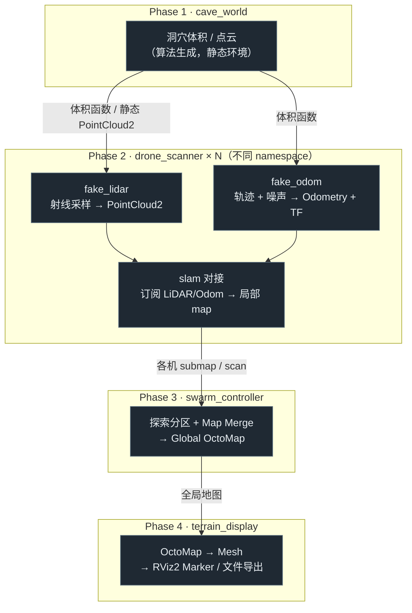
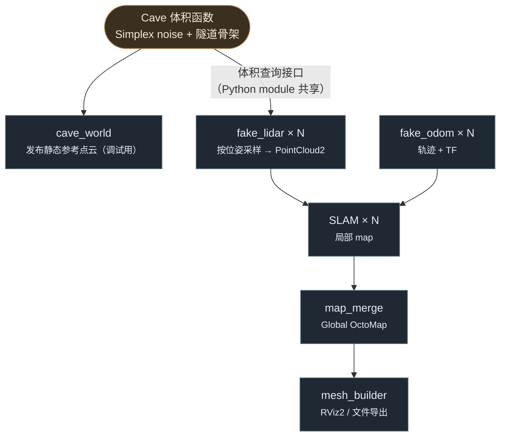
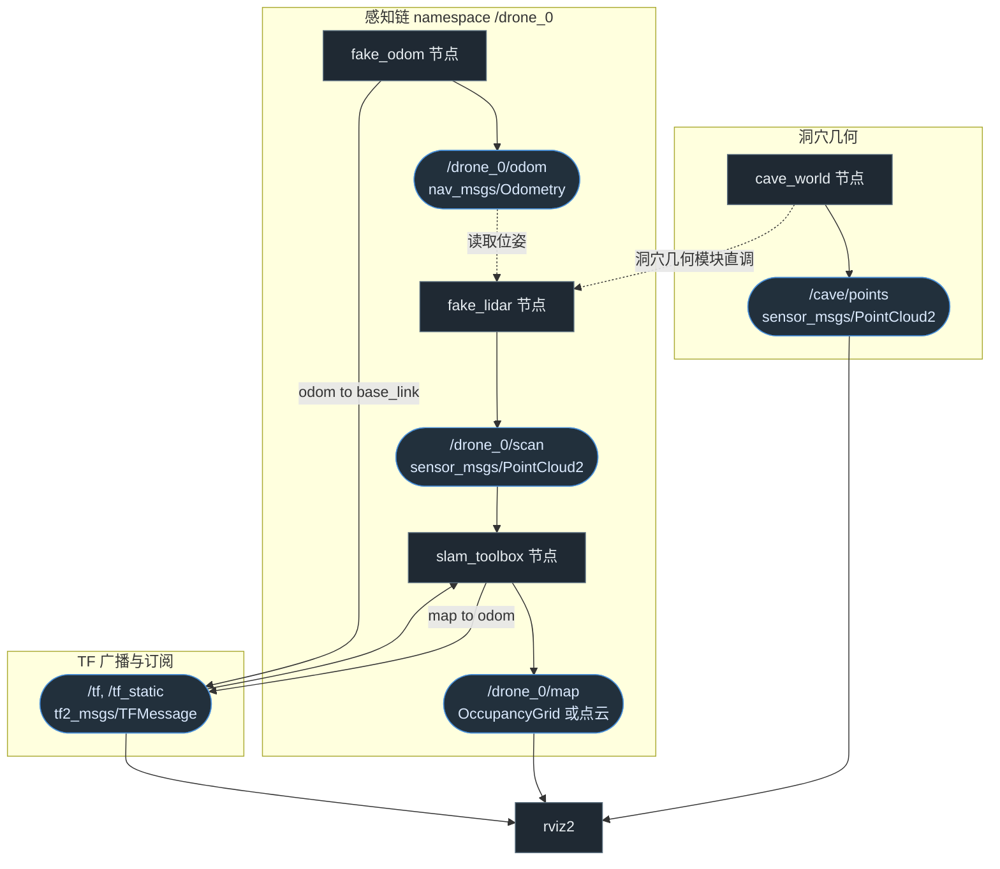
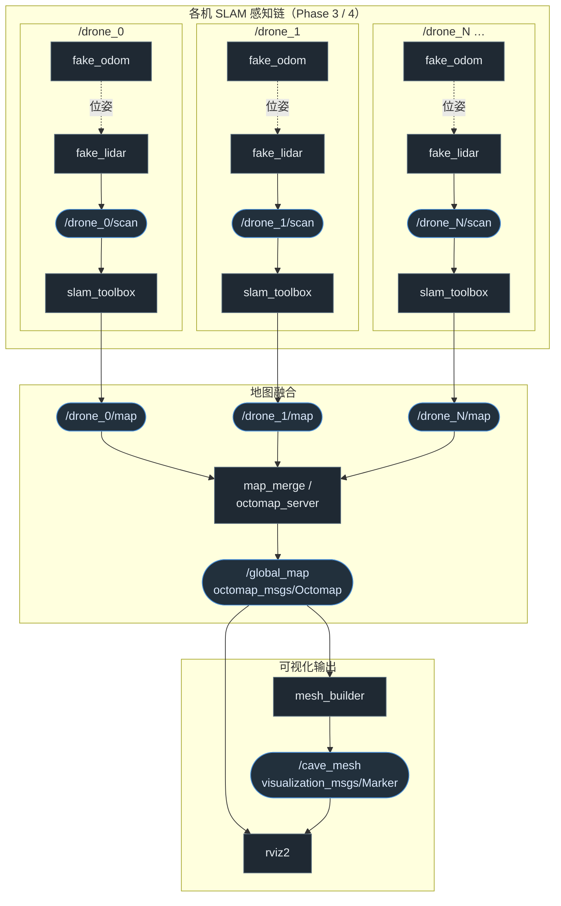

# 异形场景：多无人机地下扫描与实时地形构建

> 项目代号：**xenomorph-scanner**  
> 目标：在无真实硬件条件下，用 ROS 2 模拟多架无人机进入地下空间扫描，并实时构建、显示三维地形。  
> 环境：Windows + Docker（`alien-scanner-dev` / `alien-scanner-jazzy:latest`）+ VcXsrv GUI 转发

---

## 1. 场景与目标

参考《异形》中探测队进入未知地下结构的桥段：

- 多架无人机（建议 3～5 架）进入隧道/溶洞环境
- 各机携带 LiDAR（及可选 IMU）沿路径扫描
- 单机 SLAM 建局部地图，中心节点融合全局地图
- 在 RViz2 中实时看到点云地图逐步「长出来」，后期可导出 Mesh 面片

**成功判据（最终）：**

1. 至少 3 个命名空间下的 drone 节点同时运行
2. 全局 OctoMap 或合并点云随探索进度持续更新
3. RViz2 可交互查看完整洞穴结构
4. （可选）导出 `.obj` / `.ply` 地形网格

---

## 2. 已确定的技术决策

| 决策项 | 选择 | 理由 |
|--------|------|------|
| 仿真方式 | **脚本仿真**（Python 生成传感器数据） | Docker 内跑 Gazebo Harmonic 需 GPU/渲染栈，配置成本高 |
| 物理引擎 | **不使用 Gazebo**（Phase 1～4） | 核心目标是 SLAM + 多机融合算法，非物理真实性 |
| 洞穴数据来源 | **Simplex/Perlin noise 算法生成** | 零外部文件依赖；Phase 2 fake LiDAR 可直接复用同一体积函数做射线采样 |
| ROS 发行版 | **Jazzy**（容器内） | 已有 `ros2-jazzy-devcontainer` 与学习 workspace |
| 可视化 | **RViz2**（VcXsrv 已测通） | 备选：Foxglove Studio（Windows 原生） |
| SLAM | Phase 2 先用 **slam_toolbox**；后期可换 FAST-LIO2 | 上手快，与现有 Jazzy 包兼容 |

> **工程约定（分层 / 接口 / 测试边界）见仓库根 [`AGENTS.md`](../AGENTS.md)，为单一事实来源。** 本文档只描述各阶段如何套用这些约定，不重复其内容。

---

## 3. 开发环境映射

```
Windows                              Docker 容器 (alien-scanner-dev)
─────────────────────────────────────────────────────────────────────
D:\WorkDir\alien-scanner       ←→    /workspaces/alien-scanner      (bind mount)
D:\WorkDir\alien-scanner\ws\src←→    /workspaces/alien-scanner/ws/src
build / install / log          →     命名卷 alien_build / alien_install / alien_log
.env                           →     DISPLAY, ROS_DOMAIN_ID
```

**关键环境变量（`.env`）：**

```bash
DISPLAY=host.docker.internal:0.0
ROS_DOMAIN_ID=0
```

**容器内常用路径：**

| 用途 | 路径 |
|------|------|
| 工作区根 | `/workspaces/alien-scanner` |
| colcon workspace | `/workspaces/alien-scanner/ws` |
| 源码包目录 | `/workspaces/alien-scanner/ws/src` |
| Phase 1 包 | `/workspaces/alien-scanner/ws/src/cave_world` |

**构建与运行（容器内）：**

```bash
cd /workspaces/alien-scanner/ws
colcon build --symlink-install
source install/setup.bash
```

---

## 4. 总体架构



---

## 5. 包规划（ws/src 下新增）

```
ws/src/
├── cave_world/           # Phase 1 — 洞穴点云生成与发布
├── drone_scanner/        # Phase 2 — 单机 fake 传感器 + SLAM 对接
├── swarm_controller/     # Phase 3 — 多机探索与地图融合
└── terrain_display/      # Phase 4 — 地形 Mesh 与展示优化
```

---

## 6. 分阶段实施计划

### Phase 1：洞穴点云生成器（C++ 主体）— **已完成**

**语言约定：** 主体使用 **C++（rclcpp + ament_cmake）**；launch 使用 Python（`cave_world_launch.py`）集中声明地图参数；运行期节点是纯 C++。

**目标：** 生成并可视化静态地下洞穴点云，作为后续 LiDAR 采样的「真实环境」体积函数。

**产出：**

- RViz2 中看到网状分叉洞穴（默认）或经典 Y 字隧道（回退模式）的 3D 点云
- 话题 `/cave/points`（`sensor_msgs/PointCloud2`），`frame_id = map`，`TRANSIENT_LOCAL`（latched）发布
- `ICaveField` 接口 + `isSolid` / `raycast` / `sampleSurface`，供 Phase 2 `fake_lidar` 同进程链接复用

**状态：** ✅ 已实现并通过 RViz2 目检；单元测试 11 项（`TestProceduralCaveField` 6 + `TestTreeCaveField` 5）通过。

---

#### 1.1 包结构（实际）

```
ws/src/cave_world/
├── CMakeLists.txt              # cave_geometry 静态库 + cave_publisher 可执行
├── package.xml
├── include/cave_world/
│   ├── ICaveField.hpp          # 抽象洞穴场（ROS-free）
│   ├── ProceduralCaveField.hpp # 经典对称 Y 字（cave_mode:=y）
│   ├── TreeCaveField.hpp       # 草图网状拓扑（cave_mode:=tree，默认）
│   └── CavePublisherNode.hpp
├── src/
│   ├── ProceduralCaveField.cpp # 中轴线 / 半径剖面 / 外表面过滤 / raycast
│   ├── TreeCaveField.cpp       # 7 条臂 + Bezier 外环 + 体积并集
│   ├── CavePublisherNode.cpp   # 薄节点：参数 → ICaveField → PointCloud2
│   └── CavePublisherMain.cpp
├── launch/
│   └── cave_world_launch.py    # 启动 cave_publisher + rviz2，声明全部地图参数
├── config/
│   └── cave_world.rviz         # Fixed Frame=map，订阅 /cave/points，Z 轴着色
└── test/
    ├── TestProceduralCaveField.cpp
    └── TestTreeCaveField.cpp
```

**分层（遵循 `AGENTS.md`）：**

- 算法库 `cave_geometry`（`ProceduralCaveField` + `TreeCaveField`）**不含 rclcpp**。
- 节点 `cave_publisher` 持有 `std::unique_ptr<ICaveField>`，启动时 `sampleSurface()` 一次并缓存，定时重发。
- Phase 2 `fake_lidar` 将**链接 `cave_geometry` 并注入 `std::shared_ptr<ICaveField>`**，调用 `raycast()`。

---

#### 1.2 几何模式

| `cave_mode` | 实现类 | 说明 |
|-------------|--------|------|
| `tree`（**默认**） | `TreeCaveField` | 项目基础地图：1 入口、3 出口、1 外环 |
| `y` | `ProceduralCaveField` | 经典对称 Y 字，保留作回退/对照 |

**基础地图拓扑（`TreeCaveField`，已确认参数）：**

```text
入口 ──approach──► A ─┬─ 外环（Bezier 弧，相对 A→B 直连向左鼓出）──┐
                      ├─ 直连 A→B ───────────────────────────────► B ──► 出口1
                      └─ 右廊 A→C ──┬─► 出口2
                                    └─► 出口3
```

合并算法（两套实现共用思路）：

- `isSolid`：各臂折线管体**体积并集**（任一条臂内即空腔）
- `sampleSurface`：各臂独立环采样 + **外表面过滤**（沿外法向微移后仍非 solid 则丢弃内部假墙）

---

#### 1.3 `ICaveField` 接口

```cpp
// include/cave_world/ICaveField.hpp
namespace CaveWorld {
struct Point3 { float x, y, z; };

class ICaveField {
public:
  virtual ~ICaveField() = default;
  virtual bool isSolid(float x, float y, float z) const = 0;
  virtual bool raycast(const Point3& origin, const Point3& dir,
                       float max_range, float& out_dist) const = 0;
  virtual std::vector<Point3> sampleSurface() const = 0;
};
}  // namespace CaveWorld
```

---

#### 1.4 地图参数指定方式

**推荐：通过 launch 文件传参**

```bash
cd /workspaces/alien-scanner/ws && source install/setup.bash

# 基础地图（默认即此配置，无需额外参数）
ros2 launch cave_world cave_world_launch.py

# 显式写出基础地图三要素（与默认等价）
ros2 launch cave_world cave_world_launch.py \
  seed:=42 tree.loop_bulge:=12 tree.loop_direct_length:=16

# 微调示例
ros2 launch cave_world cave_world_launch.py \
  seed:=42 tree.loop_bulge:=14 density:=500

# 回退经典 Y 字
ros2 launch cave_world cave_world_launch.py cave_mode:=y seed:=7 length:=40
```

**语法规则：**

| 方式 | 写法 | 说明 |
|------|------|------|
| ✅ Launch 覆盖 | `ros2 launch ... param:=value` | **首选**；`tree.*` 带点号的参数名原样书写 |
| ✅ 多参数 | 空格分隔多个 `name:=value` | 布尔：`branch:=false`；整数：`seed:=42` |
| ❌ 避免 | `ros2 launch ... --ros-args -p` | 对 launch 文件**无效**，参数不会传到节点 |
| 备选 | `ros2 run cave_world cave_publisher --ros-args -p ...` | 仅单独跑节点时用；launch 未暴露的 `frame_id` / `topic` / `publish_rate` 只能走此路径 |

**参数生效范围：**

- `cave_mode:=tree` 时：`tree.*` 与下方「通用参数」生效；`length` / `branch_*` / `chamber_*`（Y 专用）被忽略。
- `cave_mode:=y` 时：Y 专用参数 + 通用参数生效；`tree.*` 被忽略。
- 修改几何参数后需**重启 launch**（点云在节点启动时生成并缓存）。

---

#### 1.5 参数表

**基础地图默认值（`cave_mode:=tree`）— 后续 Phase 2/3 以此为基准：**

| 参数 | 默认 | 说明 |
|------|------|------|
| `seed` | `42` | 形状确定性种子（`asymmetry` 扰动） |
| `tree.loop_direct_length` | `16.0` | A→B 直连长度 (m) |
| `tree.loop_bulge` | `12.0` | 外环相对 A→B 中点左侧鼓出 (m) |

**通用参数（两种模式共用）：**

| 参数 | 默认 | 说明 |
|------|------|------|
| `cave_mode` | `tree` | `tree` \| `y` |
| `seed` | `42` | 确定性种子 |
| `base_radius` | `2.5` | 管体基础半径 (m) |
| `n_segments` | `200` | 中轴线分段数（tree 接入段；Y 每条臂） |
| `density` | `400` | 表面采样密度（越大点越多） |
| `noise_scale` | `0.4` | 洞壁噪声强度 |

**`tree.*` 参数（仅 `cave_mode:=tree`）：**

| 参数 | 默认 | 说明 |
|------|------|------|
| `tree.approach_length` | `12.0` | 入口 → 分叉点 A (m) |
| `tree.loop_yaw` | `0.50` | A→B 方向相对入口切线偏角 (rad) |
| `tree.loop_direct_length` | `16.0` | A→B 直连长度 (m) |
| `tree.loop_bulge` | `12.0` | 外环左侧鼓出 (m) |
| `tree.exit1_length` | `14.0` | B → 出口1 (m) |
| `tree.right_yaw` | `-0.12` | A→C 右廊偏角 (rad) |
| `tree.right_corridor_length` | `10.0` | A→C 长度 (m) |
| `tree.exit_yaw_spread` | `0.35` | 出口2/3 展开半角 (rad) |
| `tree.exit_arm_length` | `14.0` | 出口2/3 长度 (m) |
| `tree.vertical_step` | `-0.10` | 各臂 pitch，负=下沉 (rad) |
| `tree.asymmetry` | `0.22` | seed 驱动的角度/长度扰动 [0,1] |
| `tree.chamber_on_approach` | `false` | 接入段溶洞（默认关，避免入口膨大） |
| `tree.chamber_at` | `0.55` | 溶洞轴向位置（仅上项为 true 时） |
| `tree.chamber_scale` | `2.2` | 溶洞半径放大倍数 |

**Y 模式参数（仅 `cave_mode:=y`）：**

| 参数 | 默认 | 说明 |
|------|------|------|
| `length` | `40.0` | 入口 → junction 主干长度 (m) |
| `branch_length` | `20.0` | 每条岔臂长度 (m) |
| `branch` | `true` | 是否生成 Y 分叉 |
| `branch_angle` | `0.55` | 两岔臂半角 (rad) |
| `chamber_at` | `0.5` | 溶洞在主干上的比例 [0,1] |
| `chamber_scale` | `3.0` | 溶洞放大倍数 |

**发布相关（节点 `declare_parameter`，launch 未暴露，改默认值或 `ros2 run --ros-args -p`）：**

| 参数 | 默认 | 说明 |
|------|------|------|
| `frame_id` | `map` | 点云坐标系 |
| `topic` | `/cave/points` | 发布话题 |
| `publish_rate` | `1.0` | 重发频率 (Hz)；几何不变，仅刷新 stamp |

---

#### 1.6 发布话题与 QoS

| 项目 | 值 |
|------|-----|
| **话题** | `/cave/points` |
| **消息类型** | `sensor_msgs/msg/PointCloud2` |
| **发布节点** | `cave_publisher`（`cave_world` 包） |
| **frame_id** | `map` |
| **字段** | `x`, `y`, `z`（float32，`is_dense=true`） |
| **QoS** | 深度 1 + **`TRANSIENT_LOCAL`**（latched）；晚订阅的 RViz2 也能立即收到 |
| **生成时机** | 节点启动时 `sampleSurface()` 一次；定时器按 `publish_rate` 重发同一缓存 |
| **典型点数** | 与 `density`、臂长度、拓扑相关，约 10⁵ 量级（视参数而定） |

**验证命令：**

```bash
ros2 topic list | grep cave
ros2 topic info /cave/points -v
ros2 topic hz /cave/points
ros2 topic echo /cave/points --once | head -20
```

**RViz2：** launch 自动加载 `config/cave_world.rviz`；Fixed Frame 须为 `map`，PointCloud2 显示订阅 `/cave/points`。

---

#### 1.7 构建、测试与验收

```bash
cd /workspaces/alien-scanner/ws
colcon build --symlink-install --packages-select cave_world
source install/setup.bash

# 单元测试（算法库，无 ROS）
colcon test --packages-select cave_world --event-handlers console_direct+
colcon test-result --verbose

# 可视化验收
ros2 launch cave_world cave_world_launch.py
```

**通过标准（已满足）：**

- RViz2 可见网状分叉洞穴，可旋转/缩放
- `/cave/points` 持续发布，`frame_id=map`，新开 RViz 能立即显示
- 修改 `density` / `tree.loop_bulge` 等参数后重启，点云随之变化
- `seed` 固定时形状可复现（单测覆盖）

**任务清单：**

- [x] 创建 `cave_world` C++ 包（`ament_cmake`）
- [x] `ICaveField.hpp` 抽象接口
- [x] `ProceduralCaveField` — 经典 Y + `isSolid` / `raycast` / `sampleSurface`
- [x] `TreeCaveField` — 草图拓扑 + 外环 + 外表面过滤
- [x] `CavePublisherNode` — 参数、`TRANSIENT_LOCAL`、缓存点云、定时发布
- [x] `cave_world_launch.py` + `cave_world.rviz`
- [x] gtest：`TestProceduralCaveField`、`TestTreeCaveField`
- [x] 基础地图默认值：`seed=42`, `tree.loop_bulge=12`, `tree.loop_direct_length=16`
- [ ] （可选）`scripts/gen_cave_ply.py` 离线导出 `.ply`
- [ ] （可选）`launch_testing` 集成测试（话题存在 / TF 合法）

**Phase 2 衔接：** `fake_lidar` 链接 `cave_geometry`，构造注入与 `cave_publisher` 相同配置的 `ICaveField` 实例，按位姿调用 `raycast()`；静态 `/cave/points` 仍可用于 RViz 对照真值。

---

### Phase 2：单 drone 扫描闭环

**目标：** 一架虚拟无人机沿洞穴飞行，fake LiDAR 从 `cave_world` 体积采样，SLAM 实时建图。

**产出：**

- RViz2 中 drone 轨迹 + **逐步构建**的局部地图（与 Phase 1 全量静态点云区分开）
- 完整 TF 树：`map → odom → base_link → lidar_link`

**任务清单（C++ 主体，接口标注见根 `AGENTS.md`）：**

- [ ] 创建 `drone_scanner` C++ 包（`ament_cmake`）
- [ ] `fake_lidar`（具体类，**不自身抽象**）：**构造注入 `std::shared_ptr<CaveWorld::ICaveField>`**，按 drone 位姿调用 `raycast()` 采样 → 发 `PointCloud2`
  - [ ] 单测：注入解析可算的假 `ICaveField`（单位球/平面），断言扫描点/range
- [ ] `ITrajectory`（**接口**）+ 实现：`LineTrajectory` / `WaypointTrajectory` / `OrbitTrajectory`；`pose(t)` 返回位姿
  - [ ] 单测：直接测各实现（`pose(0)=起点`、`pose(1)=终点`、速度不超限）
- [ ] `fake_odom` 节点：持有 `ITrajectory`，采样位姿 + 高斯噪声 → 发 `nav_msgs/Odometry` + TF(`odom→base_link`)
- [ ] 对接 **slam_toolbox**（外部节点，不做 C++ 接口；或简化版：点云累积 + ICP 占位）
- [ ] `launch/single_drone.launch.xml`：cave_world + fake 节点 + slam + rviz
- [ ] 单机 namespace 约定：`/drone_0/...`

**建议依赖：**

```bash
sudo apt install -y \
  ros-jazzy-slam-toolbox \
  ros-jazzy-tf2-ros \
  ros-jazzy-tf2-geometry-msgs \
  ros-jazzy-nav-msgs
pip install transforms3d
```

**关键话题（示例）：**

| 话题 | 类型 | 说明 |
|------|------|------|
| `/drone_0/scan` | `sensor_msgs/PointCloud2` | 模拟 LiDAR |
| `/drone_0/odom` | `nav_msgs/Odometry` | 里程计 |
| `/drone_0/map` | `nav_msgs/OccupancyGrid` 或点云 map | SLAM 输出 |

**验收：**

- 播放 launch 后，地图随 drone 移动而扩展
- `ros2 run tf2_tools view_frames` 生成合理 TF 树

**预计工作量：** 2～3 天

---

### Phase 3：多 drone 协同

**目标：** 3～5 架 drone 分区探索，子图融合为全局 OctoMap。

**产出：**

- 多 namespace 并行扫描
- 全局 `/global_map` 或 OctoMap 话题
- （可选）简单 frontier 探索：未扫描区域驱动下一目标点

**任务清单（C++ 主体，接口标注见根 `AGENTS.md`）：**

- [ ] 创建 `swarm_controller` C++ 包（`ament_cmake`）
- [ ] `IExplorationStrategy`（**接口，强烈建议**）+ 实现：`PartitionStrategy` / `FrontierStrategy` / `WaypointStrategy`；输入地图 → 输出下一目标点
  - [ ] 单测：喂合成栅格地图，断言返回目标落在未探索区
- [ ] `IMapMerger`（**先具体、留接口边界**）：`octomap_server` 封装 或 自写点云拼接；多机子图 → `/global_map`
  - [ ] 单测：喂两张合成子图，断言合并覆盖并集
- [ ] `launch/swarm.launch.xml`：参数 `num_drones:=3`
- [ ] 命名空间：`/drone_0` … `/drone_N`
- [ ] QoS：点云话题使用 `sensor_data` 配置，避免丢帧

**建议依赖：**

```bash
sudo apt install -y \
  ros-jazzy-octomap \
  ros-jazzy-octomap-msgs \
  ros-jazzy-octomap-rviz-plugins \
  ros-jazzy-nav2-msgs
```

**验收：**

- 同时 3 个 fake drone 运行，CPU 可接受
- 全局地图无明显的重复 ghosting（或 merge 参数可调）

**预计工作量：** 3～5 天

---

### Phase 4：地形显示优化

**目标：** 将 OctoMap/点云转为 Mesh，提升「电影感」展示效果。

**产出：**

- RViz2 中 Mesh marker 或着色点云
- 可选导出 `cave_mesh.obj` / `cave_mesh.ply`

**任务清单（接口标注见根 `AGENTS.md`）：**

- [ ] 创建 `terrain_display` 包
- [ ] `IMeshReconstructor`（**先具体、留接口边界**）：`MarchingCubes` / `Poisson` 实现；OctoMap → Mesh
  - [ ] 单测：喂已知体素/点云，断言输出三角面片数量/包围盒合理
- [ ] `mesh_builder` 节点：持有 `IMeshReconstructor`，发 `visualization_msgs/Marker`
- [ ] `launch/terrain_display.launch.xml`
- [ ] RViz2 配置：OctoMap 插件 + Mesh marker
- [ ] （可选）录制 `ros2 bag` 做回放演示

> 说明：若重建走 Open3D（Python 生态更成熟），此模块可作为「特殊/外部数据处理」例外用 Python 实现；否则 C++ 主体。按 `AGENTS.md` 的语言例外条款执行。

**建议依赖：**

```bash
# C++ 路线无需 open3d；若走 Python 重建例外则：
# pip install open3d
sudo apt install -y ros-jazzy-visualization-msgs
```

**验收：**

- 全局探索完成后，Mesh 表面连续、无明显空洞（或参数可调）
- 导出文件可在外部查看器打开

**预计工作量：** 1～2 天

---

## 7. 数据流（脚本仿真版）



---

### 7.1 节点 ↔ 话题 发布/订阅图（rqt_graph 风格）

> 矩形 = ROS 节点；圆角框 = 话题（含消息类型）；实线 = 话题发布/订阅；虚线 = 非话题依赖（TF 或 Python 模块直接调用）。

### 单机版（Phase 2 · namespace `/drone_0`）



### 多机版（Phase 3 / 4 · N 架无人机 + 融合 + 显示）



### 话题一览表

| 话题 | 消息类型 | 发布者 | 订阅者 |
|------|----------|--------|--------|
| `/cave/points` | `sensor_msgs/PointCloud2` | `cave_world` | `rviz2` |
| `/drone_i/odom` | `nav_msgs/Odometry` | `fake_odom` | `fake_lidar`（读位姿） |
| `/drone_i/scan` | `sensor_msgs/PointCloud2` | `fake_lidar` | `slam_toolbox` |
| `/drone_i/map` | `OccupancyGrid` / 点云 | `slam_toolbox` | `map_merge` |
| `/global_map` | `octomap_msgs/Octomap` | `map_merge` | `mesh_builder`, `rviz2` |
| `/cave_mesh` | `visualization_msgs/Marker` | `mesh_builder` | `rviz2` |
| `/tf`, `/tf_static` | `tf2_msgs/TFMessage` | `fake_odom`(odom→base_link)、`slam_toolbox`(map→odom) | 全体 |

---

## 8. 暂不采用 Gazebo 的说明

Jazzy 对应 **Gazebo Harmonic**，相关包名为 `ros-jazzy-ros-gz-sim` 等，但在 Docker 内运行通常需要：

- GPU 设备映射（`/dev/dri`）
- 完整 OpenGL/Vulkan 渲染链
- 额外的 X11/Wayland 配置

当前 Dev Container 以 **CLion + RViz2** 为主，未针对 Gazebo 优化。若后期需要物理仿真，建议在 **WSL2 Ubuntu 22.04 + Humble/Fortress** 或宿主机原生环境单独搭建，与本 workspace 通过 `ros_gz_bridge` 桥接。

---

## 9. 风险与缓解

| 风险 | 缓解 |
|------|------|
| 命名卷导致 Windows 上看不到 build 产物 | 正常；在容器内 build，源码在 bind mount 的 `ws/src` |
| 点云带宽大、多机卡顿 | 降低发布频率；OctoMap 压缩；只传 keyframe |
| slam_toolbox 偏 2D | Phase 2 可先用 2D 投影验证流程，再换 3D 方案 |
| Simplex 洞穴不够「真实」 | 调参增加分支/溶洞；或后期替换为 PLY 模型 |
| GUI 黑屏 | 确认 VcXsrv「Disable access control」；检查 `DISPLAY` |

---

## 10. 推荐执行顺序（Checklist）

```
[x] 0. 容器与环境（alien-scanner-dev + VcXsrv）
[x] 1. Phase 1 — cave_world 包 + RViz2 看到洞穴（基础地图 seed=42）
[ ] 2. Phase 2 — 单机 fake LiDAR + SLAM 闭环
[ ] 3. Phase 3 — 3 机 swarm + 全局 map
[ ] 4. Phase 4 — Mesh 与演示 polish
[ ] 5. （可选）ros2 bag 录制 + README 演示 GIF
```

**当前进度：** Phase 1 **已完成**；Phase 1 详细用法见上文 §6 Phase 1（参数、话题、launch 命令）。

---

## 11. 参考与学习资源

- ROS 2 Jazzy 文档：https://docs.ros.org/en/jazzy/
- slam_toolbox：https://github.com/SteveMacenski/slam_toolbox
- OctoMap：http://octomap.github.io/

---

## 12. 文档维护

| 字段 | 值 |
|------|-----|
| 创建日期 | 2026-07-06 |
| 最后更新 | 2026-07-06 |
| 状态 | Phase 1 已完成；Phase 2 待实施 |
