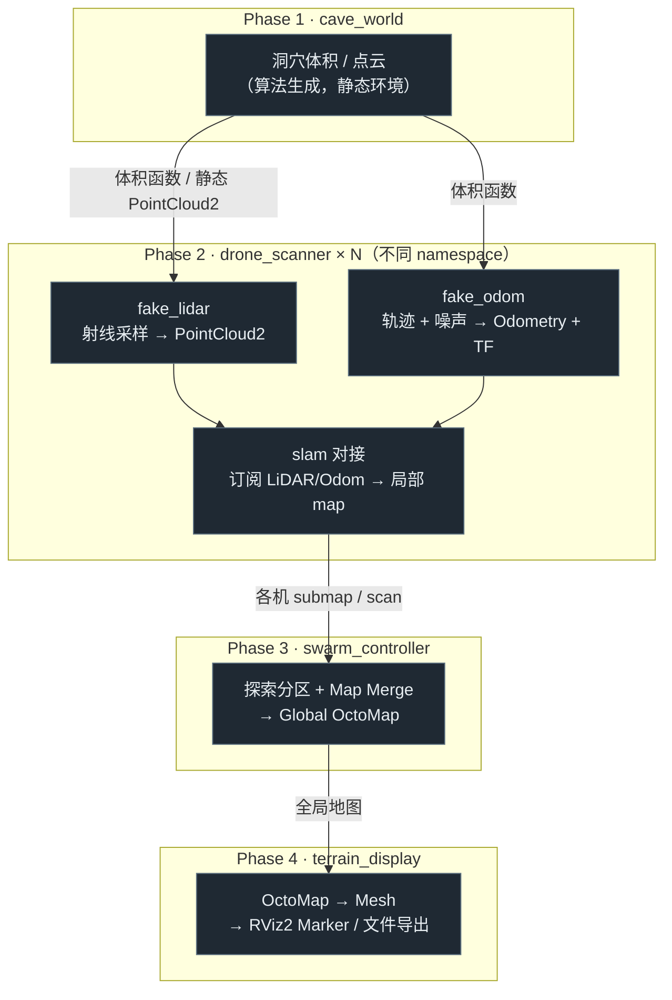
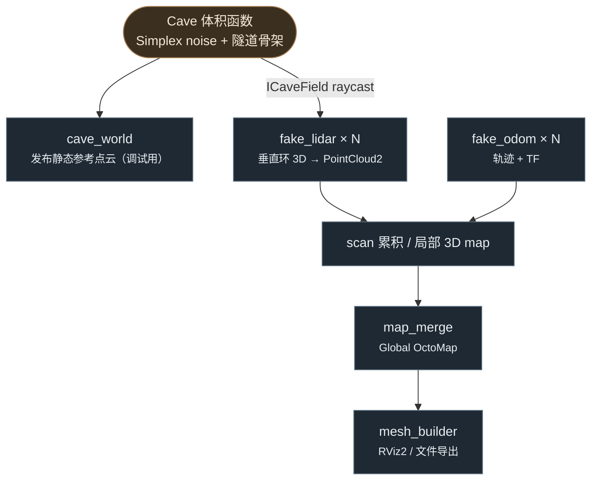
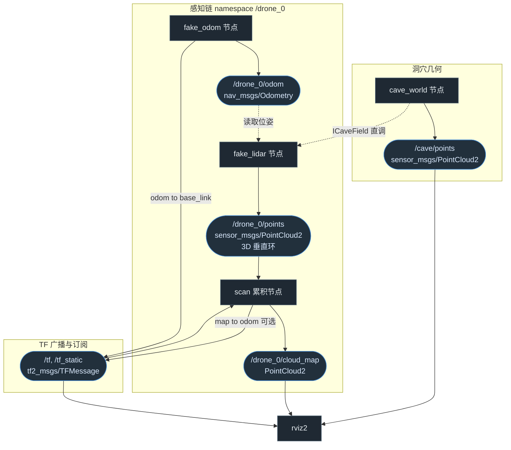
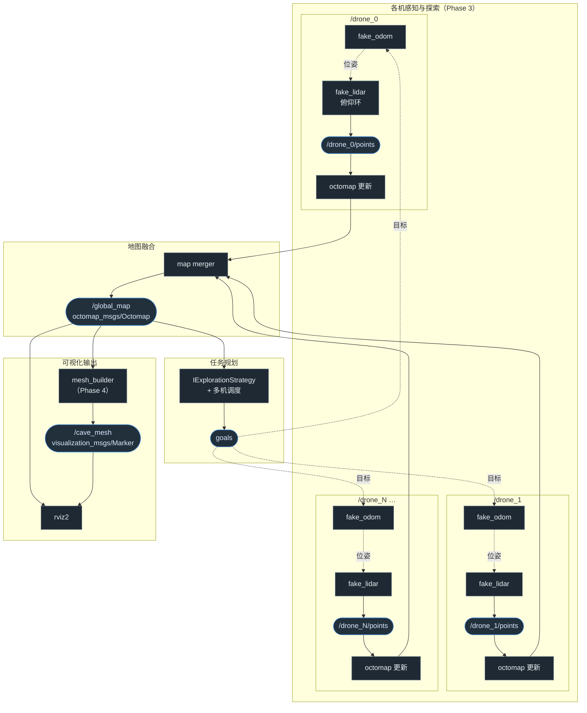

# 异形场景：多无人机地下扫描与实时地形构建

> 项目代号：**xenomorph-scanner**  
> 目标：在无真实硬件条件下，用 ROS 2 模拟多架无人机进入地下空间扫描，并实时构建、显示三维地形。  
> 环境：Windows + Docker（`alien-scanner-dev` / `alien-scanner-jazzy:latest`）+ VcXsrv GUI 转发

---

## 1. 场景与目标

参考《异形》中探测队进入未知地下结构的桥段：

- 多架无人机（建议 3～5 架）进入隧道/溶洞环境
- 各机携带 LiDAR（及可选 IMU）沿路径扫描
- 单机 SLAM 建局部地图，中心节点融合全局地图
- 在 RViz2 中实时看到点云地图逐步「长出来」，后期可导出 Mesh 面片

**成功判据（最终）：**

1. 至少 3 个命名空间下的 drone 节点同时运行
2. 全局 OctoMap 或合并点云随探索进度持续更新
3. RViz2 可交互查看完整洞穴结构
4. （可选）导出 `.obj` / `.ply` 地形网格

---

## 2. 已确定的技术决策

| 决策项 | 选择 | 理由 |
|--------|------|------|
| 仿真方式 | **脚本仿真**（Python 生成传感器数据） | Docker 内跑 Gazebo Harmonic 需 GPU/渲染栈，配置成本高 |
| 物理引擎 | **不使用 Gazebo**（Phase 1～4） | 核心目标是 SLAM + 多机融合算法，非物理真实性 |
| 洞穴数据来源 | **Simplex/Perlin noise 算法生成** | 零外部文件依赖；Phase 2 fake LiDAR 可直接复用同一体积函数做射线采样 |
| ROS 发行版 | **Jazzy**（容器内） | 已有 `ros2-jazzy-devcontainer` 与学习 workspace |
| 可视化 | **RViz2**（VcXsrv 已测通） | 备选：Foxglove Studio（Windows 原生） |
| SLAM / 建图 | **3D 点云 / OctoMap**（Phase 2 累积扫描；Phase 3 多机融合） | 洞穴高度变化大，**不用 2D 水平 LaserScan + slam_toolbox** 作为主路径 |
| 模拟 LiDAR 几何 | **垂直 360° 环**（见 [`phase-02-drone-scanner.md`](phases/phase-02-drone-scanner.md)） | 需感知上下与侧向，避免地面骤降时纯水平 2D 漏检 |

> **工程约定（分层 / 接口 / 测试边界）见仓库根 [`AGENTS.md`](../AGENTS.md)，为单一事实来源。** 本文档只描述各阶段如何套用这些约定，不重复其内容。

### 2.1 坐标系约定

| 帧 | 标准 | 本项目 |
|----|------|--------|
| **`map` / `odom`** | 右手系、**z 朝上**（同 [REP-105](https://www.ros.org/reps/rep-0105.html) 惯例） | 洞穴与点云在 `map`；`map→odom` static 零变换 |
| **`base_link` / `lidar_link`** | [REP-103](https://www.ros.org/reps/rep-0103.html)：x 前、y 左、z 上 | 默认 `yaw=0` 时机头 **+x ∥ map +X** |
| **`ICaveField` 坐标** | 无 ROS 帧名 | 数值与 **`map` 同系** |

扫描几何、TF、话题细节见 [`docs/phases/phase-02-drone-scanner.md`](phases/phase-02-drone-scanner.md) §坐标系。

---

## 3. 开发环境映射

```
Windows                              Docker 容器 (alien-scanner-dev)
─────────────────────────────────────────────────────────────────────
D:\WorkDir\alien-scanner       ←→    /workspaces/alien-scanner      (bind mount)
D:\WorkDir\alien-scanner\ws\src←→    /workspaces/alien-scanner/ws/src
build / install / log          →     命名卷 alien_build / alien_install / alien_log
.env                           →     DISPLAY, ROS_DOMAIN_ID
```

**关键环境变量（`.env`）：**

```bash
DISPLAY=host.docker.internal:0.0
ROS_DOMAIN_ID=0
```

**容器内常用路径：**

| 用途 | 路径 |
|------|------|
| 工作区根 | `/workspaces/alien-scanner` |
| colcon workspace | `/workspaces/alien-scanner/ws` |
| 源码包目录 | `/workspaces/alien-scanner/ws/src` |
| Phase 1 包 | `/workspaces/alien-scanner/ws/src/cave_world` |

**构建与运行（容器内）：**

```bash
cd /workspaces/alien-scanner/ws
colcon build --symlink-install
source install/setup.bash
```

---

## 4. 总体架构



---

## 5. 包规划（ws/src 下新增）

```
ws/src/
├── cave_world/           # Phase 1 — 洞穴点云生成与发布
├── drone_scanner/        # Phase 2 — 单机 fake 传感器 + SLAM 对接
├── swarm_controller/     # Phase 3 — 多机探索与地图融合
└── terrain_display/      # Phase 4 — 地形 Mesh 与展示优化
```

---

## 6. 分阶段实施计划

> **分步细节**（参数表、launch、逐步验收、Git commit）已拆至 [`docs/phases/`](phases/)；本节仅保留各 Phase **目标 / 产出摘要 / 跨 Phase 契约**。

### Phase 1：洞穴点云生成器 — **已完成**

**目标：** 生成并可视化静态洞穴点云；暴露 `ICaveField` 供 Phase 2 raycast。

**产出摘要：**

- 包 `cave_world`：`TreeCaveField`（默认）/ `ProceduralCaveField`（Y 回退）
- 话题 `/cave/points`（`PointCloud2`，`frame_id=map`，`TRANSIENT_LOCAL`）
- 进洞方向 **`map +X`**（默认轨迹机头沿 map +X，`yaw=0`）；基础地图 `seed=42`, `tree.loop_bulge=12`, `tree.loop_direct_length=16`
- gtest 11 项通过；RViz2 目检通过

**快速启动：**

```bash
ros2 launch cave_world cave_world_launch.py
```

**详细文档（参数表 / launch 拆分 / 拓扑 / 验收）：** [`docs/phases/phase-01-cave-world.md`](phases/phase-01-cave-world.md)

---

### Phase 2：单 drone 三维扫描闭环 — **已完成**

**目标：** fake LiDAR 对 `ICaveField` 做 **YZ 垂直 360° 环** raycast；单机 3D 点云累积（非 2D SLAM）。

**进度摘要：**

| 步 | 内容 | 状态 |
|----|------|------|
| 2-1 | `LineTrajectory` + gtest | ✅ |
| 2-2 | `FakeLidar` + gtest | ✅ |
| 2-3 | `fake_odom` + TF + launch 复用 cave | ✅ |
| 2-4 | `fake_lidar` 节点 → `/drone_0/points` | ✅ |
| 2-5 | `scan_accumulator` + 双 RViz 预览 | ✅ |
| 2-6 | 单机一键闭环（=`fake_lidar_launch.py`） | ✅ |

**跨 Phase 契约（摘要）：**

- 进洞 **map +X**（机头 `yaw=0`）；默认轨迹 `(0,0,1.5)→(11,0,1.5)`
- 扫描环在 **YZ 平面**（⊥ 前进方向）；不用 xy 水平 2D 作主路径
- 关键话题：`/drone_0/odom`、`/drone_0/points`、`/drone_0/cloud_map`
- 累积默认 **50 万点上限**（超出丢最早点）；**轨迹结束后停扫**，避免停飞空转占满上限
- **Phase 3 将扩展：** 环面俯仰（`ring_pitch`）以消除正前盲区；本 Phase 默认 `pitch=0`

**当前预览（Phase 2 single_drone 入口 = `fake_lidar_launch.py`；双 RViz，仿真窗默认叠加洞穴真值）：**

```bash
ros2 launch drone_scanner fake_lidar_launch.py

# 纯探索视角（关闭真值）
ros2 launch drone_scanner fake_lidar_launch.py show_cave:=false
```

**详细文档（分步实现 / 坐标约定 / Git commit / 验收）：** [`docs/phases/phase-02-drone-scanner.md`](phases/phase-02-drone-scanner.md)

---

### Phase 3：多机未知探索与地图融合 — **未开始**

**分支（建议）：** `phase/3-swarm-controller`

**目标：** 未知探索（规划不读洞穴真值拓扑）；可俯仰垂直环 + 高度自适应；**OctoMap** 观测地图；多机任务调度；`/global_map` 融合。

**进度摘要：**

| 步 | 内容 | 状态 |
|----|------|------|
| 3-1 | 环面俯仰倾斜 `ring_pitch`（方案 A，不增 beam） | ✅ |
| 3-2 | 高度自适应 | ⬜ |
| 3-3 | OctoMap 观测地图（含未命中 beam free 雕刻） | ⬜ |
| 3-4 | `IExplorationStrategy`（单机选目标） | ⬜ |
| 3-5 | 单机探索闭环 + 最小避障 | ⬜ |
| 3-6 | 多机 launch（`num_drones:=3`） | ⬜ |
| 3-7 | 多机任务调度（未知分配） | ⬜ |
| 3-8 | `/global_map` 融合 | ⬜ |
| 3-9 | 更强路径规划（按需） | ⬜ |
| 3-10 | 一键 swarm + 测试验收 | ⬜ |

**跨 Phase 契约（摘要）：**

- 真值 `ICaveField` 仅造数；规划 / 调度零拓扑真值依赖
- 主路径观测地图 = **OctoMap**（非「纯点云不维护未知」）
- 扫描：可俯仰垂直环；高度传感自适应；非整条预设廊道
- 任务规划派机探索未知；不按已知出口预分配航线

**建议依赖：**

```bash
sudo apt install -y \
  ros-jazzy-octomap \
  ros-jazzy-octomap-msgs \
  ros-jazzy-octomap-rviz-plugins
```

**验收（硬判据）：** 零真值依赖规划；覆盖单调；不穿已知墙；默认俯仰前视有效；多机覆盖优于单机。

**详细文档：** [`docs/phases/phase-03-swarm.md`](phases/phase-03-swarm.md)

**预计工作量：** 4～6 天（含 3-1 感知扩展）

---

### Phase 4：地形显示优化

**目标：** 将 OctoMap/点云转为 Mesh，提升「电影感」展示效果。

**产出：**

- RViz2 中 Mesh marker 或着色点云
- 可选导出 `cave_mesh.obj` / `cave_mesh.ply`

**任务清单（接口标注见根 `AGENTS.md`）：**

- [ ] 创建 `terrain_display` 包
- [ ] `IMeshReconstructor`（**先具体、留接口边界**）：`MarchingCubes` / `Poisson` 实现；OctoMap → Mesh
  - [ ] 单测：喂已知体素/点云，断言输出三角面片数量/包围盒合理
- [ ] `mesh_builder` 节点：持有 `IMeshReconstructor`，发 `visualization_msgs/Marker`
- [ ] `launch/terrain_display.launch.xml`
- [ ] RViz2 配置：OctoMap 插件 + Mesh marker
- [ ] （可选）录制 `ros2 bag` 做回放演示

> 说明：若重建走 Open3D（Python 生态更成熟），此模块可作为「特殊/外部数据处理」例外用 Python 实现；否则 C++ 主体。按 `AGENTS.md` 的语言例外条款执行。

**建议依赖：**

```bash
# C++ 路线无需 open3d；若走 Python 重建例外则：
# pip install open3d
sudo apt install -y ros-jazzy-visualization-msgs
```

**验收：**

- 全局探索完成后，Mesh 表面连续、无明显空洞（或参数可调）
- 导出文件可在外部查看器打开

**预计工作量：** 1～2 天

---

## 7. 数据流（脚本仿真版）



---

### 7.1 节点 ↔ 话题 发布/订阅图（rqt_graph 风格）

> 矩形 = ROS 节点；圆角框 = 话题（含消息类型）；实线 = 话题发布/订阅；虚线 = 非话题依赖（TF 或 Python 模块直接调用）。

### 单机版（Phase 2 · namespace `/drone_0`）



### 多机版（Phase 3 / 4 · N 架无人机 + 融合 + 显示）



### 话题一览表

| 话题 | 消息类型 | 发布者 | 订阅者 |
|------|----------|--------|--------|
| `/cave/points` | `sensor_msgs/PointCloud2` | `cave_world` | `rviz2`（对照，不参与规划） |
| `/drone_0/points` | `sensor_msgs/PointCloud2` | `fake_lidar` | OctoMap 更新、RViz |
| `/drone_0/cloud_map` | `sensor_msgs/PointCloud2` | scan 累积 | RViz（可选） |
| `/drone_0/odom` | `nav_msgs/Odometry` | `fake_odom` | `fake_lidar`、探索执行 |
| `/global_map` | `octomap_msgs/Octomap` | map merger | 调度、`mesh_builder`、`rviz2` |
| `/cave_mesh` | `visualization_msgs/Marker` | `mesh_builder`（Phase 4） | `rviz2` |
| `/tf`, `/tf_static` | `tf2_msgs/TFMessage` | `fake_odom`、static TF | 全体 |

---

## 8. 暂不采用 Gazebo 的说明

Jazzy 对应 **Gazebo Harmonic**，相关包名为 `ros-jazzy-ros-gz-sim` 等，但在 Docker 内运行通常需要：

- GPU 设备映射（`/dev/dri`）
- 完整 OpenGL/Vulkan 渲染链
- 额外的 X11/Wayland 配置

当前 Dev Container 以 **CLion + RViz2** 为主，未针对 Gazebo 优化。若后期需要物理仿真，建议在 **WSL2 Ubuntu 22.04 + Humble/Fortress** 或宿主机原生环境单独搭建，与本 workspace 通过 `ros_gz_bridge` 桥接。

---

## 9. 风险与缓解

| 风险 | 缓解 |
|------|------|
| 命名卷导致 Windows 上看不到 build 产物 | 正常；在容器内 build，源码在 bind mount 的 `ws/src` |
| 点云带宽大、多机卡顿 | 降低发布频率；OctoMap 压缩；只传 keyframe |
| 2D 水平扫描不适于 3D 洞 | **垂直环 3D 扫描** + Phase 3 OctoMap；不以 slam_toolbox 2D 为主路径 |
| Simplex 洞穴不够「真实」 | 调参增加分支/溶洞；或后期替换为 PLY 模型 |
| GUI 黑屏 | 确认 VcXsrv「Disable access control」；检查 `DISPLAY` |

---

## 10. 推荐执行顺序（Checklist）

```
[x] 0. 容器与环境（alien-scanner-dev + VcXsrv）
[x] 1. Phase 1 — cave_world 包 + RViz2 看到洞穴
[x] 2. Phase 2 — 3D 垂直环 fake LiDAR + fake_odom（见 docs/phases/phase-02-drone-scanner.md）
[ ] 3. Phase 3 — 未知探索 + 俯仰环 + OctoMap + 多机调度（见 docs/phases/phase-03-swarm.md）
[ ] 4. Phase 4 — Mesh 与演示 polish
[ ] 5. （可选）ros2 bag 录制 + README 演示 GIF
```

**当前进度：** Phase 1、Phase 2 已完成；下一步 Phase 3（见 [`docs/phases/phase-03-swarm.md`](phases/phase-03-swarm.md)）。

---

## 11. 分阶段详细文档

| Phase | 文档 | 说明 |
|-------|------|------|
| 1 | [`docs/phases/phase-01-cave-world.md`](phases/phase-01-cave-world.md) | 参数表、launch、拓扑、测试与验收 |
| 2 | [`docs/phases/phase-02-drone-scanner.md`](phases/phase-02-drone-scanner.md) | 分步实现、坐标约定、Git、数据流 |
| 3 | [`docs/phases/phase-03-swarm.md`](phases/phase-03-swarm.md) | 俯仰环、OctoMap、未知探索、多机调度 |

---

## 12. 参考与学习资源

- ROS 2 Jazzy 文档：https://docs.ros.org/en/jazzy/
- slam_toolbox：https://github.com/SteveMacenski/slam_toolbox
- OctoMap：http://octomap.github.io/

---

## 13. 文档维护

| 字段 | 值 |
|------|-----|
| 创建日期 | 2026-07-06 |
| 最后更新 | 2026-07-09 |
| 状态 | Phase 1–2 已完成；Phase 3 规划已就绪（未开始实现）；分步细节见 `docs/phases/` |
